## 分布式推理
refer: [使用 vLLM 进行分布式推理](https://blog.vllm.com.cn/2025/02/17/distributed-inference.html)

### 张量并行
背景：同一个节点上，模型超过单个 GPU 容量
张量并行依赖于两种主要技术：
- 列并行（Column Parallelism）：沿列拆分权重矩阵，并在计算后拼接结果。
- 行并行（Row Parallelism）：沿行拆分矩阵，并在计算后对部分结果求和。
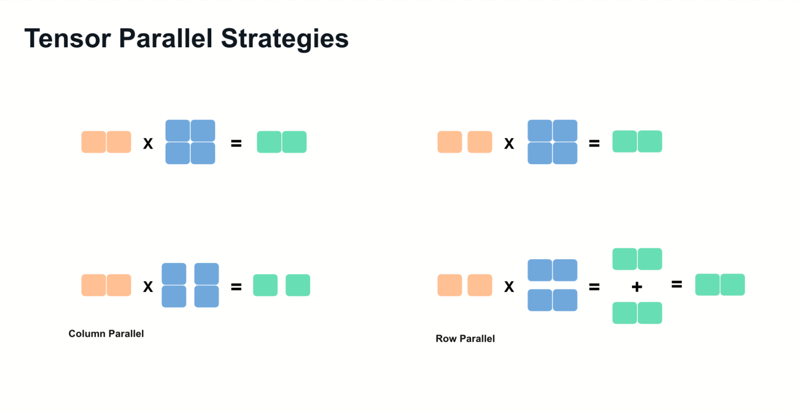
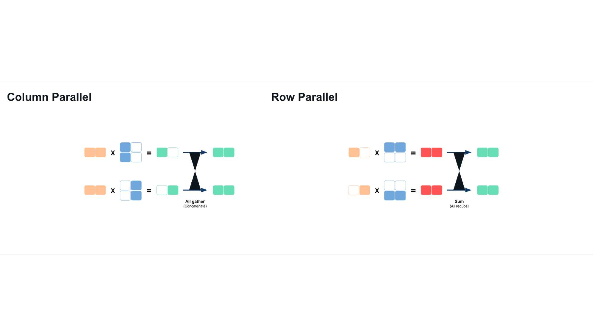
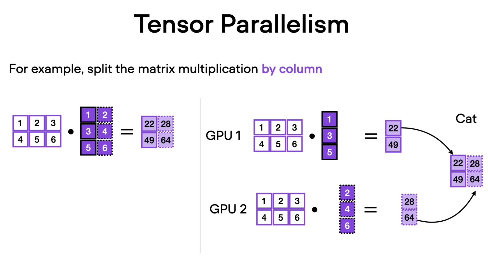


### 流水线并行
背景：模型超过多 GPU 节点的容量
流水线并行 在节点之间对模型进行切片，每个节点处理特定的连续模型层。

### 结合张量并行与流水线并行
作为一般经验法则，可以这样考虑并行的应用：

- 当互连速度较慢时，使用 跨节点的流水线并行 和 节点内的张量并行。
- 如果互连效率高（例如 NVLink, InfiniBand），张量并行可以扩展到跨节点。
- 智能地结合这两种技术可以 减少不必要的通信开销 并最大化 GPU 利用率。

## AiBrix 要点
### AiBrix StormService 
StormService是RoleSet的控制器，并非只是用于Prefill/Decode分离，真正的P/D分离需要在vllm中通过参数配置

### 相关协议
#### NCCL (NVIDIA Collective Communications Library)
- 用于模型权重同步(广播、梯度同步、集合通信)，主要是多GPU间的数据交换
- 模型训练过程的权重更新，张量并行（TP）中的AllReduce操作

#### NIXL (NVIDIA Inference Xfer Library)
- 用于AI分布式推理中KV Cache跨节点数据传输
- PD分离推理中，prefill节点向decode节点传输KV Cache
- 默认使用UCX作为传输后端

#### UCX (Unified Communication X)
- 通用高性能点对点通信的底层标准件
- 支持TCP/RoCE/IB/RDMA/共享内存
- 可作为NIXL的传输后端
- HPC/大数据/AI/MPI

### AiBrix 同时配置 L1 Cache 与 L2 Cache

L1和L2 cache是可以共存的，共存的情况下先查L1(本地缓存)，未命中再查L2(分布式缓存)

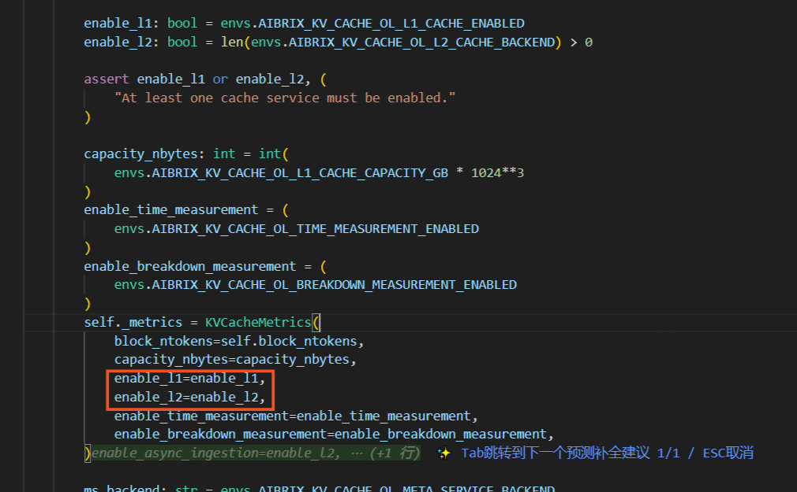

### 查看ray-head pod内rdma网卡设备名
通过nsenter使用宿主机命令行进入容器网络空间查看容器内rdma网卡设备名
```
crictl ps | grep rdma
crictl inspect <container_id> | grep pid
nsenter -n -t <pid> bash
show_gids
```
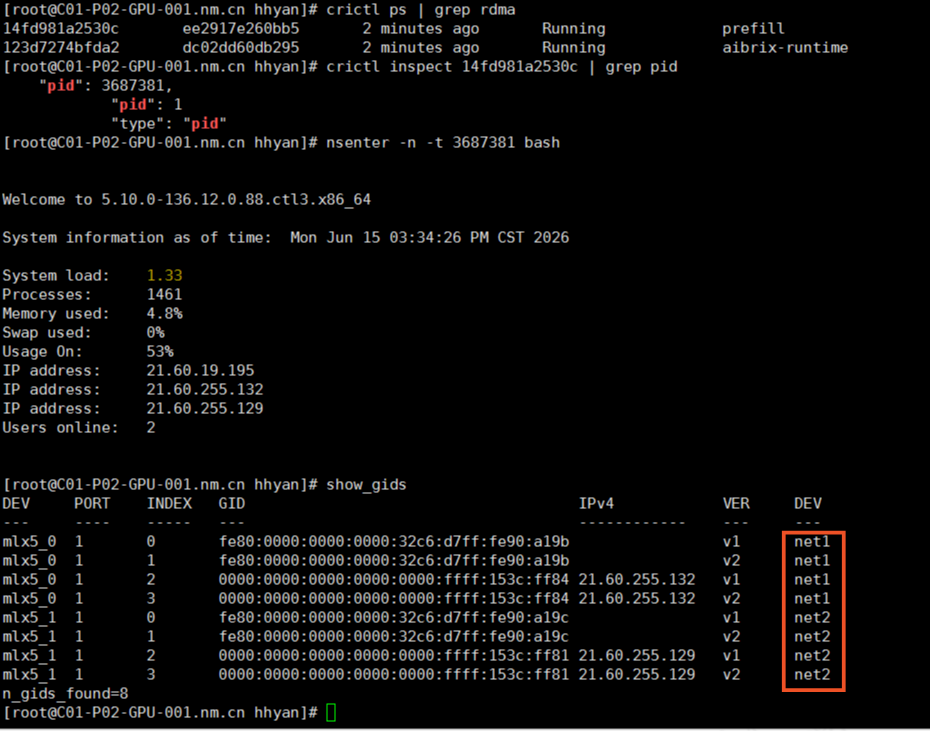

### decode pod正常加载远程prefill pod的kv cache 日志

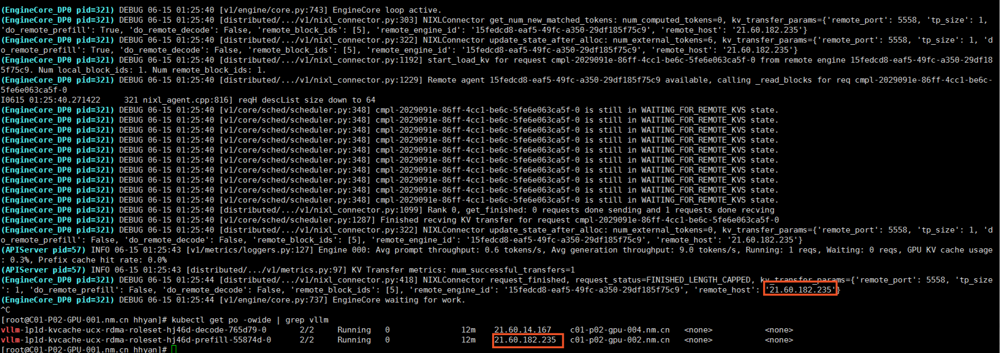


### 推理Pod配置NCCL使用RDMA
pod层面关注两个配置(配置名称与k8s集群配置的CNI插件相关，本集群配置hostdev-net CNI插件来管控rdma设备的挂载与卸载)
- nvidia.com/hostdev: "1" 资源申请通过dp确保 RDMA 设备被预留给pod，并调度pod到对应资源所在节点
- k8s.v1.cni.cncf.io/networks: hostdev-net CNI注解把rdma设备真正挂载到pod内

主要配置变更包括：
- pod资源申请
```
    resources:
      limits:
        cpu: "2"
        nvidia.com/gpu: 1
        nvidia.com/hostdev: '1'
      requests:
        cpu: "2"
        nvidia.com/gpu: 1
        nvidia.com/hostdev: '1'
```
- pod新增注解
```
    annotations:
      k8s.v1.cni.cncf.io/networks: hostdev-net
```
- pod新增环境变量指定rdma网卡设备
```
    env:
      - name: NCCL_IB_DISABLE
        value: "0"
      - name: NCCL_IB_HCA
        value: mlx5_0
```
***注：hostdev-net CNI插件不会隔离rdma设备视图，如果配置NCCL_IB_HCA为空或者与分配的rdma设备不匹配会导致NCCL通信失败。故需要通过环境变量NCCL_IB_HCA来指定正确的rdma网卡设备***

- pod确保权限
```
    securityContext:
      capabilities:
        add:
          - IPC_LOCK
```

### AiBrix查询相关metrics
aibrix-controller-manager和aibrix-gateway-plugins 都会执行都会运行cache_metrics相关逻辑
```
cache_metrics->
InitWithOptions->initMetricsCache->time.NewTicker(podMetricRefreshInterval)->AIBRIX_POD_METRIC_REFRESH_INTERVAL_MS
```
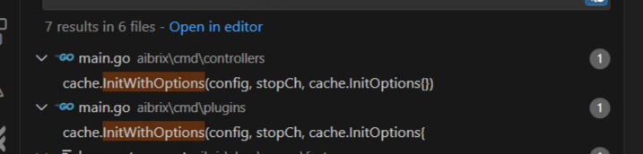
通过设置AIBRIX_POD_METRIC_REFRESH_INTERVAL_MS可以调节查询metrics的间隔。

查询metrics作用
- aibrix-gateway-plugins：数据面路由决策，选取 pod 处理当前请求
- aibrix-controller-manager：控制面PodAutoscaler进行扩缩容决策


## AiBrix Troubleshooting
### NCCL 通过IB通信有问题

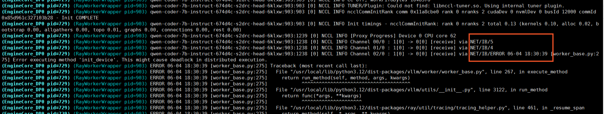

先禁用rdma，使用tcp：NCCL_IB_DISABLE=1

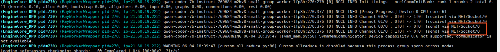

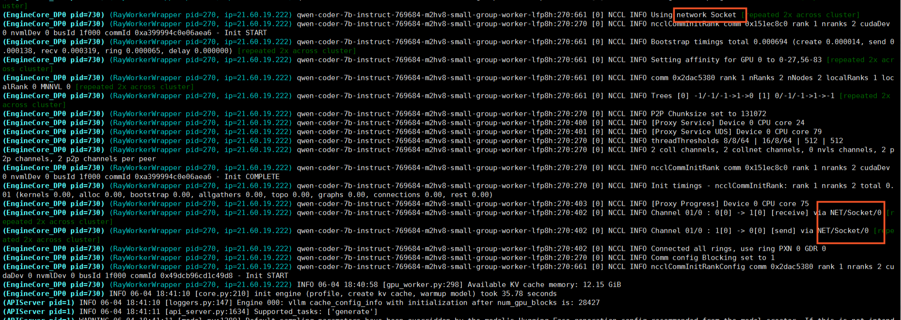

### vllm L0 KVCache 显存不足报错
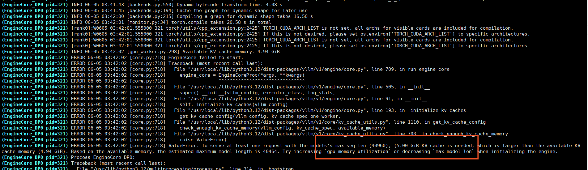

**说明：max-model-len 是 vLLM 中控制单个请求最大序列长度（输入 Prompt）的核心参数。它直接决定了显存预分配量、上下文窗口上限以及服务稳定性。**

L0 Cache不够只能通过降低这个取值
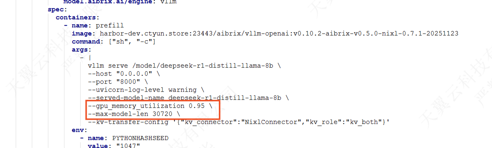

### 开启KVCache Offload，使用L1 Cache

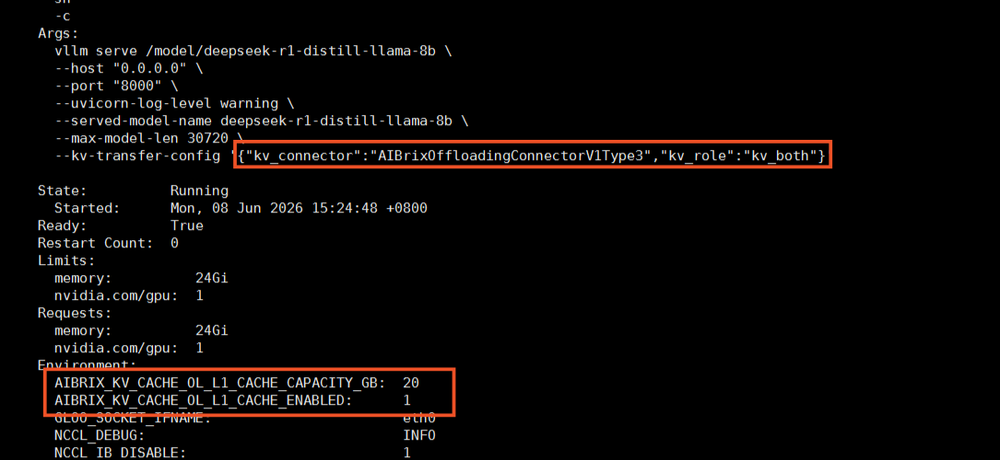

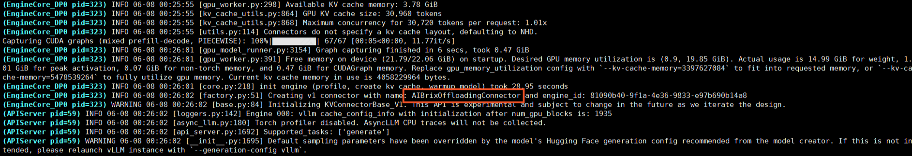

### benchmark环境准备
- 下载tokenizer 模型: modelscope download --model deepseek-ai/deepseek-llm-7b-chat --local_dir ../models/deepseek-ai/deepseek-llm-7b-chat
- 下载ShareGPT数据集：modelscope download --dataset gliang1001/ShareGPT_V3_unfiltered_cleaned_split  --local_dir ../datasets/gliang1001/ShareGPT_V3_unfiltered_cleaned_split
- 调整config.yaml配置内容
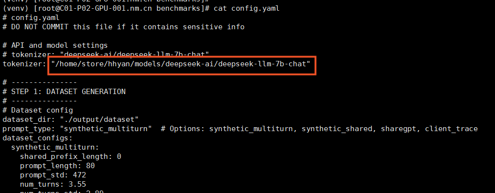
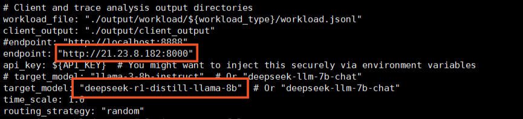

### benchmark报错：got Future <Future pending> attached to a different loop
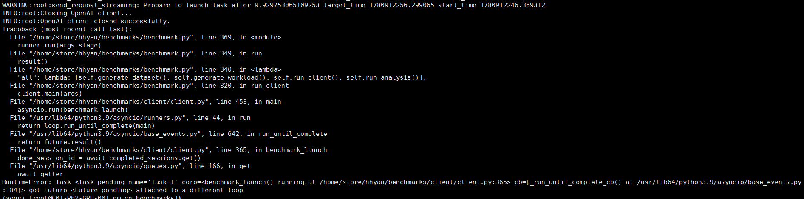
***解决：升级python至3.12.11版本可解决***

### benchmark报错：openai.OpenAIError: The api_key client option must be set either by passing api_key to the client or by setting the OPENAI_API_KEY environment variable

解决：这里只检测在不在不检测是否合法，直接 export API_KEY='sk-xxxxxxxxxxxxxxxx' 

### benchmark执行

执行aibrix自带benchmark：python3 benchmark.py --stage all --config config.yaml

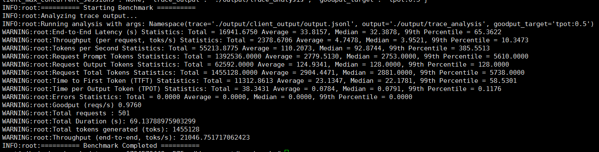
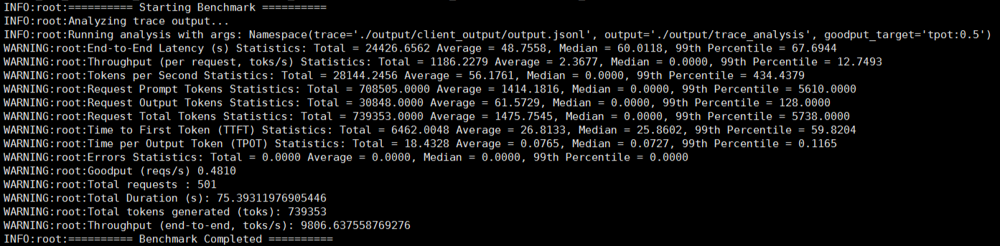

### AiBrix监控问题：servicemonitor 采集不到stormservice拉起的推理服务指标：
原因：stormservice自动创建的headless service缺少ports

解决：自己额外创建clusterip service指向其自动创建的pod后端，然后配置servicemonitor，如下
```
[root@C01-P01-GPU-001.sh.cn hhyan]# cat vllm-1p1d-qwen-coder-7b-instruct-monitor-service.yaml 
apiVersion: v1
kind: Service
metadata:
  name: vllm-1p1d-qwen-coder-7b-instruct-metrics
  namespace: default
  labels:
    prometheus-discovery: "true"  # 这里配置label供servicemonitor匹配
spec:
  type: ClusterIP
  selector:
    storm-service-name: vllm-1p1d-qwen-coder-7b-instruct
  ports:       # 这里需要配置ports
    - name: metrics
      port: 8080
      targetPort: 8080
      protocol: TCP

[root@C01-P01-GPU-001.sh.cn hhyan]# cat vllm-monitor.yaml 
apiVersion: monitoring.coreos.com/v1
kind: ServiceMonitor
metadata:
  name: vllm-1p1d-monitor
  namespace: default
spec:
  selector:
    matchLabels:
      prometheus-discovery: "true"    # 匹配service label
  endpoints:
  - port: metrics
    path: /metrics/     # 这里是因为aibrix-runtime容器对metric的url做了调整，这里url需要新增后缀 /
    interval: 15s      # 抓取间隔
```


### benchmark下finished_reason="stop"的请求为0，所有请求被强制截断，结束原因标记为 length

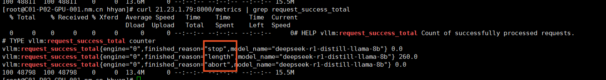

解决： benchmark配置中调大 output_token_limit
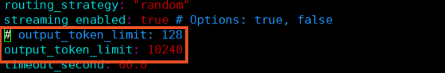
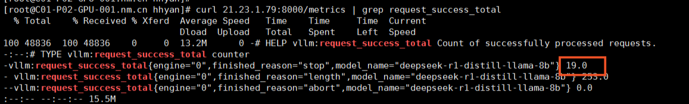

### metrics请求到aibrix-runtime后没有返回，报307
原因：配置 sidecar-injection: true后，aibrix会自动给vllm拉起aibrix-runtime容器来代理接口请求，但是runtime容器对metrics请求做了处理

解决：将请求 /metrics 换成 /metrics/，ServiceMonitor也需要调整path
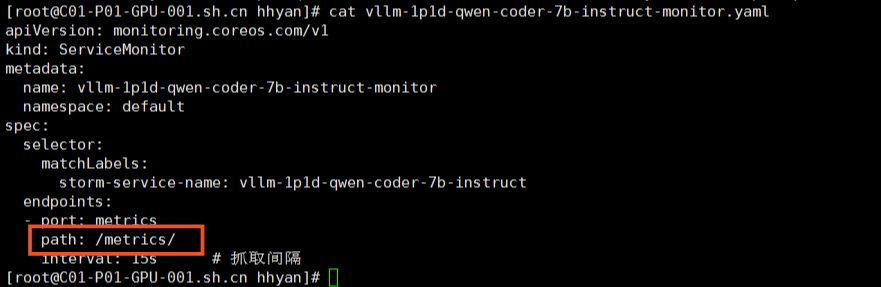
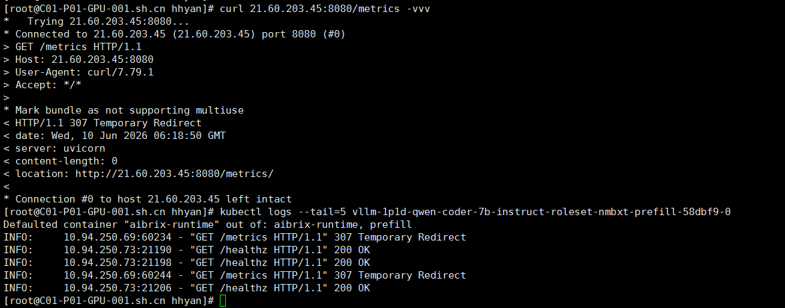
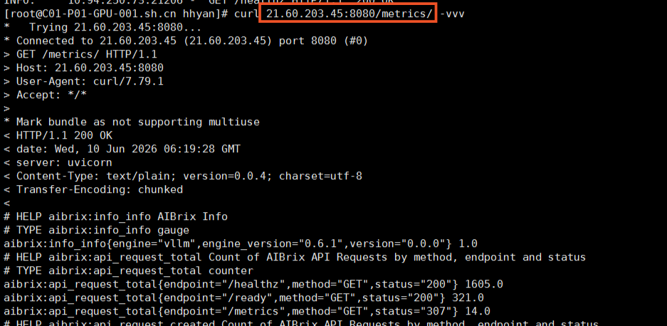

### routing-strategy: pd 请求导致prefill pod dump: uct_tcp_ep_am_bcopy

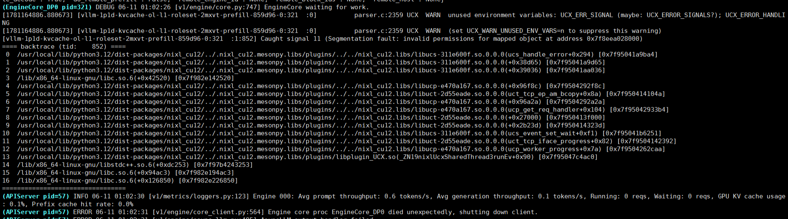

查看prefill其它日志有告警：memory is detected as host, check that UCX is configured with CUDA support

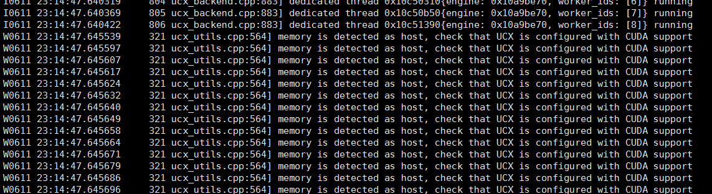

其它报错内容
```
[1781251134.964050] [vllm-1p1d-kvcache-ucx-tcp-roleset-7w6dx-prefill-66557c-0:321  :0]       ib_device.c:1383 UCX  ERROR   ibv_create_ah(dlid=49152 sl=0 port=1 src_path_bits=0 dgid=fe80::aac9:8aff:fe2d:d51d fl
ow_label=0xffffffff sgid_index=0 traffic_class=0) for UD mlx5 connect on mlx5_0 failed: No such device
W0612 00:58:54.964067     321 ucx_utils.cpp:64] Unexpected UCX error: Address not valid
```
说明UCX找mlx5设备走rdma，导致报错 NIXL_ERR_BACKEND

原因：NixlConnector下配置tcp需要显式配置UCX_TLS: tcp,cuda_copy,cuda_ipc,sm， 否则会遇到NIXL_ERR_BACKEND。

解决：配置 UCX_TLS: tcp,cuda_copy,cuda_ipc,sm  内存访问告警和PD分离请求coredump问题解决。另外，切换到MooncakeStoreConnector之后，因为不走ucx，UCX_TLS的配置无影响。

### Error executing method 'init_device'.

其它报错
```
RuntimeError: NCCL error: unhandled system error (run with NCCL_DEBUG=INFO for details)
```
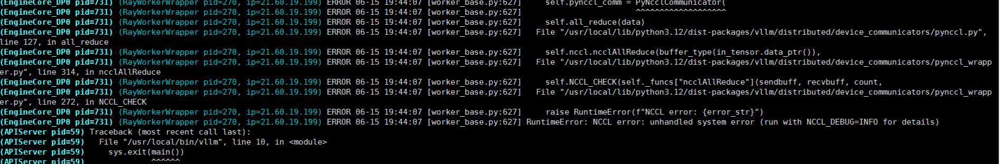
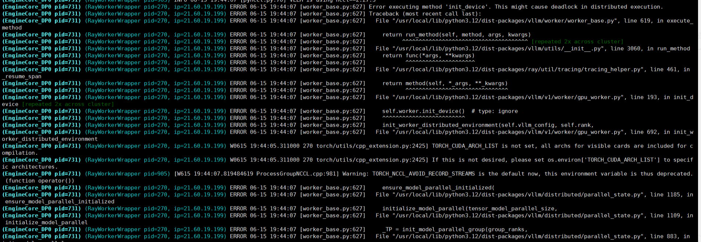

原因及解决：NCCL初始化报错的原因比较多，本次是由于pod缺少权限, 配置IPC_LOCK权限即可
```
    securityContext:
      capabilities:
        add:
          - IPC_LOCK
```

### Total number of attention heads (28) must be divisible by tensor parallel size (3)

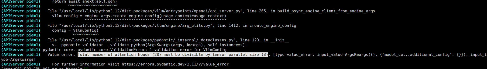

解决：将 tensor_parallel_size 调整为模型头数的约数

### ray-head 节点刷大量的metrics请求日志
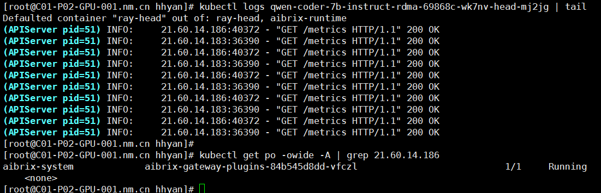

查询这两个ip分别是 aibrix-gateway-plugins 与 aibrix-controller-manager

解决：
```
kubectl set env deployment/aibrix-gateway-plugins -n aibrix-system AIBRIX_POD_METRIC_REFRESH_INTERVAL_MS=10000
kubectl set env deployment/aibrix-controller-manager -n aibrix-system AIBRIX_POD_METRIC_REFRESH_INTERVAL_MS=10000
```

### NCCL_IB_HCA不配置的情况下，pod(只分配一个rdma设备)内会把宿主机上所有的rdma设备都发现出来，nccl初始化报错：
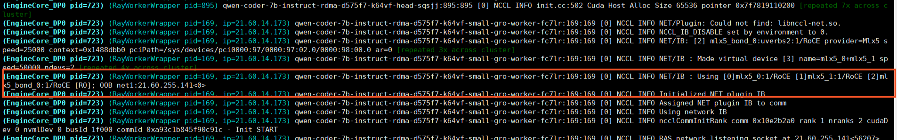

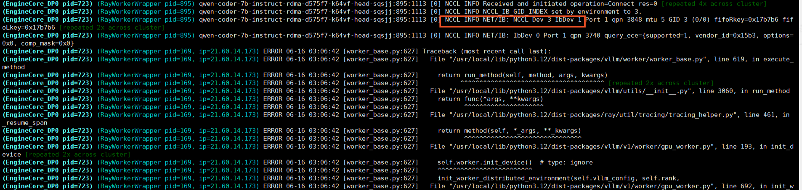

原因：pod内能看到宿主机上其它未分配给它的rdma设备(pod通过ibv_devices也能查询到)，但没权限导致nccl初始化失败。问题出在host-device CNI 不提供 /dev/infiniband/设备的全局视图隔离。


解决：手动指定NCCL_IB_HCA环境变量；或配置NetworkAttachmentDefinition 使用rdma cni，并在pod配置自动发现(NCCL_IB_HCA配置为空或者前缀匹配)。

https://pkg.go.dev/github.com/Mellanox/rdma-cni#section-readme
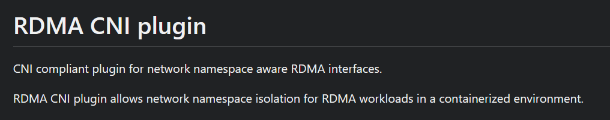

说明：NCCL底层发现 RDMA 设备的原理与 ibv_devices 命令本质上是一样的，都是通过libibverbs 库的ibv_get_device_list函数来获取RDMA设备列表。该函数通过查询 /sys/class/infiniband/ 目录下的设备文件来获取RDMA设备列表。此外，NCCL 会将查询到的RDMA设备列表通过 NCCL_IB_HCA 环境变量来过滤出当前pod可以访问的设备。

### 追踪ibv_devices的执行轨迹
strace ibv_devices
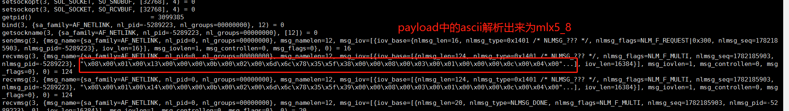
说明是从内核函数中读取对应网络命名空间中注册的rdma设备

### pod内看到的设备目录与nsenter看到不同
原因：nsenter进入网络空间，没有进入mount ns
解决：需要同时进入网络+mount命名空间：nsenter -n -m <pid>

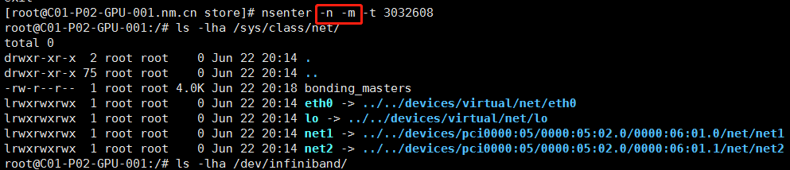
注：但进入了mount命名空间后，就无法使用宿主机的命令行了

### ValueError: Unsupported connector type: AIBrixOffloadingConnectorV1Type3
解决：切换镜像到aibrix官方镜像后解决 vllm-openai:v0.10.2-aibrix-v0.5.0-nixl-0.7.1-20251123，该镜像内部的vllm适配了这个connector
vllm/distributed/kv_transfer/kv_connector/factory.py

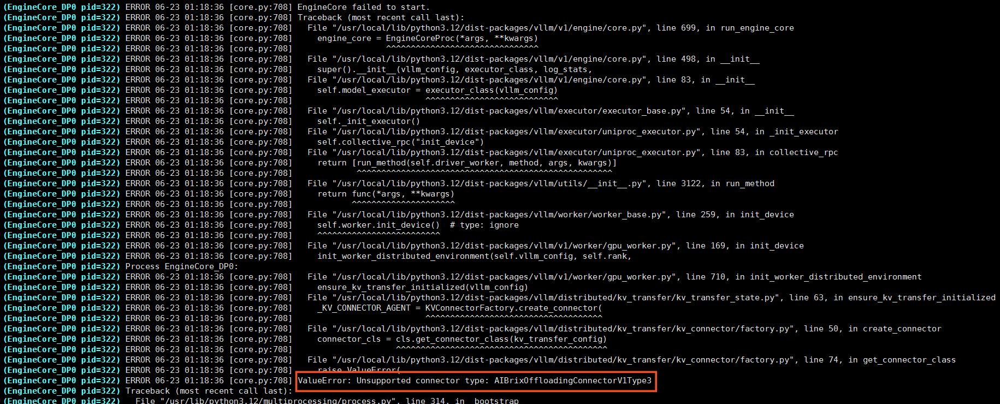

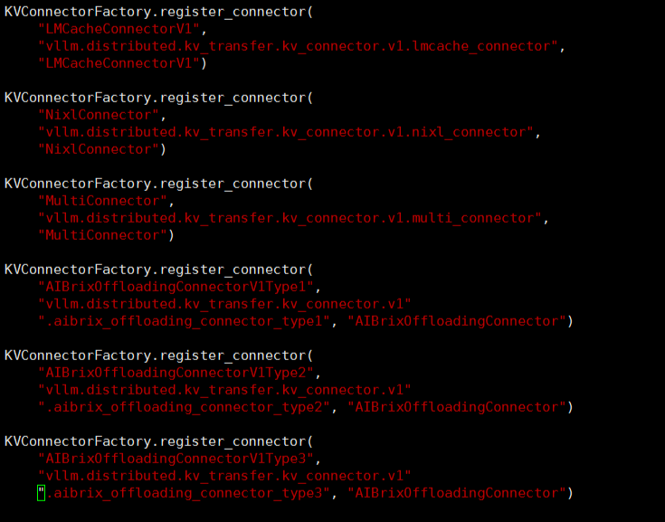

### vllm 集成 aibrix 的 AIBrixOffloadingConnectorV1Type3
这个pr显示vllm社区可能不会支持inifistore: https://github.com/vllm-project/vllm/pull/9079
故vllm官方镜像不能直接用，需要在构建vllm镜像时，给vllm的python库打patch
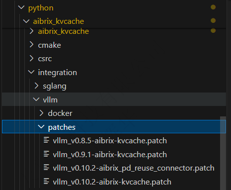
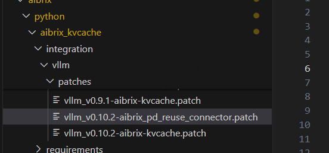
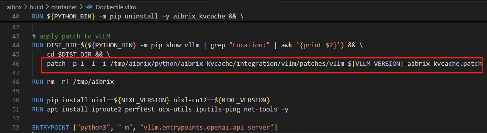

### L1和L2 cache都存在的情况下，L2 cache找到的内容会写入L1 cache
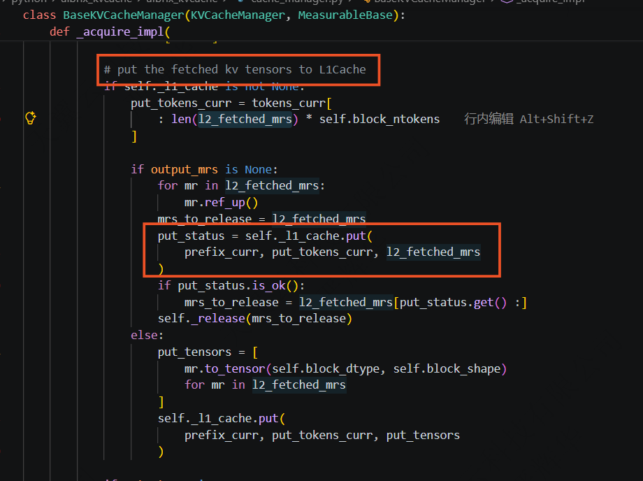
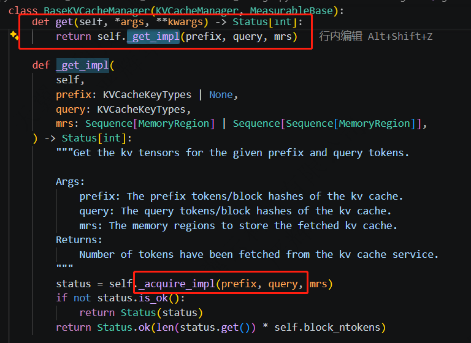

### AIBrixPDReuseConnector 需要感知到当前是否是pd场景，如果是decode需要一直等待kv cache
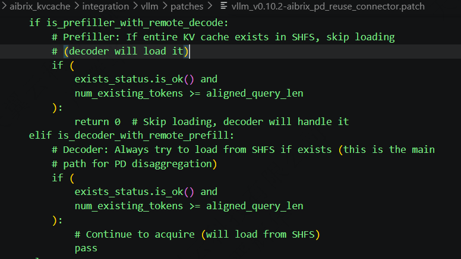

### vLLM 集成 AIBrix 自定义 kv_connector 流程
```
vLLM kv_connector patch(新增的 AIBrixOffloadingConnector/AIBrixPDReuseConnector)
->BaseKVCacheManager
  ->L1Cache->根据eviction policy选择对应的BaseEvictionPolicy子类(s3fifo/lru/fifo)对内存字典_hashmap进行操作
  ->L2Cache(根据backend_name初始化不同的L2存储Connector:RocksDBConnector/InfiniStoreConnector/PrisKVConnector/SHFSConnector等)
```

### AIBrixOffloadingConnector vs AIBrixPDReuseConnector
- AIBrixOffloadingConnector 专注于cache offloading，可配置kv_both，但不支持实际的pd分离请求
- AIBrixPDReuseConnector 基于offloading上增加了 PD Disaggregation 支持，判断出decode请求类型必须从L2 cache中获取：
  - prefill请求完成返回 PD 信息的字典，传给 router，由router再转到 decoder
  - 判断出decode请求类型，decoder 强制从 L2 cache SHFS 加载
