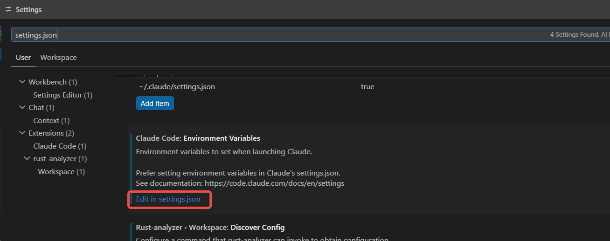
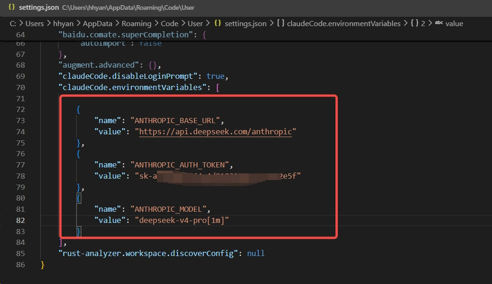
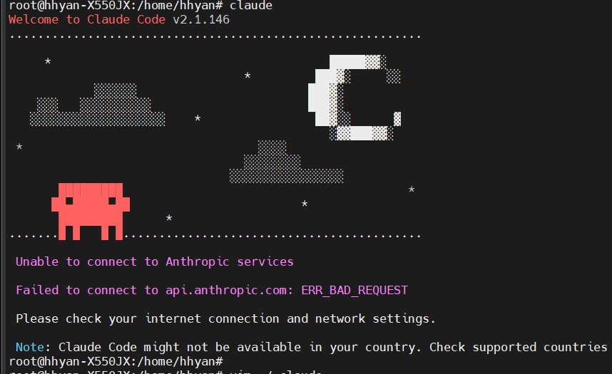
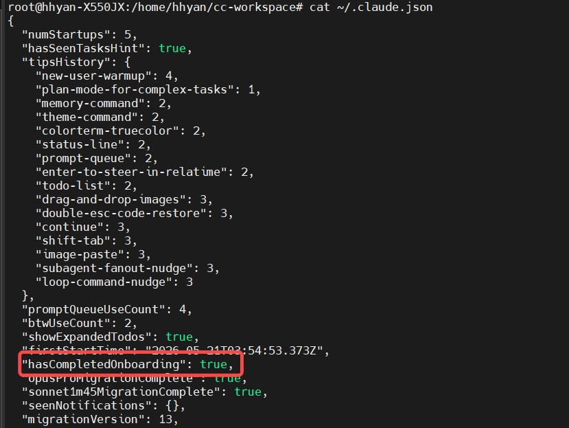

## 安装Claude
```bash
sudo apt install npm
sudo npm install -g @anthropic-ai/claude-code
```
## 配置deepseek
```bash
export ANTHROPIC_BASE_URL=https://api.deepseek.com/anthropic
export ANTHROPIC_AUTH_TOKEN=sk-xxxxxxxxxxxxxxxxxxxxxxxxxxxxxx
export ANTHROPIC_MODEL=deepseek-v4-pro[1m]
export ANTHROPIC_DEFAULT_OPUS_MODEL=deepseek-v4-pro[1m]
export ANTHROPIC_DEFAULT_SONNET_MODEL=deepseek-v4-pro[1m]
export ANTHROPIC_DEFAULT_HAIKU_MODEL=deepseek-v4-flash
export CLAUDE_CODE_SUBAGENT_MODEL=deepseek-v4-flash
export CLAUDE_CODE_EFFORT_LEVEL=max

```
## 运行Claude

```bash
# 创建工作空间
mkdir -p cc-workspace
cd cc-workspace
claude
```

## VSCode下使用Claude Code
修改settings.json
- 修改claudeCode.disableLoginPrompt为true，绕过登录提示
- 配置claude code使用deepseek模型




## Troubleshooting
### 1. Note: Claude Code might not be available in

~/.claude.json 配置启动跳过引导，直接进入主界面
```bash
"hasCompletedOnboarding": true,
```


