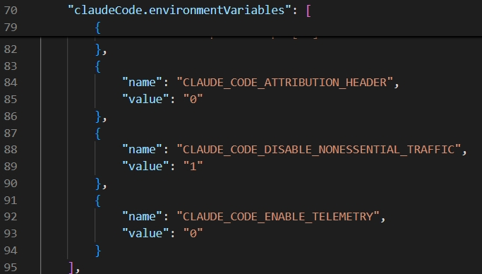

## 安装Claude
```bash
sudo apt install npm
sudo npm install -g @anthropic-ai/claude-code
```
## 配置deepseek
```bash
export ANTHROPIC_BASE_URL=https://api.deepseek.com/anthropic
export ANTHROPIC_AUTH_TOKEN=sk-xxxxxxxxxxxxxxxxxxxxxxxxxxxxxx
export ANTHROPIC_MODEL=deepseek-v4-pro[1m]
export ANTHROPIC_DEFAULT_OPUS_MODEL=deepseek-v4-pro[1m]
export ANTHROPIC_DEFAULT_SONNET_MODEL=deepseek-v4-pro[1m]
export ANTHROPIC_DEFAULT_HAIKU_MODEL=deepseek-v4-flash
export CLAUDE_CODE_SUBAGENT_MODEL=deepseek-v4-flash
export CLAUDE_CODE_EFFORT_LEVEL=max

```
## 运行Claude

```bash
# 创建工作空间
mkdir -p cc-workspace
cd cc-workspace
claude
```

## VSCode下使用Claude Code
修改settings.json
- 配置claudeCode.disableLoginPrompt为true，绕过登录提示
- 配置claude code使用deepseek模型


## 客户端优优
| 配置项 | 功能说明 |
| --- | --- |
| CLAUDE_CODE_ATTRIBUTION_HEADER | 核心提速变量。设置为"0"可禁止发送计费头部，消除本地服务器的多余处理开销，显著提升推理速度 |
| CLAUDE_CODE_ENABLE_TELEMETRY | 隐私优化。设置为"0"关闭使用情况统计，防止个人数据上传，增强本地部署的隐私安全性 |
| CLAUDE_CODE_DISABLE_NONESSENTIAL_TRAFFIC | 性能优化。设置为"1"停止后台ping及非关键网络调用，集中设备资源用于模型推理 |

vscode 插件新增优化配置如下


## Troubleshooting
### 1. Note: Claude Code might not be available in

~/.claude.json 配置启动跳过引导，直接进入主界面
```bash
"hasCompletedOnboarding": true,
```


