## 安装多智能体框架CrewAI
```
# 安装uv
curl -LsSf https://astral.sh/uv/install.sh | sh
# -i 指定国内源
uv pip install crewai -i https://mirrors.aliyun.com/pypi/simple/
```
* 当前主流开始使用uv替换pip来管理依赖，使用原生的pip或者virtualenv在crewai run阶段可能导致重复创建沙盒


## 下载安装可视化工具 CrewAI-Studio
```
git clone https://github.com/strnad/CrewAI-Studio.git
cd CrewAI-Studio
pip install -r requirements.txt
cp .env_example .env
```
* requirements.txt 中指定了crewai的版本，会导致原先安装的crewai版本被覆盖，可以去掉requirements.txt中的版本指定

## 命令行使用CrewAI
```
crewai create crew ctest --provider deepseek
```
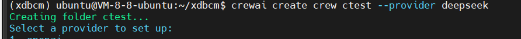

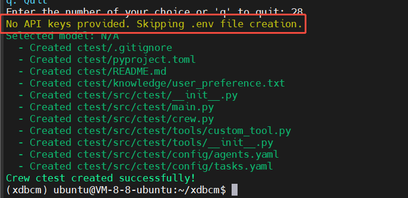

命令可配置的大模型必须在constants.py中定义
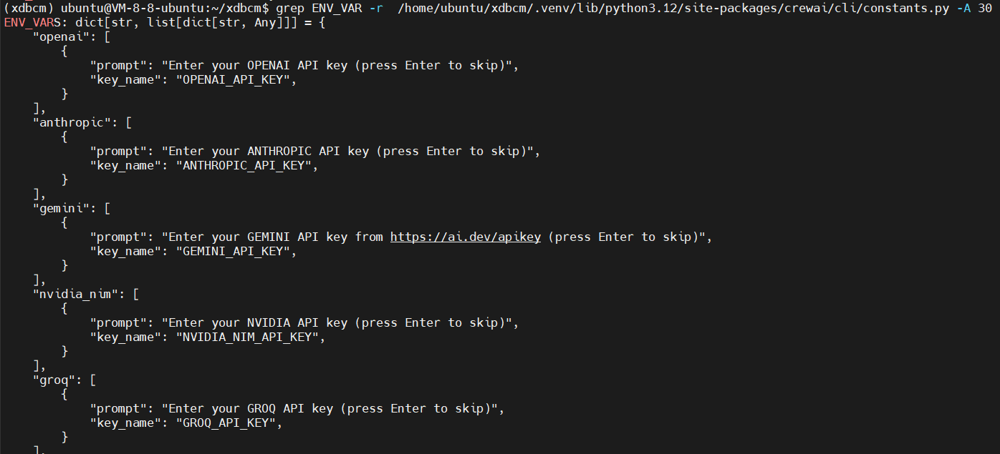

否则直接.env中配置兼容openapi的大模型
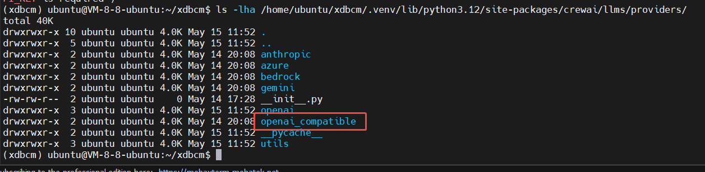
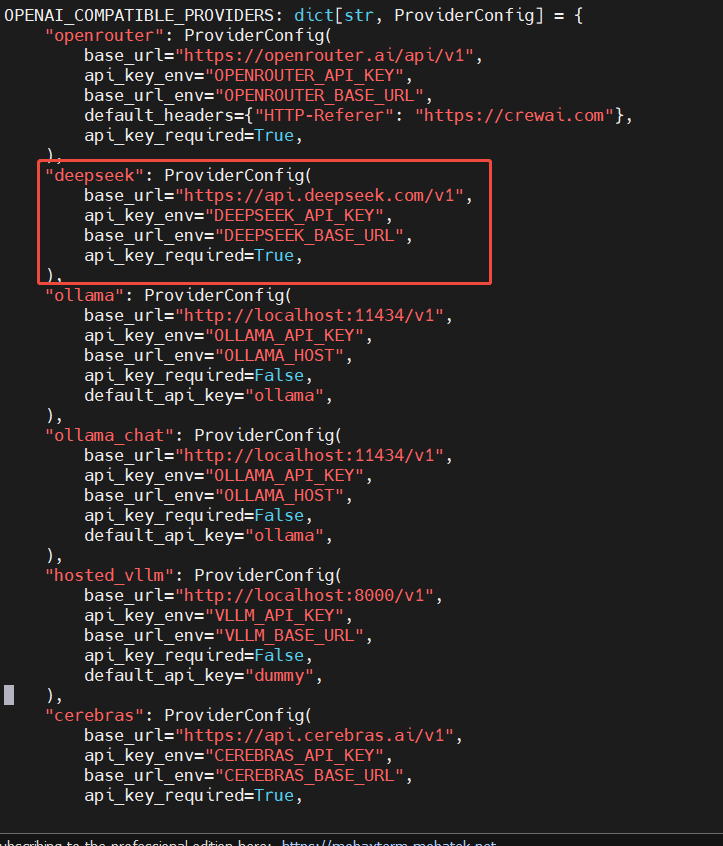

运行时需要指定沙盒路径，否则会导致重复创建沙盒
```
UV_PROJECT_ENVIRONMENT=/home/ubuntu/xdbcm/.venv/ crewai run
```
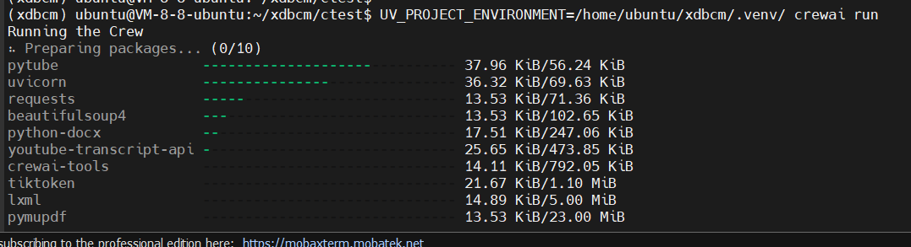
* 这里只下载沙盒中没有的依赖

也可以把 UV_PROJECT_ENVIRONMENT=/home/ubuntu/xdbcm/.venv/ 配置到.env文件中，将.env文件放在crewai模块所在目录下，或者沙盒根目录下
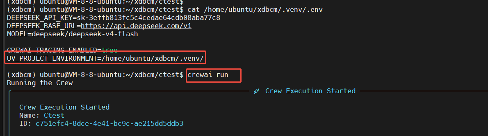


也可以先运行 install 把智能体依赖安装到沙盒中再Run
```
# 安装智能体依赖到沙盒中
crewai install --active
# 指定沙盒路径
UV_PROJECT_ENVIRONMENT=/home/ubuntu/xdbcm/.venv/ crewai run
```
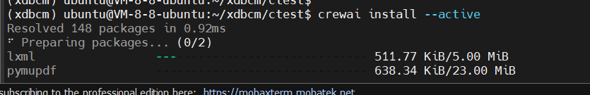

* 注意：由于load_dotenv函数会从当前模块所在目录开始查找.env文件，所以如果在crewai模块所在目录下运行，.env文件需要放在crewai python模块所在目录下，或者沙盒根目录下


## Troubleshooting
1. 配置了deepseek大模型，crewai run 时报错“ OPENAI_API_KEY is required ”
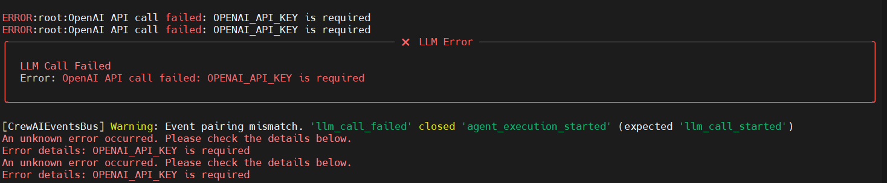
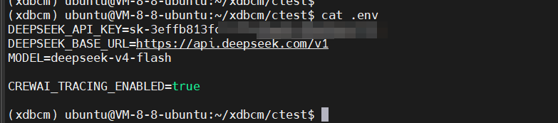

OpenAI兼容性模型需要 / 加前缀
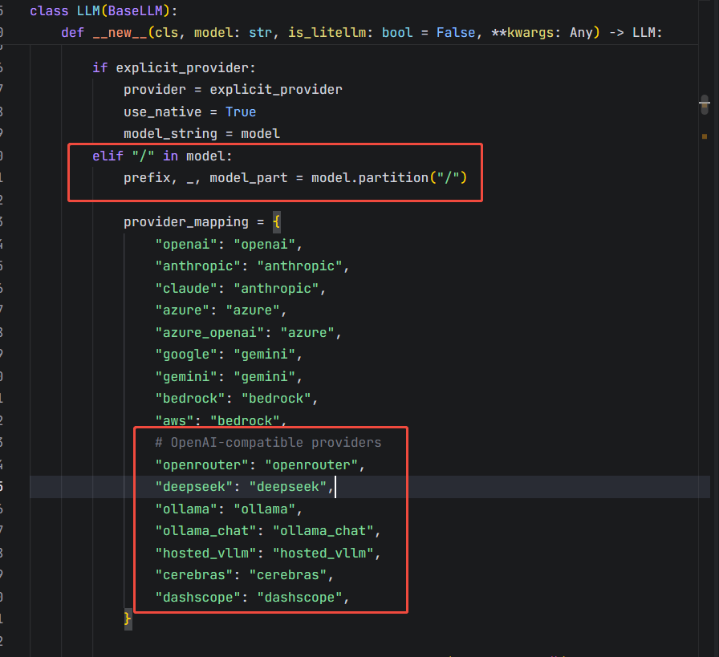

加了前缀识别仍有问题
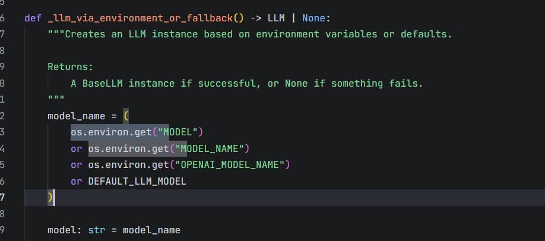

这里读取出来为空，通过export设置环境变量可以正常运行
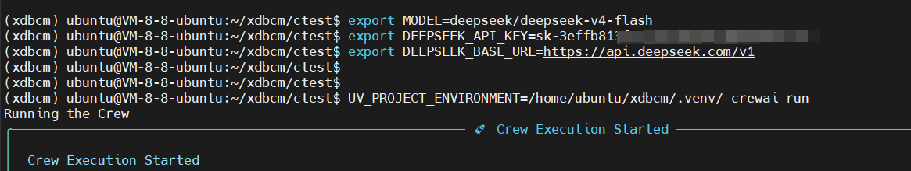

代码中多次load_dotenv读取.env文件中的环境变量，调试阶段生效，但是实际运行无法生效
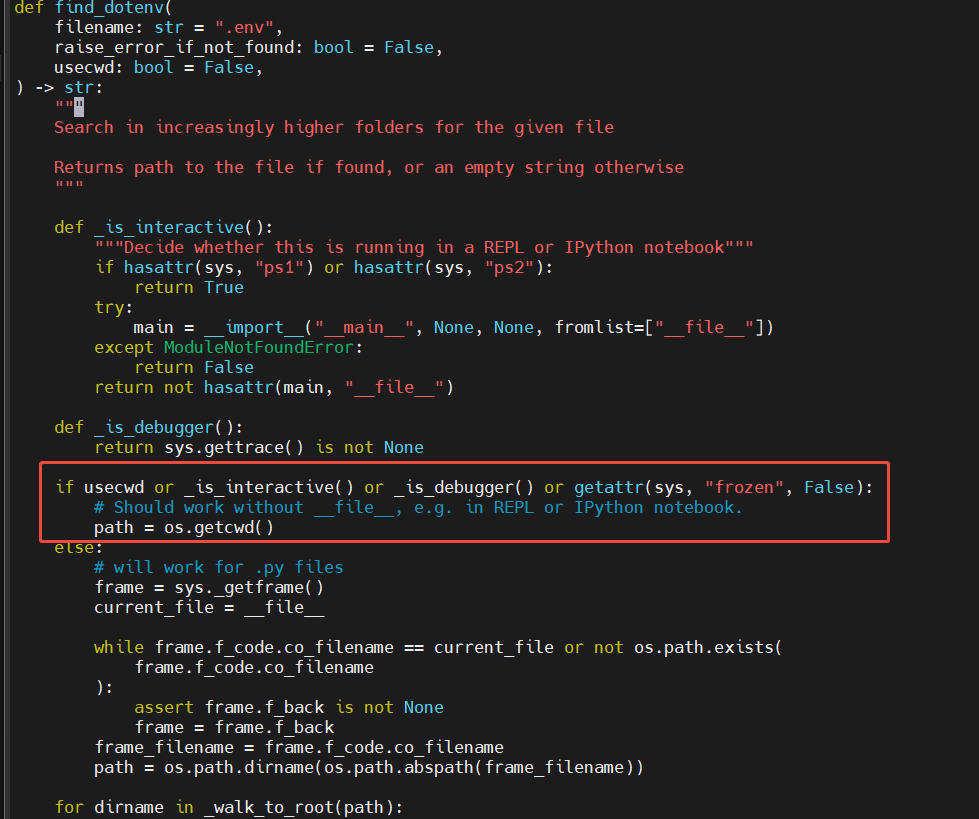
调试模式会找cwd作为.env文件的路径

查看并调试获取.env文件路径代码函数find_dotenv逻辑
```
/home/ubuntu/xdbcm/.venv/lib/python3.12/site-packages/dotenv/main.py
```
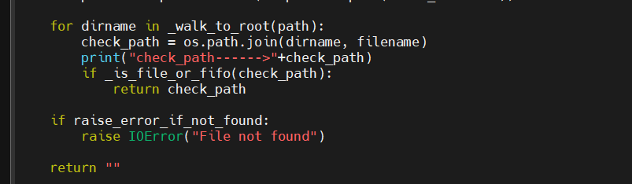

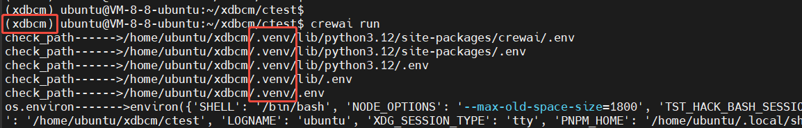

* find_dotenv函数会从当前模块所在目录开始查找.env文件，直到找到或到达沙盒.venv根目录
解决：故.env文件应该放在.venv或者在crewai模块所在目录

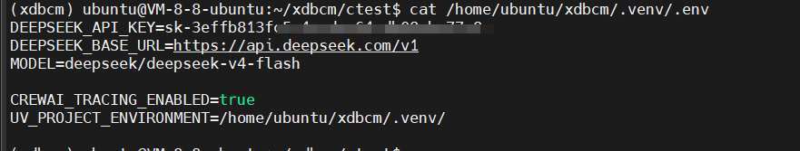

