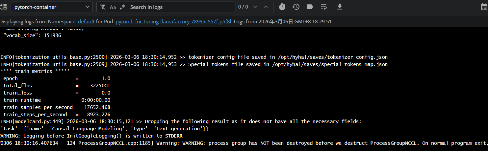
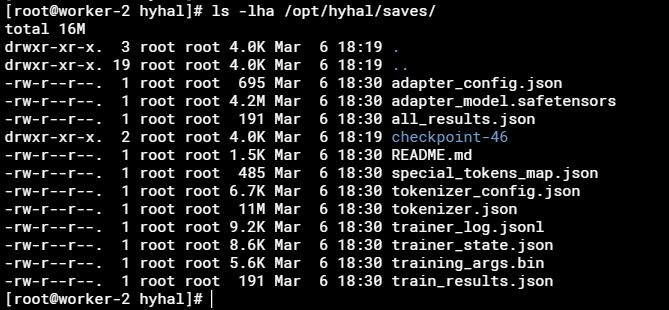
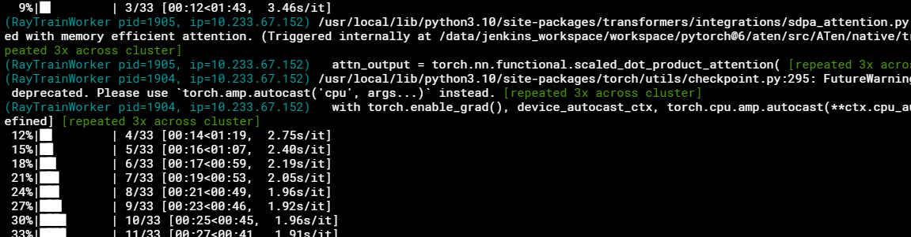
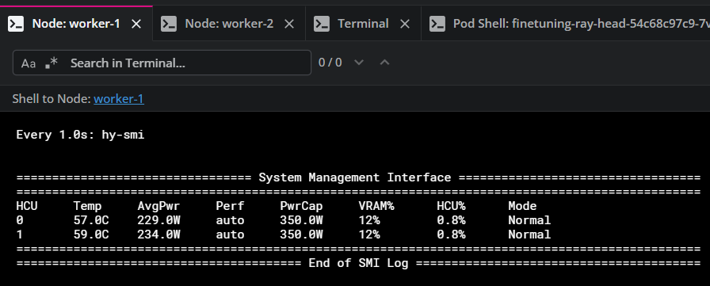
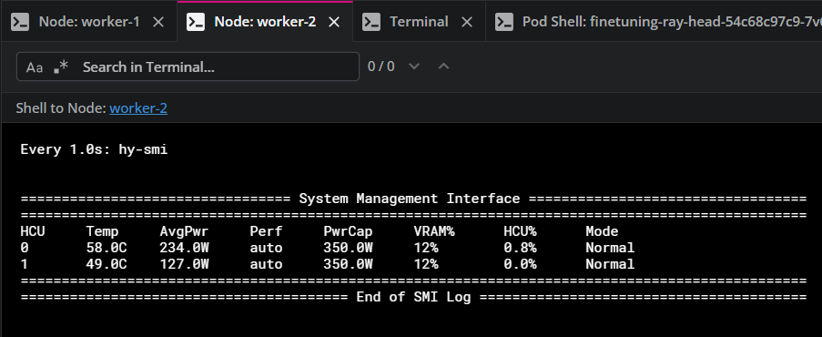
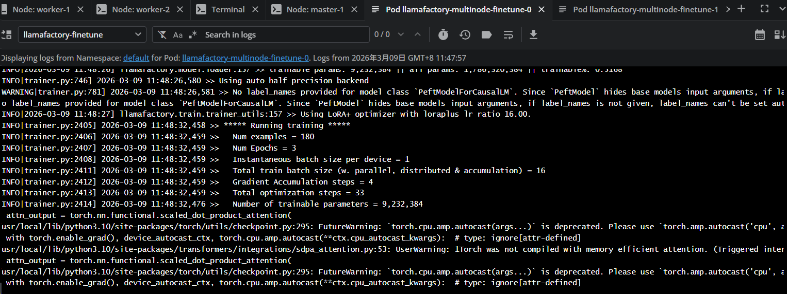
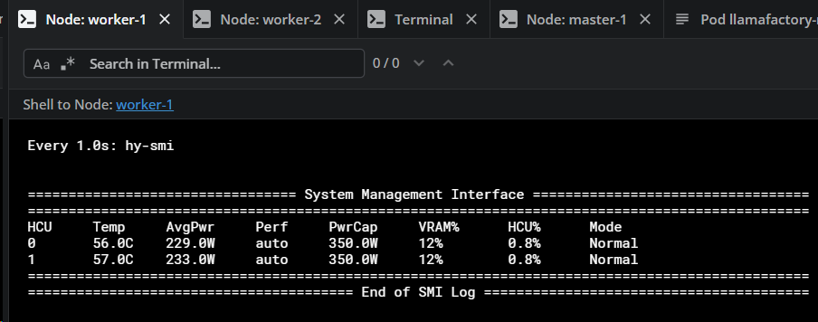
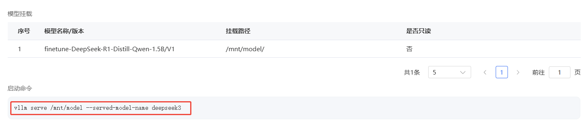
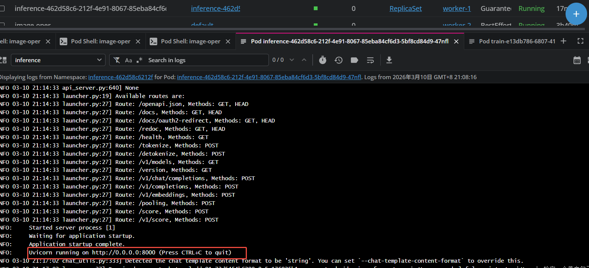
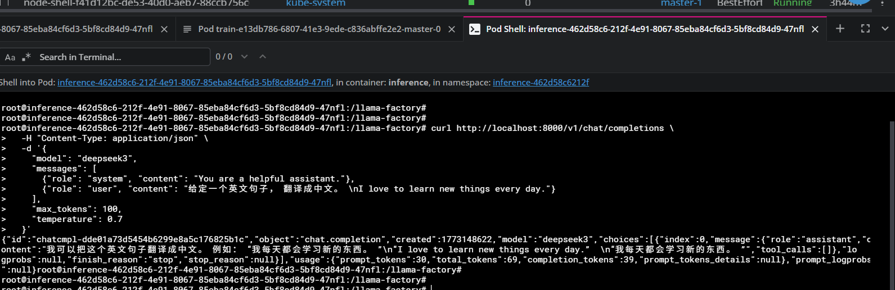

# DCU 微调及推理实践

## 基本信息
适配平台：DCU K100_AI/BW1000
适配节点：worker-1 / worker-2
原始镜像：image.sourcefind.cn:5000/dcu/admin/base/custom:llamafactory-ubuntu22.04-dtk25.04-rc4-vllm0.6.6-py3.10
基础模型权重地址：/opt/hyhal/models/deepseek-ai/deepseek-ai/DeepSeek-R1-Distill-Qwen-1.5B (两节点上路径一致)
微调数据集地址：/opt/hyhal/llamafactory/data/ (两节点上路径一致)

## 数据获取
### 获取基础模型
```
# 下载模型
pip install modelscope
modelscope download --model deepseek-ai/DeepSeek-R1-Distill-Qwen-1.5B --local_dir /opt/hyhal/models/deepseek-ai
```
### 配置数据集
#### 获取用于微调训练的数据集
```
# 下载数据集
modelscope download --dataset AI-ModelScope/train_0.5M_CN --local_dir /opt/hyhal/dataset

# 裁剪数据集
head -n 200 Belle_open_source_0.5M.jsonl > /opt/hyhal/llamafactory/data/identity.jsonl
```
#### 配置dataset_info.json文件指定数据集
创建/opt/hyhal/llamafactory/data/dataset_info.json，配置如下内容
```
{
  "identity": {
    "file_name": "identity.jsonl"
  }
}
```
## 单节点微调

挂载llamafactory微调配置文件 /opt/hyhal/llamafactory/config/train_single.yaml

```
model_name_or_path: /opt/hyhal/models/deepseek-ai/deepseek-ai/DeepSeek-R1-Distill-Qwen-1.5B
dataset: identity
dataset_dir: data
template: deepseek3
finetuning_type: lora
output_dir: /opt/hyhal/saves

# 训练参数
per_device_train_batch_size: 1
gradient_accumulation_steps: 1
num_train_epochs: 1.0
learning_rate: 5.0e-5
lr_scheduler_type: cosine
warmup_ratio: 0.1

# LoRA 参数
lora_rank: 8
lora_alpha: 16
lora_dropout: 0.1
lora_target: q_proj,v_proj

# 保存和日志
save_steps: 100
logging_steps: 1

# 其他
val_size: 0.0
ddp_find_unused_parameters: false
bf16: true
stage: sft
do_train: true
```
配置deployment拉起镜像开启微调任务
```
---
apiVersion: apps/v1
kind: Deployment
metadata:
  name: pytorch-for-tuning-llamafactory
  labels:
    app: pytorch-dcu-llamafactory
spec:
  replicas: 1
  selector:
    matchLabels:
      app: pytorch-dcu-llamafactory
  template:
    metadata:
      labels:
        app: pytorch-dcu-llamafactory
    spec:
#      nodeName: worker-2
      containers:
      - name: pytorch-container
        image: harbor.ctyuncdn.cn/tai-dev/custom:llamafactory-ubuntu22.04-dtk25.04-rc4-vllm0.6.6-py3.10
        #command: ["sleep", "infinity"]
        command: 
          - /bin/bash
          - '-c'
          - >
            SWANLAB_MODE="disabled" llamafactory-cli train /opt/hyhal/llamafactory/config/train_single.yaml;
            exec sleep infinity
        resources:
          limits:
            hygon.com/dcu: 1
          requests:
            hygon.com/dcu: 1
        volumeMounts:
        - name: hyhal
          mountPath: /opt/hyhal
        securityContext:
          privileged: true
          runAsUser: 0
      volumes:
      - name: hyhal
        hostPath:
          path: /opt/hyhal
          type: DirectoryOrCreate
```
查看日志


输出训练模型


## 多节点分布式微调
分布式微调验证了“Ray集群调度”和“llamafactory原生集群微调”两种方案，可根据下发情况选择合适的方案

### 使用Ray集群调度任务

挂载微调配置 /opt/hyhal/llamafactory/config/train_ray.yaml

```
model_name_or_path: /opt/hyhal/models/deepseek-ai/deepseek-ai/DeepSeek-R1-Distill-Qwen-1.5B

stage: sft
do_train: true
finetuning_type: lora
lora_rank: 8
lora_target: all
lora_alpha: 16
lora_dropout: 0
loraplus_lr_ratio: 16

dataset_dir: /opt/hyhal/llamafactory/data
dataset: identity
template: deepseek3
cutoff_len: 2048
overwrite_cache: true
preprocessing_num_workers: 16

output_dir: /opt/hyhal/saves
logging_steps: 100
save_steps: 10
overwrite_output_dir: true

# 核心优化：调整批量大小和梯度累积，适配4卡分布式
per_device_train_batch_size: 1  # 降低单卡批次大小，减少显存占用
gradient_accumulation_steps: 4  # 增加梯度累积，保持总批次大小不变
max_grad_norm: 1.0
learning_rate: 5.0e-6
num_train_epochs: 3.0
lr_scheduler_type: cosine
warmup_ratio: 0.1
packing: false
bf16: true
ddp_timeout: 1800
trust_remote_code: true
optim: adamw_torch

# 评估配置优化：减少评估频率，避免阻塞
val_size: 0.1
per_device_eval_batch_size: 1
eval_strategy: "no"
#eval_strategy: epoch  # 改为按epoch评估，而非steps，减少评估开销
# eval_steps: 10  # 注释掉，使用epoch评估时不需要

# Ray分布式配置优化
ray_run_name: ds_ray_cluster
ray_num_workers: 4
resources_per_worker:
  GPU: 1
placement_strategy: SPREAD  # 改为SPREAD策略，更均衡分配资源

save_strategy: "no"
save_steps: 0
ray_storage_path: "/opt/hyhal/saves"
```
k8s上创建ray集群
```
apiVersion: apps/v1
kind: Deployment
metadata:
  name: finetuning-ray-head
  namespace: default
spec:
  replicas: 1
  selector:
    matchLabels:
      app: finetuning-ray-head
  template:
    metadata:
      labels:
        app: finetuning-ray-head
    spec:
      volumes:
        - name: hyhal
          hostPath:
            path: /opt/hyhal
            type: Directory
        - name: host-data
          hostPath:
            path: /data02
            type: Directory
        - name: save-path
          hostPath:
            path: /mnt/data/hyhal/saves
            type: Directory
        - name: shm
          emptyDir:
            medium: Memory
            sizeLimit: 64Gi
        - name: kfd
          hostPath:
            path: /dev/kfd
            type: ''
        - name: dri
          hostPath:
            path: /dev/dri
            type: ''
      containers:
        - name: ray-head
          image: harbor.ctyuncdn.cn/tai-dev/custom:llamafactory-ubuntu22.04-dtk25.04-rc4-vllm0.6.6-py3.10
          command:
            - /bin/bash
            - '-c'
          args:
            - |
              # 启动 Ray Head
              echo "Starting Ray Head..."

              # 第一步：强制覆盖环境变量
              export HIP_VISIBLE_DEVICES="0,1"
              export CUDA_VISIBLE_DEVICES="0,1"
              export VLLM_DEVICE_MAP='{"0":0,"1":1}'

              # 第二步：验证
              echo "=== 环境变量 ==="
              echo "HIP_VISIBLE_DEVICES: $HIP_VISIBLE_DEVICES"
              echo "CUDA_VISIBLE_DEVICES: $CUDA_VISIBLE_DEVICES"
              echo "VLLM_DEVICE_MAP: $VLLM_DEVICE_MAP"

              ray start \
                --head \
                --port=6379 \
                --block
          ports:
            - containerPort: 6379
              protocol: TCP
            - containerPort: 8265
              protocol: TCP
            - containerPort: 10001
              protocol: TCP
          env:
            - name: RAY_ADDRESS
              value: auto
            - name: NCCL_DEBUG
              value: "INFO"
          resources: {}
          volumeMounts:
            - name: hyhal
              mountPath: /opt/hyhal
            - name: save-path
              mountPath: /llama-factory/saves
            - name: host-data
              mountPath: /data
            - name: shm
              mountPath: /dev/shm
            - name: kfd
              mountPath: /dev/kfd
            - name: dri
              mountPath: /dev/dri
          livenessProbe:
            tcpSocket:
              port: 6379
            initialDelaySeconds: 30
            timeoutSeconds: 1
            periodSeconds: 10
            successThreshold: 1
            failureThreshold: 3
          readinessProbe:
            tcpSocket:
              port: 6379
            initialDelaySeconds: 5
            timeoutSeconds: 1
            periodSeconds: 5
            successThreshold: 1
            failureThreshold: 3
          terminationMessagePath: /dev/termination-log
          terminationMessagePolicy: File
          imagePullPolicy: IfNotPresent
          securityContext:
            capabilities:
              add:
                - SYS_PTRACE
                - IPC_LOCK
            privileged: true
            allowPrivilegeEscalation: true
      dnsPolicy: ClusterFirst
---
apiVersion: apps/v1
kind: DaemonSet
metadata:
  name: finetuning-ray-worker
  namespace: default
spec:
  selector:
    matchLabels:
      app: finetuning-ray-worker
  template:
    metadata:
      labels:
        app: finetuning-ray-worker
    spec:
      volumes:
        - name: hyhal
          hostPath:
            path: /opt/hyhal
            type: Directory
        - name: host-data
          hostPath:
            path: /data02
            type: Directory
        - name: save-path
          hostPath:
            path: /mnt/data/hyhal/saves
            type: Directory
        - name: shm
          emptyDir:
            medium: Memory
            sizeLimit: 64Gi
        - name: kfd
          hostPath:
            path: /dev/kfd
            type: ''
        - name: dri
          hostPath:
            path: /dev/dri
            type: ''
      containers:
        - name: ray-worker
          image: image.sourcefind.cn:5000/dcu/admin/base/custom:llamafactory-ubuntu22.04-dtk25.04-rc4-vllm0.6.6-py3.10
          command:
            - /bin/bash
            - '-c'
          args:
            - |
              # 等待 Ray Head 服务准备就绪
              echo "Waiting for Ray Head to be ready..."
              sleep 1

              echo "Connecting to Ray Head at ray-head:6379..."

              # 第一步：强制覆盖环境变量
              export HIP_VISIBLE_DEVICES="0,1"
              export CUDA_VISIBLE_DEVICES="0,1"
              export VLLM_DEVICE_MAP='{"0":0,"1":1}'

              # 第二步：验证
              echo "=== 环境变量 ==="
              echo "HIP_VISIBLE_DEVICES: $HIP_VISIBLE_DEVICES"
              echo "CUDA_VISIBLE_DEVICES: $CUDA_VISIBLE_DEVICES"
              echo "VLLM_DEVICE_MAP: $VLLM_DEVICE_MAP"

              # 启动 Ray Worker
              ray start \
                --address=finetuning-ray-head:6379 \
                --node-ip-address=$(hostname -i) \
                --num-gpus=2 \
                --block
          env:
            - name: RAY_HEAD_SERVICE
              value: ray-head
            - name: NCCL_DEBUG
              value: "INFO"
          resources: {}
          volumeMounts:
            - name: hyhal
              mountPath: /opt/hyhal
            - name: host-data
              mountPath: /data
            - name: save-path
              mountPath: /llama-factory/saves
            - name: shm
              mountPath: /dev/shm
            - name: kfd
              mountPath: /dev/kfd
            - name: dri
              mountPath: /dev/dri
          terminationMessagePath: /dev/termination-log
          terminationMessagePolicy: File
          imagePullPolicy: IfNotPresent
          securityContext:
            capabilities:
              add:
                - SYS_PTRACE
                - IPC_LOCK
            privileged: true
            allowPrivilegeEscalation: true
      dnsPolicy: ClusterFirst
      nodeSelector:
        hygon.com/dcu: 'true'
#      affinity:
#        podAntiAffinity:
#          requiredDuringSchedulingIgnoredDuringExecution:
#            - labelSelector:
#                matchExpressions:
#                  - key: app
#                    operator: In
#                    values:
#                      - finetuning-ray-head
#              topologyKey: kubernetes.io/hostname
---
apiVersion: v1
kind: Service
metadata:
  name: finetuning-ray-head
  namespace: default
spec:
  ports:
    - name: ray-gcs
      protocol: TCP
      port: 6379
      targetPort: 6379
      nodePort: 31966
    - name: ray-dashboard
      protocol: TCP
      port: 8265
      targetPort: 8265
      nodePort: 32244
    - name: ray-object
      protocol: TCP
      port: 10001
      targetPort: 10001
      nodePort: 30466
  selector:
    app: finetuning-ray-head
  type: NodePort
  sessionAffinity: None
  externalTrafficPolicy: Cluster
  ipFamilies:
    - IPv4
  ipFamilyPolicy: SingleStack
  internalTrafficPolicy: Cluster

# change: head add --num-gpus=2 
# change: worker add affinity

```
进入finetuning-ray-head节点启动微调命令行
```
USE_RAY=1 llamafactory-cli train /opt/hyhal/llamafactory/config/train_ray.yaml
```


观察两个节点的dcu情况，确认dcu是否都用起来
```
watch -n 1 hy-smi
```



llamafactory原生分布式微调
挂载微调配置文件 /opt/hyhal/llamafactory/config/train_multinode.yaml
```
model_name_or_path: /opt/hyhal/models/deepseek-ai/deepseek-ai/DeepSeek-R1-Distill-Qwen-1.5B

stage: sft
do_train: true
finetuning_type: lora
lora_rank: 8
lora_target: all
lora_alpha: 16
lora_dropout: 0
loraplus_lr_ratio: 16

dataset_dir: /opt/hyhal/llamafactory/data
dataset: identity
template: deepseek3
cutoff_len: 2048
overwrite_cache: true
preprocessing_num_workers: 16

output_dir: /opt/hyhal/llamafactory/saves
logging_steps: 10  # 降低日志步数，便于观察训练状态
overwrite_output_dir: true

# ========== 多节点核心配置（原生 DDP） ==========
per_device_train_batch_size: 1
gradient_accumulation_steps: 4
max_grad_norm: 1.0
learning_rate: 5.0e-6
num_train_epochs: 3.0
lr_scheduler_type: cosine
warmup_ratio: 0.1
bf16: true
optim: adamw_torch

# DDP 关键配置（增强版）
ddp_timeout: 3600                # 延长超时时间（多节点通信需要）
ddp_find_unused_parameters: false # LoRA 训练必须设为 false
ddp_bucket_cap_mb: 256           # 增加DDP通信桶大小
trust_remote_code: true

# 评估/保存配置（适配多节点的关键修改）
val_size: 0.1
per_device_eval_batch_size: 1
eval_strategy: "no"           # 改为按步数评估（避免epoch级阻塞）
eval_steps: 10                   # 每10步评估一次（快速验证）
save_strategy: "no"           # 改为按步数保存（立即生成权重）
save_steps: 10                   # 每10步保存一次（确保有输出）
save_total_limit: 2              # 保留2个检查点（防止意外）
load_best_model_at_end: false    # 关闭加载最佳模型（多节点禁用）
report_to: none                  # 禁用wandb等报告工具（减少干扰）

```
k8s集群上创建分布式微调任务
```
---
apiVersion: v1
kind: Service
metadata:
  name: llamafactory-headless
  namespace: default
spec:
  clusterIP: None  # Headless 类型，用于稳定 DNS
  selector:
    app: llamafactory-finetune
  ports:
    - name: train-port
      port: 29500
      targetPort: 29500
      protocol: TCP
---
apiVersion: apps/v1
kind: StatefulSet
metadata:
  name: llamafactory-multinode-finetune
  namespace: default
spec:
  serviceName: llamafactory-headless   # 必须与 Headless Service 名称一致
  replicas: 2
  selector:
    matchLabels:
      app: llamafactory-finetune
  template:
    metadata:
      labels:
        app: llamafactory-finetune
    spec:
      volumes:
        - name: hyhal
          hostPath:
            path: /opt/hyhal
            type: Directory
        - name: host-data
          hostPath:
            path: /data02
            type: Directory
        - name: save-path
          hostPath:
            path: /mnt/data/hyhal/saves
            type: Directory
        - name: shm
          emptyDir:
            medium: Memory
            sizeLimit: 64Gi
        - name: kfd
          hostPath:
            path: /dev/kfd
            type: ''
        - name: dri
          hostPath:
            path: /dev/dri
            type: ''
      containers:
        - name: llamafactory-finetune
          image: harbor.ctyuncdn.cn/tai-dev/custom:llamafactory-ubuntu22.04-dtk25.04-rc4-vllm0.6.6-py3.10
          # resources:
          #   limits:
          #     hygon.com/dcu: 2
          #   requests:
          #     hygon.com/dcu: 2
          # command: ["sleep", "infinity"]
          command:
            - /bin/bash
            - -c
            - |
              export PYTHONWARNINGS="ignore::FutureWarning:torch.utils.checkpoint";
              POD_INDEX=${POD_NAME##*-};
              FORCE_TORCHRUN=1 \
              NNODES=$NNODES \
              NPROC_PER_NODE=$NPROC_PER_NODE \
              NODE_RANK=$POD_INDEX \
              MASTER_ADDR=$MASTER_ADDR \
              MASTER_PORT=$MASTER_PORT \
              llamafactory-cli train /opt/hyhal/llamafactory/config/train_doubao.yaml
          ports:
            - containerPort: 29500
              protocol: TCP
          env:
            # 注入 Pod 名称和命名空间用于动态构建
            - name: POD_NAME
              valueFrom:
                fieldRef:
                  fieldPath: metadata.name
            - name: POD_NAMESPACE
              valueFrom:
                fieldRef:
                  fieldPath: metadata.namespace
            # 训练所需环境变量
            - name: HSA_FORCE_FINE_GRAIN_PCIE
              value: "1"
            - name: NCCL_DEBUG
              value: "INFO"
            - name: FORCE_TORCHRUN
              value: "1"
            - name: NNODES
              value: "2"
            - name: NPROC_PER_NODE
              value: "2"
            - name: MASTER_PORT
              value: "29500"
            # MASTER_ADDR 使用 Rank 0 Pod 的稳定 DNS，自动替换命名空间
            - name: MASTER_ADDR
              value: "llamafactory-multinode-finetune-0.llamafactory-headless.$(POD_NAMESPACE).svc.cluster.local"
          volumeMounts:
            - name: hyhal
              mountPath: /opt/hyhal
            - name: save-path
              mountPath: /llama-factory/saves
            - name: host-data
              mountPath: /data
            - name: shm
              mountPath: /dev/shm
            - name: kfd
              mountPath: /dev/kfd
            - name: dri
              mountPath: /dev/dri
          imagePullPolicy: IfNotPresent
          securityContext:
            capabilities:
              add:
                - SYS_PTRACE
                - IPC_LOCK
            privileged: true
            allowPrivilegeEscalation: true
      dnsPolicy: ClusterFirst
      nodeSelector:
        hygon.com/dcu: 'true'
      affinity:
       podAntiAffinity:
         preferredDuringSchedulingIgnoredDuringExecution:
         - weight: 100
           podAffinityTerm:
             labelSelector:
               matchExpressions:
               - key: app
                 operator: In
                 values:
                 - llamafactory-finetune
             topologyKey: kubernetes.io/hostname
```
查看日志
 

观察节点上dcu使用情况
 

## 平台下发适配脚本

容器内适配脚本 run_all.sh

```
#!/bin/bash
# run_all.sh - Wrapper for llamafactory-cli train with automatic template inference and post-training export
# Supports both single-node and multi-node distributed training.

# Define parameter mapping (convert common parameter names to LLaMA Factory's expected names)
declare -A ARG_MAP=(
    ["--model"]="--model_name_or_path"
    ["--dataset"]="--dataset_dir"
    ["--train_type"]="--finetuning_type"
    ["--max_length"]="--cutoff_len"
    ["--split_dataset_ratio"]="--val_size"
    ["--system"]="--default_system"
    # Note: --use_chat_template is no longer used; use --template directly instead
)

# Allowed arguments (mapped names) for llamafactory-cli train.
# Based on the example invocation and internal additions.
ALLOWED_ARGS=(
    model_name_or_path
    dataset_dir
    finetuning_type
    output_dir
    logging_dir
    num_train_epochs
    learning_rate
    cutoff_len
    per_device_train_batch_size
    gradient_accumulation_steps
    lora_rank
    lora_alpha
    lora_dropout
    val_size
    dataset
    stage
    do_train
    template
)
    # default_system
    # logging_steps
    # report_to

# Store the final arguments to be passed to llamafactory-cli
CMD_ARGS=()

# Iterate over all input arguments
for arg in "$@"; do
    # Process only arguments in --key=value format
    if [[ $arg == --*=* ]]; then
        key="${arg%%=*}"   # Extract --key
        value="${arg#*=}"  # Extract value

        # Replace the key according to the mapping, keep original if not found
        mapped_key="${ARG_MAP[$key]:-$key}"
        # Remove leading '--' for comparison with ALLOWED_ARGS
        param_name="${mapped_key#--}"

        # Check if the mapped parameter name is in the allowed list
        if [[ " ${ALLOWED_ARGS[@]} " =~ " ${param_name} " ]]; then
            CMD_ARGS+=("$mapped_key=$value")
        else
            echo "Warning: Parameter $key (mapped to $mapped_key) is not allowed and will be ignored." >&2
        fi
    else
        # Keep arguments not in --key=value format (e.g., --help) as is
        CMD_ARGS+=("$arg")
    fi
done

# --- Automatic template inference logic ---
# Check if --template has already been specified (e.g., user manually added --template=xxx)
has_template=false
for arg in "${CMD_ARGS[@]}"; do
    if [[ $arg == --template=* ]]; then
        has_template=true
        break
    fi
done

if [ "$has_template" = false ]; then
    # Extract model path from original arguments
    model_path=""
    for arg in "$@"; do
        if [[ $arg == --model=* ]]; then
            model_path="${arg#*=}"
            break
        fi
    done

    if [ -n "$model_path" ]; then
        # Choose appropriate template based on keywords in model path
        if [[ "$model_path" == *"DeepSeek"* ]]; then
            # Native DeepSeek models (e.g., DeepSeek-V3) use deepseek3 template
            template_name="deepseek3"
        elif [[ "$model_path" == *"Qwen"* ]]; then
            template_name="qwen"
        elif [[ "$model_path" == *"Llama"* ]] || [[ "$model_path" == *"LLaMA"* ]]; then
            template_name="llama3"
        else
            # For other models, fallback to default or let the framework infer
            template_name="default"
        fi

        # Add template argument
        CMD_ARGS+=("--template=$template_name")
        echo "Auto-inferred template: $template_name (based on model path: $model_path)"
    else
        echo "Warning: Model path not found, cannot auto-infer template. Please ensure --template is correctly set." >&2
    fi
fi
# --- End template inference ---

# Add fixed training arguments (these are allowed as per ALLOWED_ARGS)
CMD_ARGS+=("--dataset=identity")
CMD_ARGS+=("--stage=sft")
CMD_ARGS+=("--do_train=true")
CMD_ARGS+=("--logging_steps=20")

# --- Extract key parameters for later use (export) ---
# These will be read from the final CMD_ARGS
model_name_or_path=""
dataset_dir=""
output_dir=""
logging_dir=""
finetuning_type=""
template=""

for arg in "${CMD_ARGS[@]}"; do
    case $arg in
        --model_name_or_path=*) model_name_or_path="${arg#*=}" ;;
        --dataset_dir=*) dataset_dir="${arg#*=}" ;;
        --output_dir=*) output_dir="${arg#*=}" ;;
        --logging_dir=*) logging_dir="${arg#*=}" ;;
        --finetuning_type=*) finetuning_type="${arg#*=}" ;;
        --template=*) template="${arg#*=}" ;;
    esac
done

# If logging_dir is set, report to tensorboard
if [ -z "$logging_dir" ] && [ -n "$logging_dir" ]; then
    CMD_ARGS+=("--report_to=tensorboard")
fi

# If template was not set in CMD_ARGS, use the inferred one (should not happen, but fallback)
if [ -z "$template" ] && [ -n "$template_name" ]; then
    template="$template_name"
fi

# Ensure required parameters are present
if [ -z "$model_name_or_path" ]; then
    echo "Error: --model (or --model_name_or_path) is required." >&2
    exit 1
fi
if [ -z "$output_dir" ]; then
    echo "Error: --output_dir is required." >&2
    exit 1
fi
if [ -z "$finetuning_type" ]; then
    # Default to lora if not specified
    finetuning_type="lora"
fi
# --- End parameter extraction ---

# --- Multi-node detection and environment setup ---
# Use PET_NNODES to determine if multi-node (value > 1)
if [ -n "$PET_NNODES" ] && [ "$PET_NNODES" -gt 1 ]; then
    MULTI_NODE=true
    echo "Detected multi-node training with $PET_NNODES nodes."

    # Required environment variables for multi-node training
    : "${MASTER_ADDR:?Error: MASTER_ADDR environment variable not set for multi-node training}"
    : "${MASTER_PORT:?Error: MASTER_PORT environment variable not set for multi-node training}"
    : "${PET_NODE_RANK:?Error: PET_NODE_RANK environment variable not set for multi-node training}"
    # Use PET_NNODES for NNODES if not already set
    NNODES=${NNODES:-$PET_NNODES}
    NODE_RANK=${NODE_RANK:-$PET_NODE_RANK}

    # Also need NPROC_PER_NODE; if not set, try to detect from NVIDIA_VISIBLE_DEVICES or default to 1
    if [ -z "$NPROC_PER_NODE" ]; then
        if [ -n "$WORLD_SIZE" ] && [ -n "$NNODES" ] && [ "$NNODES" -gt 0 ]; then
            # Compute NPROC_PER_NODE = WORLD_SIZE / NNODES
            computed_nproc=$((WORLD_SIZE / NNODES))
            if [ $((WORLD_SIZE % NNODES)) -eq 0 ]; then
                NPROC_PER_NODE=$computed_nproc
                echo "Derived NPROC_PER_NODE=$NPROC_PER_NODE from WORLD_SIZE=$WORLD_SIZE and NNODES=$NNODES."
            else
                echo "Warning: WORLD_SIZE ($WORLD_SIZE) not evenly divisible by NNODES ($NNODES). Falling back to auto-detection." >&2
            fi
        fi
        if [ -n "$NVIDIA_VISIBLE_DEVICES" ]; then
            # Count GPUs assigned to this pod
            NPROC_PER_NODE=$(echo "$NVIDIA_VISIBLE_DEVICES" | tr ',' '\n' | wc -l)
            echo "Auto-detected NPROC_PER_NODE=$NPROC_PER_NODE from NVIDIA_VISIBLE_DEVICES."
        else
            NPROC_PER_NODE=1
            echo "Warning: NPROC_PER_NODE not set, defaulting to 1." >&2
        fi
    fi

    # Export all needed environment variables for the training command
    export NCCL_DEBUG=INFO
    export FORCE_TORCHRUN=1
    export NNODES
    export NPROC_PER_NODE
    export NODE_RANK
    export MASTER_ADDR
    export MASTER_PORT

    echo "Multi-node training environment:"
    echo "  NNODES=$NNODES, NPROC_PER_NODE=$NPROC_PER_NODE, NODE_RANK=$NODE_RANK"
    echo "  MASTER_ADDR=$MASTER_ADDR, MASTER_PORT=$MASTER_PORT"
else
    MULTI_NODE=false
    echo "Single-node training mode."
fi
# --- End multi-node setup ---

# --- Backup the original parameters ---
original_model_name_or_path=$model_name_or_path
original_output_dir=$output_dir
original_logging_dir=$logging_dir
original_dataset_dir=$dataset_dir

start_time=$(date +%s)
echo "Starting copy at $(date)"

# copy to localhost and set path to local to accellerate
local_model_name_or_path='/llama-factory'$model_name_or_path
mkdir -p $local_model_name_or_path
echo "Copy model to local path $local_model_name_or_path..."
cp -av $original_model_name_or_path/. $local_model_name_or_path
model_name_or_path=$local_model_name_or_path

local_dataset_dir='/llama-factory'$dataset_dir
mkdir -p $local_dataset_dir
echo "Copy dataset to local path $local_dataset_dir..."
cp -av $original_dataset_dir/. $local_dataset_dir
dataset_dir=$local_dataset_dir
local_output_dir='/llama-factory'$output_dir
mkdir -p $local_output_dir
output_dir=$local_output_dir
local_logging_dir='/llama-factory'$logging_dir
mkdir -p $local_logging_dir $logging_dir
logging_dir=$local_logging_dir

end_time=$(date +%s)
duration=$((end_time - start_time))
echo "Copy completed at $(date), duration: ${duration} seconds."

# --- Update CMD_ARGS with local paths ---
echo "Updating command arguments with local paths..."
for i in "${!CMD_ARGS[@]}"; do
    case "${CMD_ARGS[$i]}" in
        --model_name_or_path=*) CMD_ARGS[$i]="--model_name_or_path=$model_name_or_path" ;;
        --dataset_dir=*) CMD_ARGS[$i]="--dataset_dir=$dataset_dir" ;;
        --output_dir=*) CMD_ARGS[$i]="--output_dir=$output_dir" ;;
        --logging_dir=*) CMD_ARGS[$i]="--logging_dir=$logging_dir" ;;
        # Add other path parameters if needed
    esac
done
# ----------------------------------------

# Execute the training command (single-node or multi-node)
echo "Executing command: llamafactory-cli train ${CMD_ARGS[@]}"
if [ "$MULTI_NODE" = true ]; then
    # For multi-node, the necessary environment variables are already exported.
    # Directly call the command; torchrun will be invoked due to FORCE_TORCHRUN=1.
    # NCCL_DEBUG=INFO \
    # FORCE_TORCHRUN=1 \
    # NNODES=$NNODES \
    # NODE_RANK=$NODE_RANK \
    # MASTER_ADDR=$MASTER_ADDR \
    # MASTER_PORT=$MASTER_PORT \
    # llamafactory-cli train "${CMD_ARGS[@]}"
    llamafactory-cli train "${CMD_ARGS[@]}"
else
    # Single-node: direct call
    llamafactory-cli train "${CMD_ARGS[@]}"
fi
train_exit_code=$?

# --- Post-training steps: export and copy back (only on main node for multi-node) ---
if [ "$MULTI_NODE" = true ]; then
    if [ "$PET_NODE_RANK" -eq 0 ]; then
        echo "This is the main node (rank 0). Proceeding with export and copy-back."
    else
        echo "This is a non-main node (rank $PET_NODE_RANK). Skipping export and copy-back."
        # Exit with training exit code (no further actions)
        exit $train_exit_code
    fi
fi

# After training, if successful, run export (only on main node)
if [ $train_exit_code -eq 0 ]; then
    echo "Training completed successfully. Starting model export..."

    # Build export command
    export_dir="${output_dir}/best-merged"
    echo "Exporting model to $export_dir"

    llamafactory-cli export \
        --model_name_or_path "$model_name_or_path" \
        --adapter_name_or_path "$output_dir" \
        --template "$template" \
        --finetuning_type "$finetuning_type" \
        --export_dir "$export_dir" \
        --export_size 2 \
        --export_device cpu \
        --export_legacy_format false

    export_exit_code=$?
    if [ $export_exit_code -eq 0 ]; then
        echo "Export completed successfully."
    else
        echo "Warning: Export failed with exit code $export_exit_code" >&2
    fi
else
    echo "Training failed with exit code $train_exit_code, skipping export." >&2
fi

# Copy back local output to original path (only on main node for multi-node)
echo "Copy local output to $original_output_dir..."
cp -av $output_dir/. $original_output_dir
echo "Copy local logging_dir to $original_logging_dir..."
cp -av $logging_dir/. $original_logging_dir
echo "Copy done."

sync

# Exit with training command's exit code
exit $train_exit_code
```
编辑镜像制作脚本 Dockerfile

```
FROM image.sourcefind.cn:5000/dcu/admin/base/custom:llamafactory-ubuntu22.04-dtk25.04-rc4-vllm0.6.6-py3.10

COPY run_all.sh /app/
RUN chmod +x /app/run_all.sh

```
执行命令行构建镜像，这里在k8s环境中使用nerdctl
```
nerdctl build -t <Registry>/<Repository>:<Tag> .
```
推送镜像
```
nerdctl push <Registry>/<Repository>:<Tag>
```

## 验证微调模型
输出模型后创建推理服务进行验证，挂载模型，启动vllm推理服务

 

查看推理pod日志

 

启动另外终端直接curl请求测试
```
curl http://localhost:8000/v1/chat/completions \
  -H "Content-Type: application/json" \
  -d '{
    "model": "deepseek3",
    "messages": [
      {"role": "system", "content": "You are a helpful assistant."},
      {"role": "user", "content": "给定一个英文句子，翻译成中文。\nI love to learn new things every day."}
    ],
    "max_tokens": 100,
    "temperature": 0.7
  }'
```


