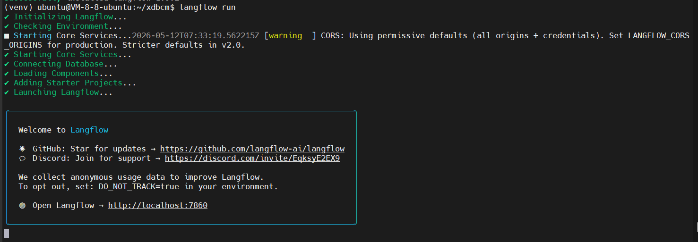
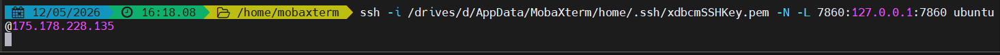
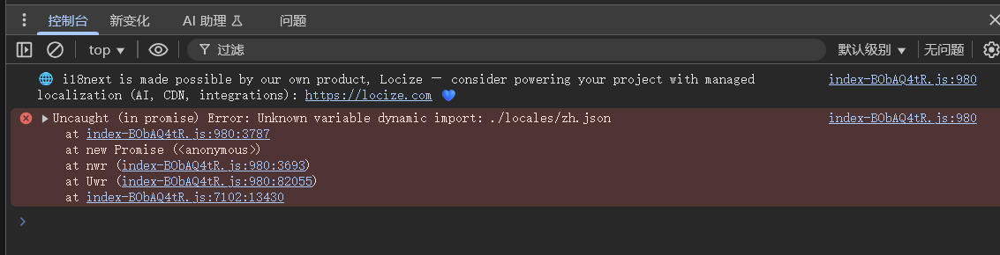
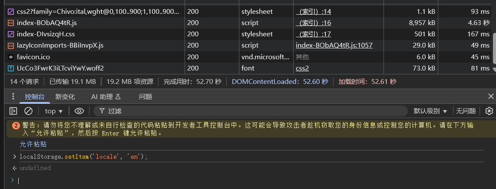
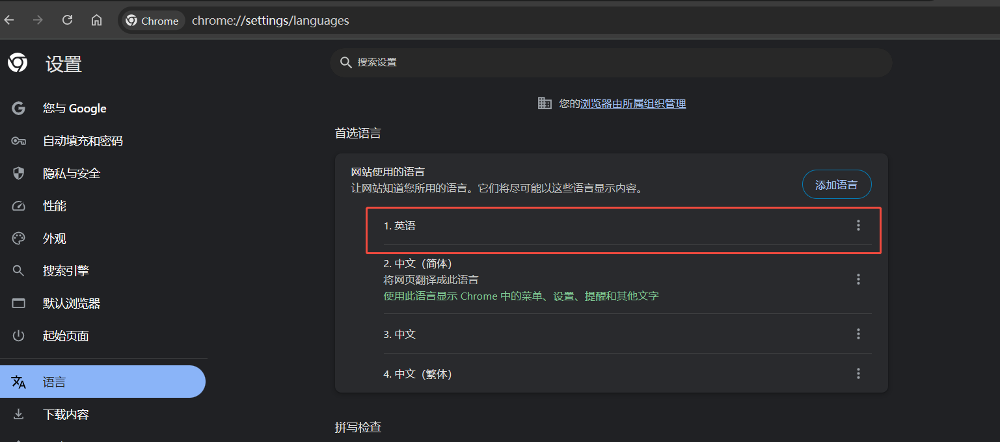

## 安装AI应用构建工具Langflow
```
python3 -m venv venv
source venv/bin/activate
pip install langflow
```
## 运行及访问
```
langflow run
```


本地pc配置ssh隧道
```
ssh -i /drives/d/AppData/MobaXterm/home/.ssh/xdbcmSSHKey.pem -N -L 7860:127.0.0.1:7860 ubuntu@175.178.228.135
```


本地pc浏览器访问 http://localhost:7860 无法展示，F12查看控制台报错


社区已有issue
https://github.com/langflow-ai/langflow/issues/12923

尝试社区workaround，通过代码设置语言仍然不生效


直接改浏览器语言后解决



