# Milvus编译

## 容器编译

拉取编译镜像

```
docker pull milvusdb/milvus-env:ubuntu22.04-latest
```

启动编译环境容器

```
docker run -d --name dev-milvus milvusdb/milvus-env:ubuntu22.04-latest
```

容器内配置代理加速conan下载包

conan配置代理，/root/.conan/conan.conf

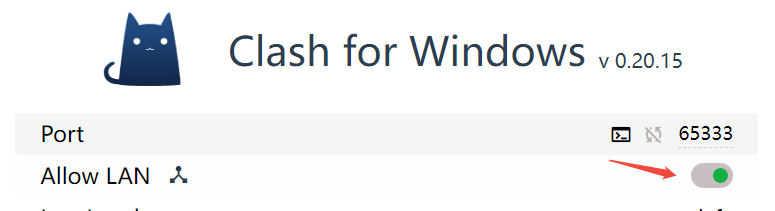

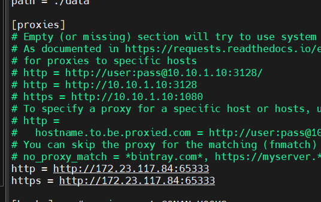


## 不带cgo编译（pkgconfig配置缺失无法成功）

使用官方开发容器(milvusdb/milvus-env:ubuntu22.04-latest)解决glibc版本问题

### 1、下载 protoc-gen-go && protoc-gen-go-grpc
```
go env -w GOPROXY=https://goproxy.cn,direct
go install google.golang.org/protobuf/cmd/protoc-gen-go@v1.33.0
go install google.golang.org/grpc/cmd/protoc-gen-go-grpc@v1.3.0
```
命令行默认下载到 GOPATH 下，可通过 go env查看

### 2、安装protoc
v3.21.4版本： https://github.com/protocolbuffers/protobuf/releases/tag/v21.4
找到合适protoc压缩包下载并解压
```
wget https://github.com/protocolbuffers/protobuf/releases/download/v21.4/protoc-21.4-linux-x86_64.zip
```
将二进制和公共库文件目录拷贝到cmake_build路径
```
mkdir -p /home/hhyan/milvus/cmake_build/
cp -r bin include  /home/hhyan/milvus/cmake_build/
```
注：include要拷贝过去，否则proto生成go报错 "google/protobuf/descriptor.proto: File not found."

### 3、下载 依赖 proto 并 编译proto文件

可以执行命令行手动下载
```
bash -x scripts/download_milvus_proto.sh
```
编译proto生成对应代码文件
```
make generated-proto-without-cpp
```

### 4、拷贝libjemalloc.so 和 libmilvus_core.so 到 milvus/internal/core/output/lib/ 目录下

要求环境libc版本必须>=2.35
```
mkdir -p ../milvus/internal/core/output/lib/
docker cp libmilvus_core.so env-milvus:/home/milvus/internal/core/output/lib/
docker cp libjemalloc.so env-milvus:/home/milvus/internal/core/output/lib/
```

### 5、编译milvus的go部分
```
go env -w GOPROXY=https://goproxy.cn,direct
go mod tidy
# 执行脚本检查依赖 libmilvus_core.so 和 libjemalloc.so
# 由于依赖glibc版本和复杂的配置，最好本地先编译出来
# 编译出动态库和生成配置之后，删除conan data目录仍然可以构建golang二进制
make build-cpp
# 用官方Makefile
make build-go
```

## 代码全量编译

ubuntu: 22.04

cmake: 3.26.4

pip3 install conan==1.64.1

go: 1.24.1

ram >= 6g (腾讯云vm配置swap分区解决内存紧张问题)

```
# conan 配置proxies
vim ~/.conan/conan.conf
make build-cpp
# cpp相关代码下载编译完成后，可以删除conan/data释放空间，不影响golang build
make build-go
```

## unitest

参考    development.md

```
# 需要先启动依赖三方组件
cd ./deployments/docker/dev
docker compose up -d

# 执行unitest脚本
make unittest
# 单独组件
make test-proxy
# 单独用例
source scripts/setenv.sh && go test -v -tags=test ./internal/proxy/ -test.run TestUpsertTask
```

## mock接口

```
source scripts/setenv.sh
make generate-mockery
```

# Troubleshooting on build

1、编译导致机器卡死

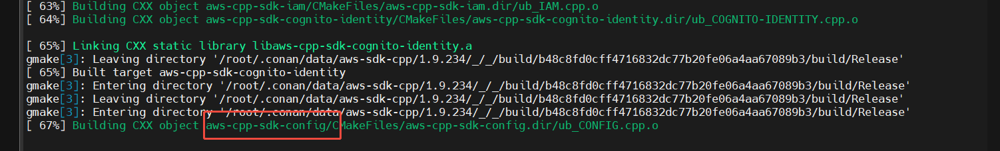

编译aws相关库导致内存耗尽，vm卡死

解决：本地ssd盘可考虑开启swap分区缓解内存问题

```
fallocate -l 8G /swapfile
chmod 600 /swapfile
mkswap /swapfile
swapon /swapfile
# 查看
swapon --show
# 开机自启动写入fstab
vim /etc/fstab
# 查看是否是否开启
free -mh 
```
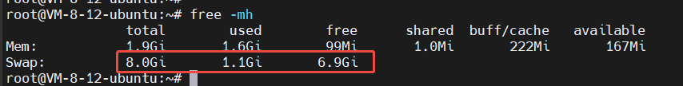

2、cmake版本太低

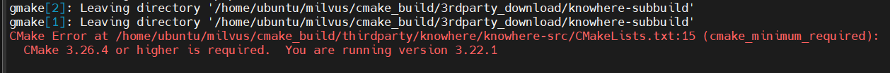

```
wget https://cmake.org/files/v3.26/cmake-3.26.4-linux-x86_64.tar.gz
tar xvf cmake-3.26.4-linux-x86_64.tar.gz
mv cmake-3.26.4-linux-x86_64 /usr/local/
ln -sf /usr/local/cmake-3.26.4-linux-x86_64/bin/* /usr/bin/
```

3、Could NOT find BLAS (missing: BLAS_LIBRARIES)

Could NOT find aio (missing: AIO_LIBRARIES AIO_INCLUDE_DIR)

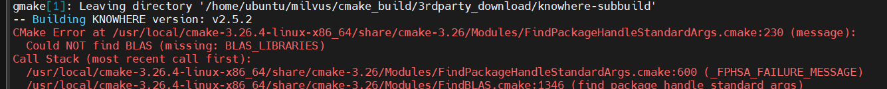

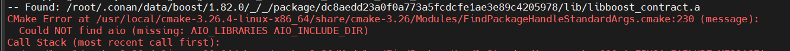

解决

```
# 安装blas库
apt-get install -y libopenblas-dev libaio-dev
```
4、编译出来的二进制无法链接部分库文件

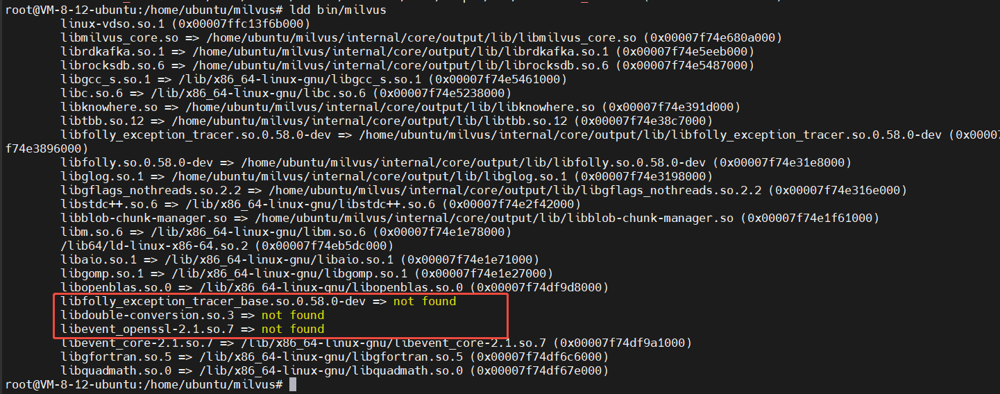

说明：实际上这几个库文件都在 /home/ubuntu/milvus/internal/core/output/lib/ 路径下

进一步定位，实际上这些not found的库是libmilvus_core.so没查找到，说明是二层查找找不到后，二进制直接依赖失败（RUNPATH只会影响当前ELF文件的直接依赖项，不会传递给间接依赖）

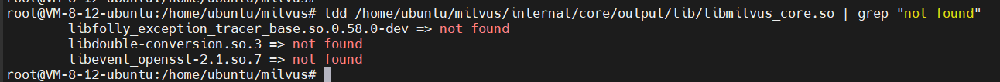

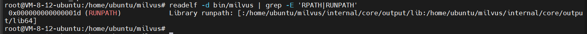

可以按照lddtree进一步排查依赖链

```
apt install pax-utils -y
```

lddtree 查看第一层同路径的/home/ubuntu/milvus/internal/core/output/lib/下的库都找到了，但是间接依赖没找到

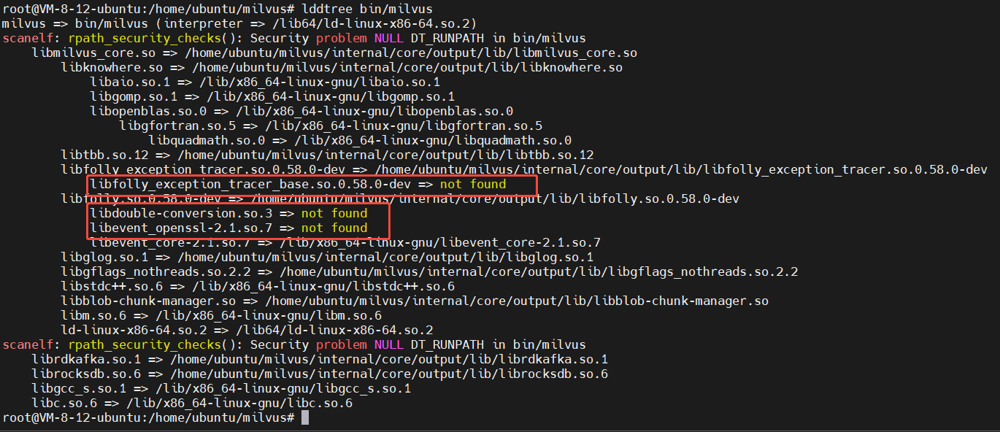

LD_DEBUG=libs ldd /home/ubuntu/milvus/internal/core/output/lib/libmilvus_core.so 2>&1  | grep -E 'RPATH|RUNPATH'

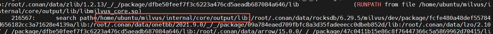

libmilvus_core.so的RUNPATH是包含这个路径的，所以这个库的直接依赖也是都可以找到的，符合lddtree展示内容

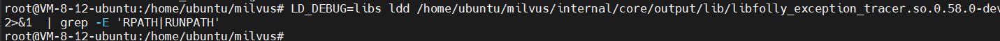

libfolly_exception_tracer.so.0.58.0-dev没有设置RPATH|RUNPATH，故而在默认的查找路径下找不到依赖的 base库 libfolly_exception_tracer_base.so.0.58.0-dev

```
LD_DEBUG=libs ldd /home/ubuntu/milvus/internal/core/output/lib/libfolly_exception_tracer.so.0.58.0-dev 2>&1 | grep libfolly_exception_tracer_base.so.0.58.0-dev
```

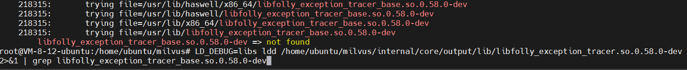

解决办法：运行前指定 LD_LIBRARY_PATH 解决间接依赖库找不到问题

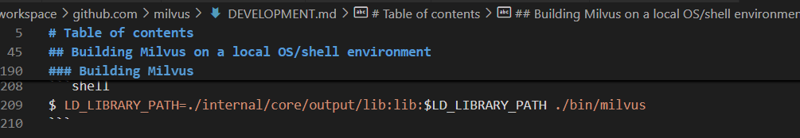

5、unitest报错：internal/proxy/authentication_interceptor_test.go:122:12: undefined: hookutil.SetMockAPIHook

函数是存在的

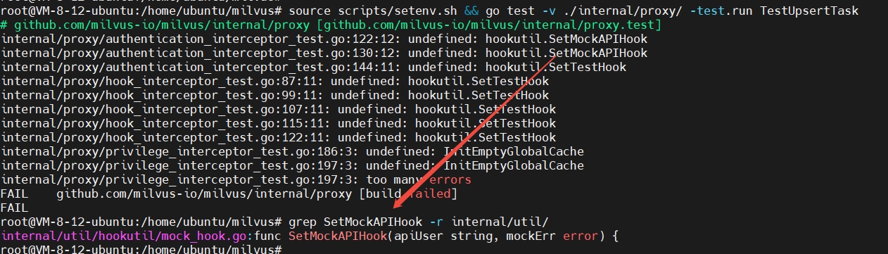

查看脚本

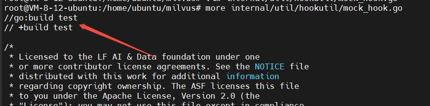

解决：go test 指定对应标签 -tags=test
```
go test -v -tags=test ./internal/proxy/ -test.run TestUpsertTask
```

6、编译报错

ProxyError('Cannot connect to proxy.', NewConnectionError('<urllib3.connection.HTTPSConnection object at 0x7fae6aa796c0>:
Failed to establish a new connection: [Errno 111] Connection refused')

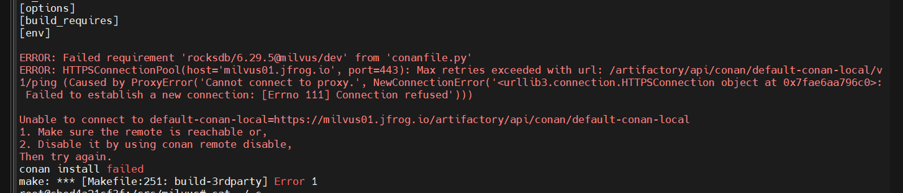

解决：编辑配置conan代理 ~/.conan/conan.conf

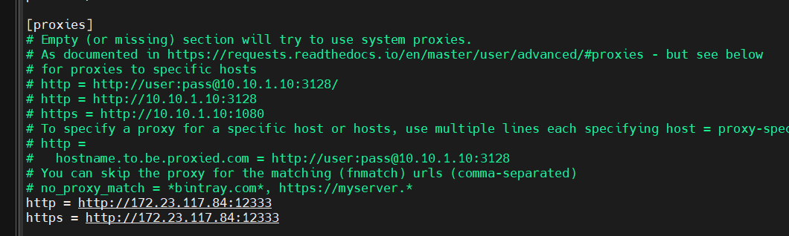

7、跳过三方包编译

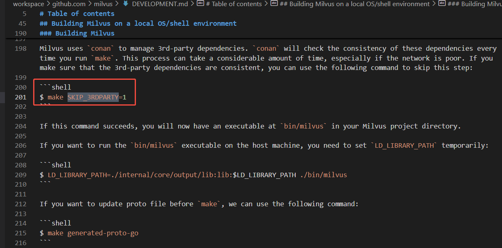

8、mock报错 2025/04/21 11:45:15 internal error: package "context" without types was imported from "github.com/milvus-io/milvus/internal/types"

原因：mockey与golang版本不兼容：https://github.com/vektra/mockery/pull/915

解决：Makefile中修改mockery版本为2.52.2


