## 1、数据持久化流程

一个虚拟通道只能分配给一个datanode，确保一条数据只被处理一次

One vchannel can only be assigned to one data node.

https://milvus.io/blog/deep-dive-4-data-insertion-and-data-persistence.md

Growing segment sorted by timestamp 达到读取未上传的数据的一致性

## 2、客户端调用flush指令

```
FulashAll/Flush(Proxy)->flushTask->dcQueue(data control queue)->controlLoop->scheduleDcTask->TaskScheduler.processTask(PreExecute->Execute->PostExecute)
```

## 3、DataNode定时上报

```
NewTimeTickSender(DataNode)->TimeTickSender.work(for loop定时执行)
  ->sendReport->ReportTimeTick->ReportDataNodeTtMsgs(调用DataCoordClient)
  ->handleDataNodeTtMsg
    ->GetFlushableSegments
	  ->tryToSealSegment(growing->sealed)
	    ->segmentSealPolicies
		->channelSealPolicies
		  ->sealByTotalGrowingSegmentsSize(sealed max size segment in growing segment)
	  ->flushPolicy(default flushPolicyL1)
    ->ClusterImpl Flush->DataNodeManagerImpl Flush->execFlush
      ->FlushSegments(DataNodeClient async)
	    ->writeBufferManager.SealSegments(datacoord已经sealed了，这里是进行持久化)->bufferManager SealSegments->writeBufferBase sealSegments
          ->UpdateSegments(Growing->Sealed)

Compaction
  -> UpdateSegment
```

## 4、持久化segment
### 启动持久化同步workerpool
```
datanode.Init->NewSyncManager
  ->newKeyLockDispatcher(start keyLockDispatcher workerPool)

  # 定时检查writer buffer使用量
  ->NewManager->bufferManager.Start->check(MemoryCheckInterval for loop)
  ->memoryCheck->EvictBuffer->syncSegments
    ->getSyncTask->EncodeBuffer->NewSyncTask to create SyncTask
    ->syncMgr.SyncData->safeSubmitTask->keyLockDispatcher.Submit(workerPool.Submit)
	  # submit的时候带上执行内容Task Run
	  ->Task Run(ctx)->callbacks

  # 工作流处理msg触发同步
  ->datanode pipeline writeNode.Operate
    ->bufferManager BufferData->l0WriteBuffer BufferData->triggerSync->syncSegments
	  ->getSyncTask->EncodeBuffer->NewSyncTask to create SyncTask
	  ->syncMgr.SyncData->safeSubmitTask->keyLockDispatcher.Submit(workerPool.Submit)
	    ->Task Run(ctx)->callbacks
```

### 实际进行持久化同步的逻辑

```
SyncTask Run
  ->processInsertBlobs->appendBinlog
  ->processStatsBlob->convertBlob2StatsBinlog->appendStatslog
  ->processDeltaBlob->appendDeltalog
  ->processBM25StastBlob->appendBM25Statslog
  ->writeLogs->chunkManager.MultiWrite
    ->RemoteChunkManager MultiWrite->RemoteChunkManager Write->client.PutObject
	||->LocalChunkManager MultiWrite(writes the data to local storage)->os.WriteFile
  ->writeMeta->metaWriter.UpdateSync
    ->dataCoordBroker SaveBinlogPaths
    ->UpdateSegments->SetStartPosRecorded(true)
```

## 5、TSO timetick流程

```
rootcoord startServerLoop
  ->startTimeTickLoop->sendMinDdlTsAsTt
```

## 6、segment的高可用保证

```
DataNode启动->注册->DataCoord通知->为每个channel创建 flowgraph loop 处理消息流
Notify(DataCoord) call NotifyChannelOperation(DataNode)
  ->Submit(info)
  ->getOrCreateRunner(channel)->executeWatch(每个channel)
  ->NewDataSyncService
    ->createNewInputFromDispatcher: GetSeekPosition 从 datacoord 获取恢复位置
    ->getServiceWithChannel(flowgraph: dmStreamNode->ddNode->writeNode->ttNode)
```

## 7、milvus集群模式无法使用embedded etcd
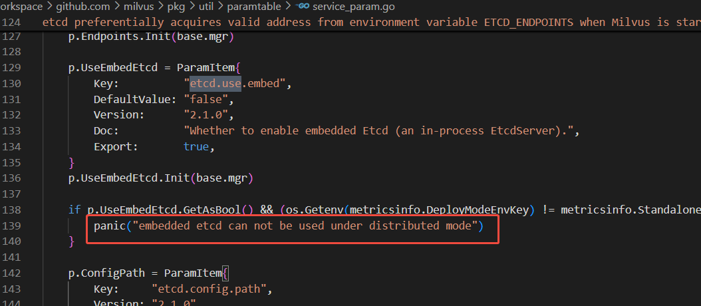

## 8、配置不使用minio/s3
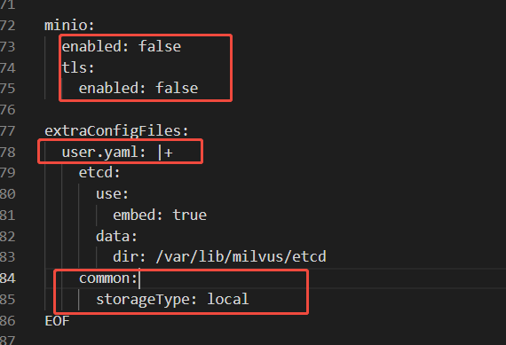

helm中values.yaml

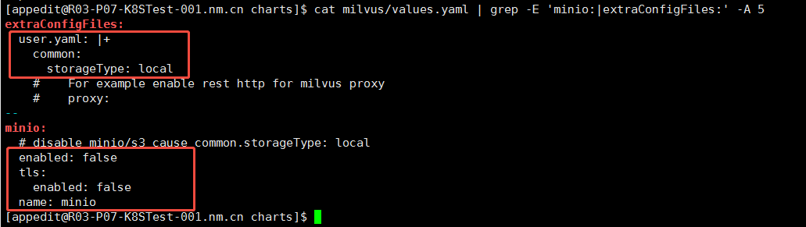

但是配置本地盘有问题！！！

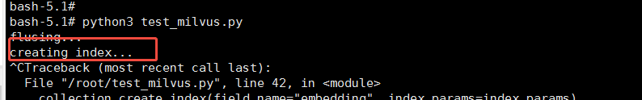

create_index会卡住，查看indexnode日志报错

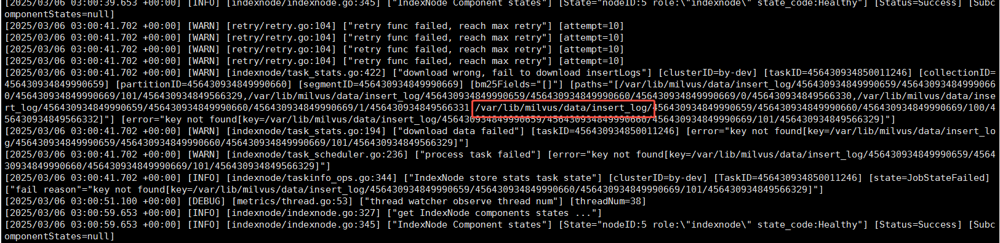

原因：indexnode需要从datanode获取IOBinlog进行构建索引，本地存储数据不同步无法操作

解决：配置nfs pvc或者对接s3/minio


## 9、协调器副本有一个无法ready

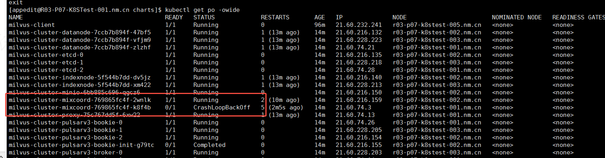

解决：配置activeStandby

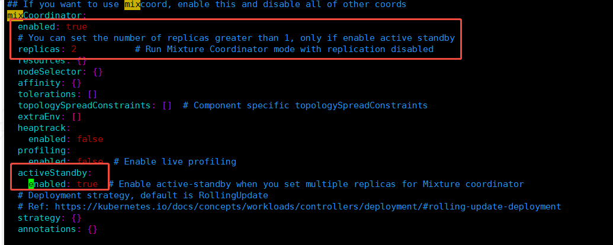

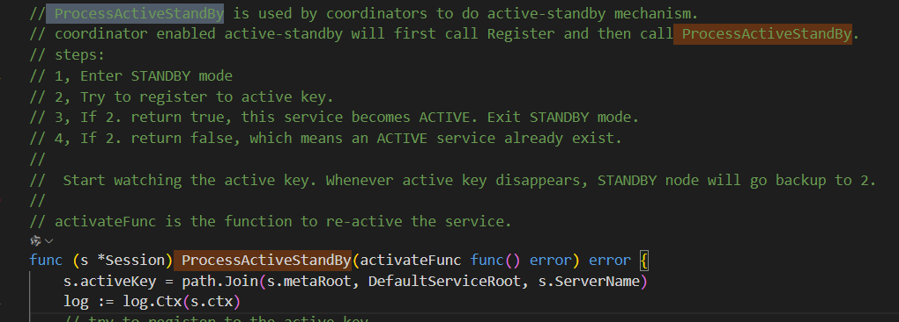

## 10、StreamingNode 是v2.5.x新特性，用于替换pulsar

https://github.com/milvus-io/milvus/issues/33285

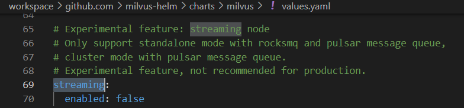


## 11、Package milvus_core was not found in the pkg-config search path.

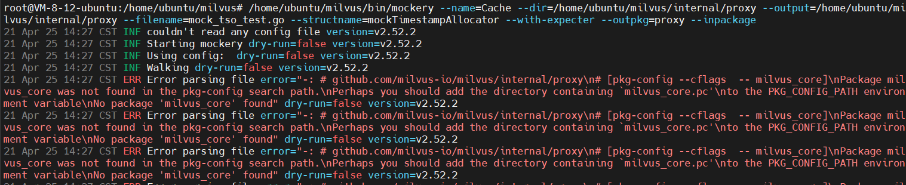

解决：环境变量初始化

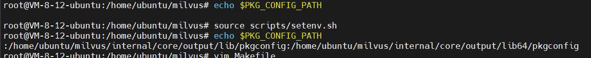

## 12、milvus helm 如果部署集群版，需要配置pvc为ReadWriteMany，否则ReadWriteOnce会导致引用的pod分配到同一个Node上

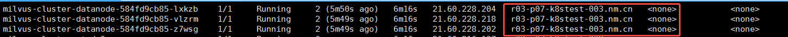

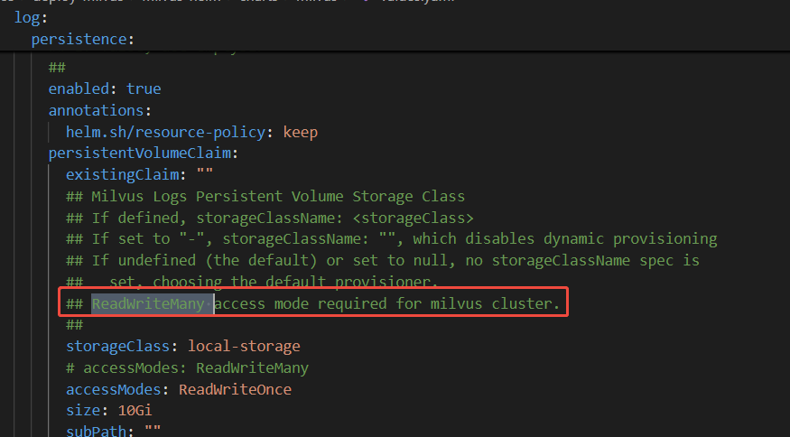

！！！另外解决方法 statefulset+volumeClaimTemplates (deployment需要切换成statefulset，无状态默认数据共享)会单独创建pvc：

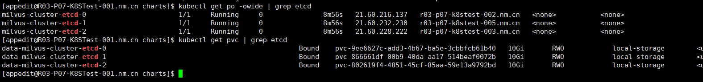

## 13、mixcoord总是报错 "bad resolver state"

原因：steamingnode 服务发现默认启动，但是服务端未启动，则打印报错

https://github.com/milvus-io/milvus/issues/40311


## 14、mixcoord服务没有监听9099端口，导致liveness和readiness一直无法通过

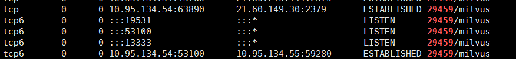

原因：查看端口9099已经被插件calico插件占用

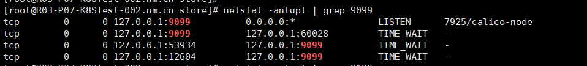

解决：mixcoord服务换个metrics端口
