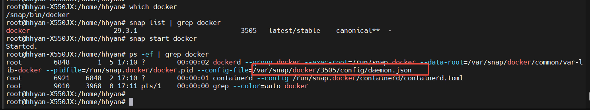
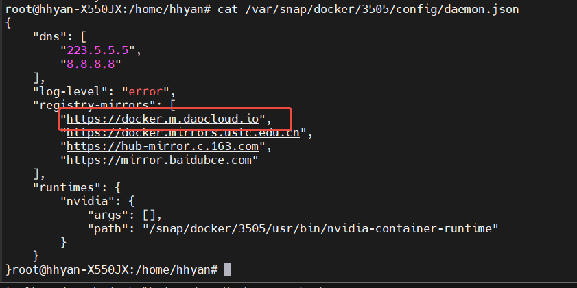
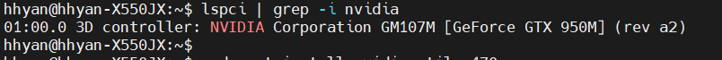
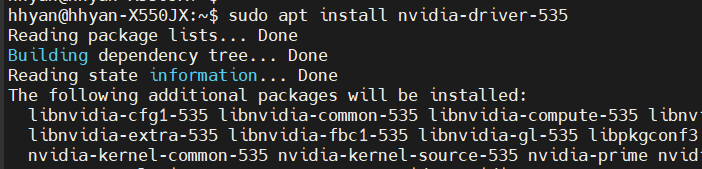
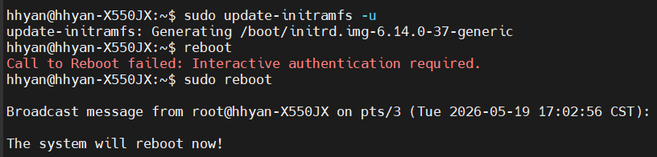
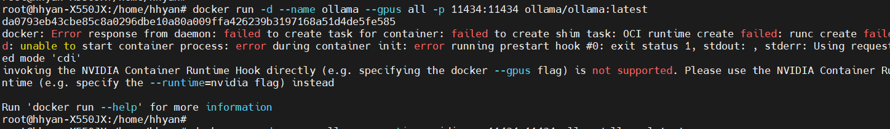
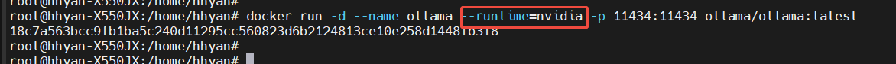
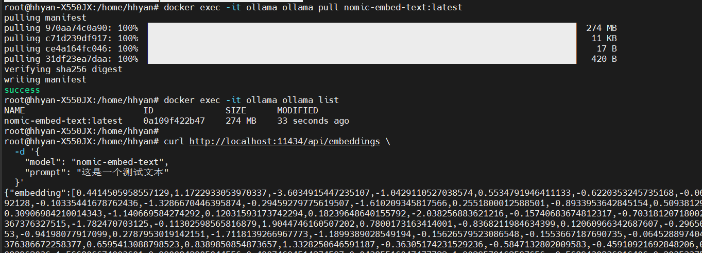

## 配置docker国内源
查看docker安装方式
```
systemctl status docker
which docker
snap list | grep docker
```


修改配置添加docker国内源
```
https://docker.m.daocloud.io
```


## 安装nvidia驱动

查看是否有NVIDIA显卡信息
```
lspci | grep -i nvidia
```


安装nvidia驱动
```
sudo apt install nvidia-driver-530
```


更新内核模块依赖并重建 initramfs
```
sudo update-initramfs -u
sudo reboot
```


## ollama拉起并运行模型
运行ollama容器
```
docker run -d --name ollama -p 11434:11434 ollama/ollama:latest
```


使用 --runtime=nvidia 参数替换 --gpus all 参数
```
docker run -d --name ollama --runtime=nvidia -p 11434:11434 ollama/ollama:latest
```


拉取并测试模型
```
docker exec -it ollama ollama pull nomic-embed-text:latest
docker exec -it ollama ollama list

curl http://localhost:11434/api/embeddings \
  -d '{
    "model": "nomic-embed-text",
    "prompt": "这是一个测试文本"
  }'

```


> 测试模型返回的向量

