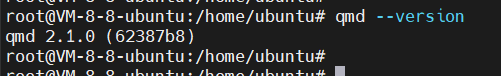

## 1、配置qmd

节点上安装qmd

```
npm i -g bun
bun install -g github:tobi/qmd --registry https://registry.npmjs.org
```

查看qmd安装结果




直接让openclaw配置每个agent的记忆后端为qmd

## 2、配置自我进化技能

直接让openclaw "给每个agent安装并启用 self-improving-agent 这个skill"
