## 一元拦截器

gRPC拦截器：https://studygolang.com/articles/23942

UnaryServerInterceptor 即一元拦截器，拦截一元RPC请求。

所谓一元RPC请求即基于http2.0的grpc请求和响应都是一次完成，与流式rpc多次进行响应区分。

## gdb调试golang二进制包

1、拷贝代码包到节点上对应路径下(与二进制编译路径一致)

2、golang编译打开debugging选项 -gcflags "all=-N -l"  去掉其它优化选项

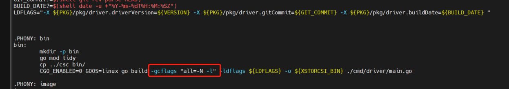

3、gdb使用--args指明需要跟参数，否则直接 gdb xstorecsi 即可

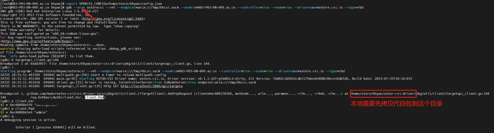

* 以上调试得知配置文件中usr/pass错位了

## 引入hmsclient

缺少 github.com/akolb1/gometastore/hmsclient

go get github.com/akolb1/gometastore/hmsclient

后仍然报错

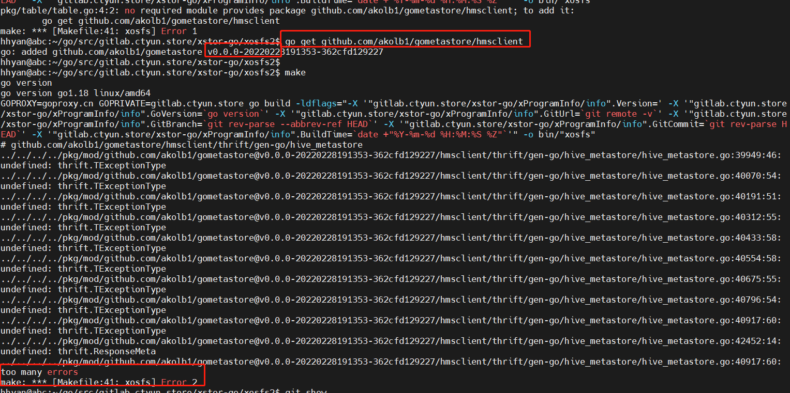

原因：thrift包版本问题

解决：手动引入指定的thrift包

go get github.com/apache/thrift@v0.16.0

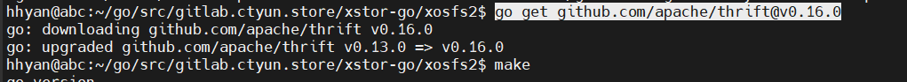

## 二进制包单元测试

单元测试文件直接编译成二进制
```
GOOS=linux go test pkg/lib/disk/lib/spdk_test.go -c -o prepare_listener.test
```
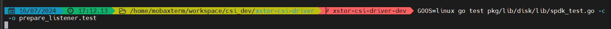

上传二进制执行测试
```
chmod +x prepare_listener.test
./prepare_listener.test -test.v
```
注： -test.v会打印详细输出

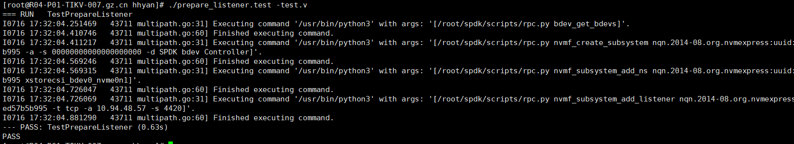

## 引进私有库

go项目引进私有库后执行和构建出现一系列的问题

### 1、fatal: could not read Username

go get gitlab.ctyun.store/xstor-go/xProgramInfo

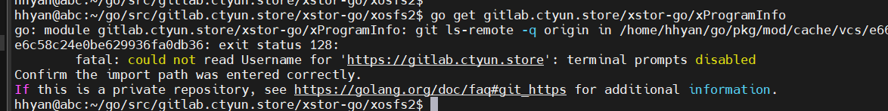

原因：使用https方式拉取，读取不到username/pass

解决：

（1）换成git方式，使用git需要ssh的22端口，服务端不支持，放弃

（2）直接将账号密码替换到访问链接中
```
git config --global --add url."https://yanhuih:<gitlabPassword>@gitlab.ctyun.store/".insteadOf "https://gitlab.ctyun.store/"
```
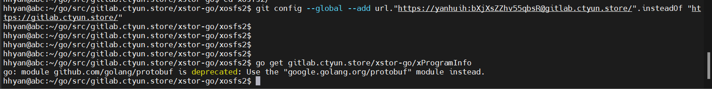

再使用git-credentials **
```
git config --global credential.helper store
```
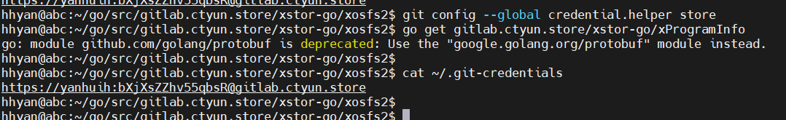

* 注：这里需要加--global使用全局，目前没找到局部（不用--global) .git配置多个项目使用credential的办法

### 2、私有库通过goproxy访问不通
解决：配置 GOPRIVATE
go env -w GOPRIVATE=gitlab.ctyun.store

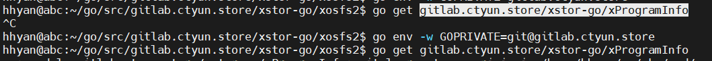

### 3、配置GOPRIVATE/GONOPROXY后仍然会走代理

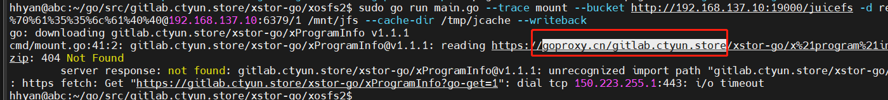

原因：使用sudo后用root的配置
解决：sudo go env -w GOPRIVATE=gitlab.ctyun.store 配置

### 4、使用sudo后 fatal: could not read Username for

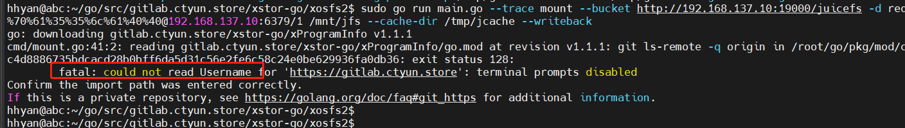

原因：与3相同，sudo后切换到root账号
解决：sudo git config --global credential.helper store
来配置credential免密

### 5、gnutls_handshake() failed: Public key signature verification has failed

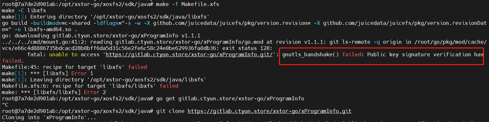

原因：libcurl3-gnutls 版本问题

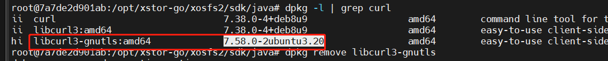

解决：卸载重新安装即可
```
apt remove libcurl3-gnutls；apt install libcurl3-gnutls
```
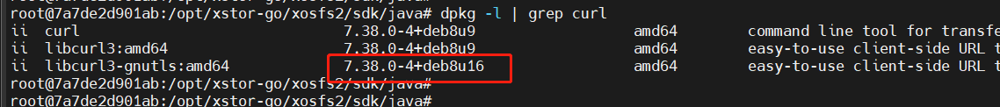
