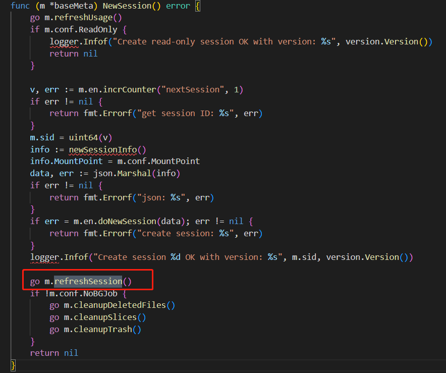

挂载后启动refreshsession协程



热加载配置流程

```
func (m *baseMeta) refreshSession() {
    for {
        // 间隔 heartbeat 向元服务器发起心跳，并执行refresh动作
        utils.SleepWithJitter(m.conf.Heartbeat)
        m.Lock()
        if m.umounting {
            m.Unlock()
            return
        }
        m.en.doRefreshSession()
        m.Unlock()
        old := m.fmt.UUID
        // Load重加载settings
        if _, err := m.Load(false); err != nil {
            logger.Warnf("reload setting: %s", err)
        } else if m.fmt.MetaVersion > MaxVersion {
            logger.Fatalf("incompatible metadata version %d > max version %d", m.fmt.MetaVersion, MaxVersion)
        } else if m.fmt.UUID != old {
            logger.Fatalf("UUID changed from %s to %s", old, m.fmt.UUID)
        }
        if m.conf.NoBGJob {
            continue
        }
        if ok, err := m.en.setIfSmall("lastCleanupSessions", time.Now().Unix(), int64(m.conf.Heartbeat/time.Second)); err != nil {
            logger.Warnf("checking counter lastCleanupSessions: %s", err)
        } else if ok {
            go m.CleanStaleSessions()
        }
    }
}
```
```
func (m *baseMeta) Load(checkVersion bool) (*Format, error) {
    body, err := m.en.doLoad()
    if err == nil && len(body) == 0 {
        err = fmt.Errorf("database is not formatted, please run `xosfs format ...` first")
    }
    if err != nil {
        return nil, err
    }
    // 将json中的settings内容解析到fmt中
    if err = json.Unmarshal(body, &m.fmt); err != nil {
        return nil, fmt.Errorf("json: %s", err)
    }
    if checkVersion {
        if err = m.fmt.CheckVersion(); err != nil {
            return nil, fmt.Errorf("check version: %s", err)
        }
    }
    return &m.fmt, nil
}
```