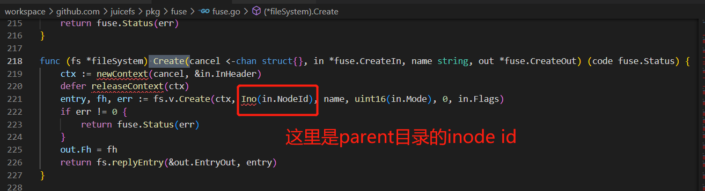
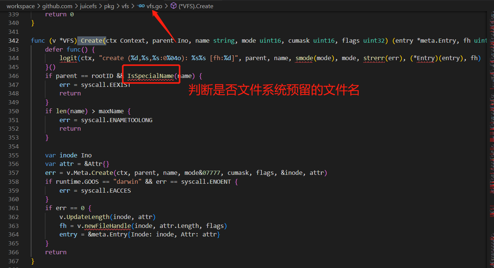
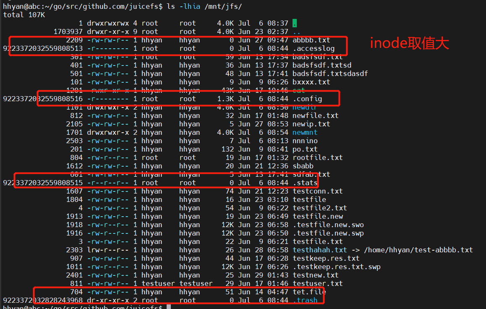
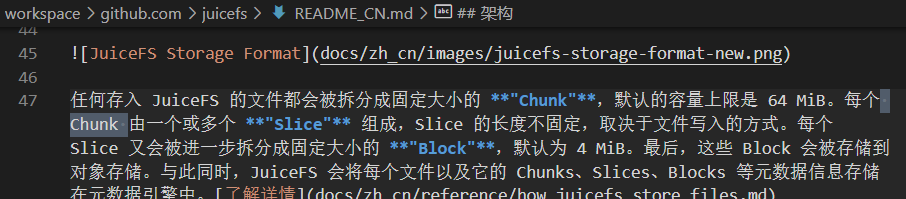

# 创建文件逻辑





IsSpecialName 判断是否特殊文件



doReaddir 读取目录元信息逻辑

```go
func (m *redisMeta) doReaddir(ctx Context, inode Ino, plus uint8, entries *[]*Entry, limit int) syscall.Errno {
    var stop = errors.New("stop")
    err := m.hscan(ctx, m.entryKey(inode), func(keys []string) error {
        // len(keys)/2, 是因为d<nodeid>下存的是文件名、对应属性、文件名、对应属性……这样顺序排列
        newEntries := make([]Entry, len(keys)/2)
        newAttrs := make([]Attr, len(keys)/2)
        for i := 0; i < len(keys); i += 2 {
            // byte(typ)bytes(ino)
            typ, ino := m.parseEntry([]byte(keys[i+1]))
            if keys[i] == "" {
                logger.Errorf("Corrupt entry with empty name: inode %d parent %d", ino, inode)
                continue
            }
            ent := &newEntries[i/2]
            ent.Inode = ino
            ent.Name = []byte(keys[i])
            ent.Attr = &newAttrs[i/2]
            ent.Attr.Typ = typ
            *entries = append(*entries, ent)
            if limit > 0 && len(*entries) >= limit {
                return stop
            }
        }
        return nil
    })
    if errors.Is(err, stop) {
        err = nil
    }
    if err != nil {
        return errno(err)
    }

    if plus != 0 {
        // 对目录下的entry获取其属性
        fillAttr := func(es []*Entry) error {
            var keys = make([]string, len(es))
            for i, e := range es {
                // 从key为 i<nodeid> 下获取具体属性
                keys[i] = m.inodeKey(e.Inode)
            }
            rs, err := m.rdb.MGet(ctx, keys...).Result()
            if err != nil {
                return err
            }
            for j, re := range rs {
                if re != nil {
                    if a, ok := re.(string); ok {
                        m.parseAttr([]byte(a), es[j].Attr)
                    }
                }
            }
            return nil
        }
        batchSize := 4096
        nEntries := len(*entries)
        if nEntries <= batchSize {
            err = fillAttr(*entries)
        } else {
            // 如果目录下的entry超过4096个，则并发2个goroutine同时处理，使用chan
            // chan允许缓存10次写入，写入一次range会读出一次
            indexCh := make(chan []*Entry, 10)
            var wg sync.WaitGroup
            for i := 0; i < 2; i++ {
                wg.Add(1)
                go func() {
                    defer wg.Done()
                    for es := range indexCh {
                        // 这里range不是python的遍历列表，而是从chan中读取消费一次数据
                        // 没有数据会阻塞，除非chan关闭后退出
                        e := fillAttr(es)
                        if e != nil {
                            err = e
                            break
                        }
                    }
                }()
            }
            for i := 0; i < nEntries; i += batchSize {
                // 每次最多写入batchsize个entry，goroutine range每次最多读出batchsize个
                if i+batchSize > nEntries {
                    indexCh <- (*entries)[i:]
                } else {
                    indexCh <- (*entries)[i : i+batchSize]
                }
            }
            // 关闭chan退出
            close(indexCh)
            wg.Wait()
        }
        if err != nil {
            return errno(err)
        }
    }
    return 0
}
```

`d<nodeid>`下数据的组织形式

```
127.0.0.1:6379[1]> HGETALL d1701
1) "nabbb.t"
2) "\x01\x00\x00\x00\x00\x00\x00\n\x97"
3) "nabbb.ta"
4) "\x01\x00\x00\x00\x00\x00\x00\n\xf4"
```
TxPipelined: 打包一次性发给redis顺序执行



prepareID 生成chunkid
```go
func (m *baseMeta) NewChunk(ctx Context, chunkid *uint64) syscall.Errno {
    // 获取当前的chunkid，如果超过了redis记录的nextChunk，则nextchunk自增chunkIDBatch=1000
    // next自增1
    m.freeMu.Lock()
    defer m.freeMu.Unlock()
    if m.freeChunks.next >= m.freeChunks.maxid {
        v, err := m.en.incrCounter("nextChunk", chunkIDBatch)
        if err != nil {
            return errno(err)
        }
        m.freeChunks.next = uint64(v) - chunkIDBatch
        m.freeChunks.maxid = uint64(v)
    }
    *chunkid = m.freeChunks.next
    m.freeChunks.next++
    return 0
}
```
通过chunkid计算对象keyname
```go
func (c *rChunk) key(indx int) string {
    if c.store.conf.HashPrefix {
        return fmt.Sprintf("chunks/%02X/%v/%v_%v_%v", c.id%256, c.id/1000/1000, c.id, indx, c.blockSize(indx))
    }
    return fmt.Sprintf("chunks/%v/%v/%v_%v_%v", c.id/1000/1000, c.id/1000, c.id, indx, c.blockSize(indx))
}
```
