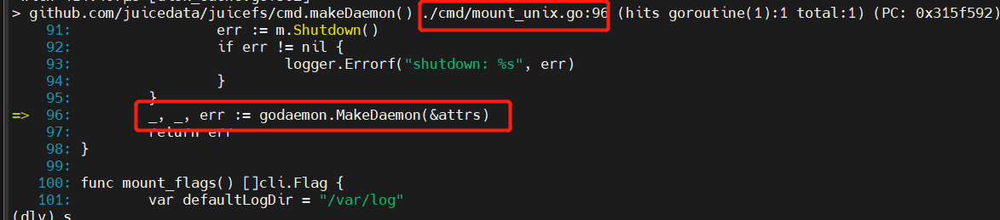
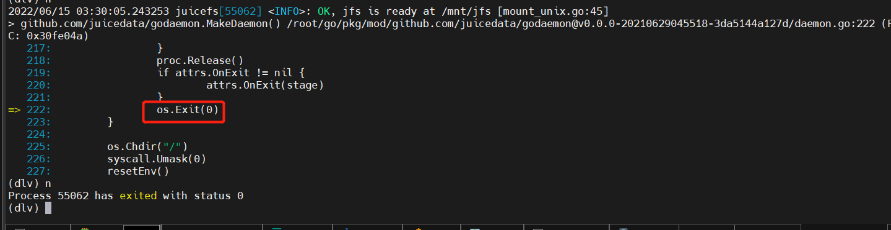
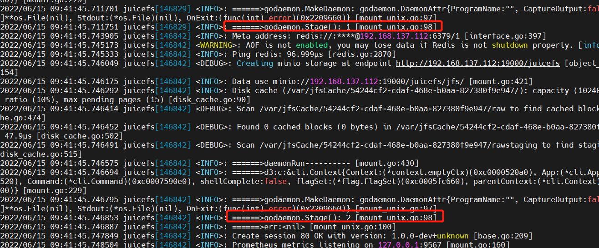
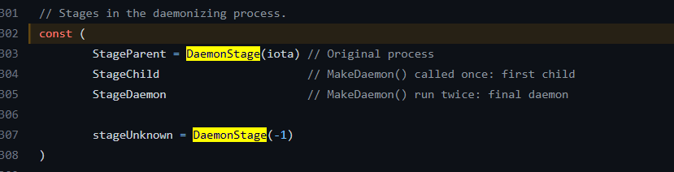
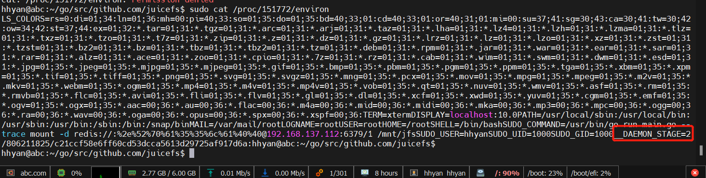
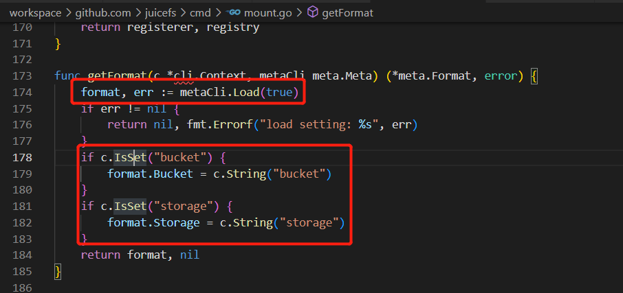
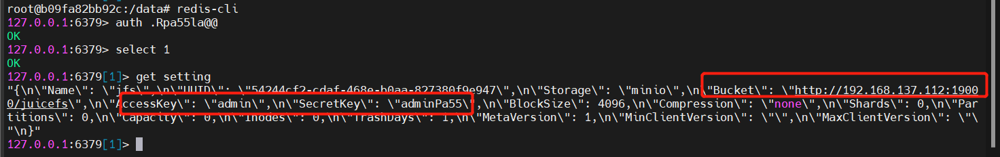
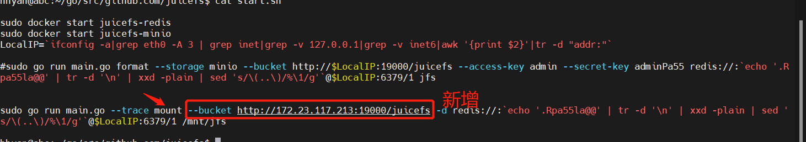

# mount 流程

## 进程启动逻辑

根据go build constraint 只include/编译mount_unix.go (同一个包包含同名函数方法)

godaemon.MakeDaemon 启动新进程后退出

启动流程总共启动三个进程，前两个进程会退出，由godaemon.stage控制

https://github.com/juicedata/godaemon/blob/master/daemon.go#L302

stage<2会继续启动新进程：
https://github.com/juicedata/godaemon/blob/master/daemon.go#L172

stage会写入到环境变量中进行记录

mount过程从redis缓存读取文件实际存储（对象存储）所在位置

实际存储情况

如果对象存储的ip地址更换，可以在mount时指定bucket地址来调整

