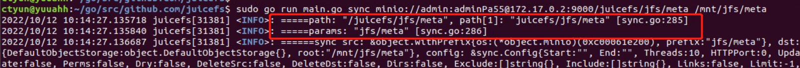

# 数据同步逻辑

异步生产者
```
// tasks 是用于接收任务obj的channel，异步的work协程会接收最终处理该obj
// 相当于两个有序的消息队列，相互比对元素。队列A的元素同步到队列B中，队列B中不存在的元素根据配置删除掉
// 注：这里边的range不是获取列表内容，而是取有序的channel队列的元素
func produce(tasks chan<- object.Object, src, dst object.ObjectStorage, srckeys, dstkeys <-chan object.Object, config *Config) {
    defer close(tasks)
    var dstobj object.Object
    for obj := range srckeys {
        if obj == nil {
            logger.Errorf("Listing failed, stop syncing, waiting for pending ones")
            return
        }
        if !config.Dirs && obj.IsDir() {
            logger.Debug("Ignore directory ", obj.Key())
            continue
        }
        if config.Limit >= 0 {
            if config.Limit == 0 {
                return
            }
            config.Limit--
        }
        handled.IncrTotal(1)
        // 上一轮 srcobj < dstobj 的情况，这一轮取下一个srcobj继续比对
        if dstobj != nil && obj.Key() > dstobj.Key() {
            if config.DeleteDst {
                if deleteFromDst(tasks, dstobj, config) {
                    // 如果delete报错则return，否则继续
                    return
                }
            }
            dstobj = nil
        }
        if dstobj == nil {
            for dstobj = range dstkeys {
                if dstobj == nil {
                    logger.Errorf("Listing failed, stop syncing, waiting for pending ones")
                    return
                }
                if obj.Key() <= dstobj.Key() {
                    break
                }
                // 说明dstobj在src中不存在，配置删除的话这里需要删除掉
                if config.DeleteDst {
                    if deleteFromDst(tasks, dstobj, config) {
                        return
                    }
                }
                dstobj = nil
            }
        }

        // FIXME: there is a race when source is modified during coping
        // obj.Key() <= dstobj.Key() 进入到这个 if-else
        if dstobj == nil || obj.Key() < dstobj.Key() {
            // 说明obj不存在在dst中，默认拷贝
            tasks <- obj
        } else { // obj.key == dstobj.key
            // 在dst中找到相同dstobj的情况
            if config.ForceUpdate ||
                (config.Update && obj.Mtime().Unix() > dstobj.Mtime().Unix()) ||
                (!config.Update && obj.Size() != dstobj.Size()) {
                // 强制copy
                tasks <- obj
            } else if config.Update && obj.Mtime().Unix() < dstobj.Mtime().Unix() {
                skipped.Increment()
                handled.Increment()
            } else if config.CheckAll { // two objects are likely the same
                tasks <- &withSize{obj, markChecksum}
            } else if config.DeleteSrc {
                // 删除srcobj
                tasks <- &withSize{obj, markDeleteSrc}
            } else if config.Perms && needCopyPerms(obj, dstobj) {
                // 同步 Perms
                tasks <- &withFSize{obj.(object.File), markCopyPerms}
            } else {
                // 跳过不同步
                skipped.Increment()
                handled.Increment()
            }
            dstobj = nil
        }
    }
    // 上述已经比对过了，剩下的dstobj都是 > src中所有的元素，根据配置全部delete即可
    if config.DeleteDst {
        if dstobj != nil {
            if deleteFromDst(tasks, dstobj, config) {
                return
            }
        }
        for dstobj = range dstkeys {
            if dstobj != nil {
                if deleteFromDst(tasks, dstobj, config) {
                    return
                }
            }
        }
    }
}
```
路径处理
```
        if strings.Count(u.Path, "/") > 1 {
            // skip bucket name
            // 举例 minio://<User>:<Password>@<IP>:<Port>/<Bucket>/aa/bb/cc
            // 则u.Path: /<Bucket>/aa/bb/cc
            // 这里传入的prefix去掉桶名，纯路径做前缀
            store = object.WithPrefix(store, strings.SplitN(u.Path[1:], "/", 2)[1])
        }
```
