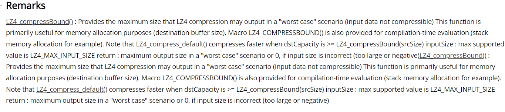

# 上传分块

## 上传一个chunk逻辑
```
    func (c *wChunk) upload(indx int) {
        // min(对应chunk剩余数据大小, 4194304B=4M)，
        // 如果是非chunk最后一个block，应该是4M，最后一个block根据实际数据量
        blen := c.blockSize(indx)
        key := c.key(indx)
        pages := c.pages[indx]
        c.pages[indx] = nil
        c.pendings++
    
        go func() {
            var block *Page
            var off int
            if len(pages) == 1 {
                // 只有一个page的情况是writeAt中indx>=1，一个page 4M
                block = pages[0]
                off = len(block.Data)
            } else {
                // 多个pages的情况是writeAt中indx=0，一个page 64k
                // 这里从堆上重新申请数据量大小的block，并把pages的数据按顺序拷贝过去
                block = NewOffPage(blen)
                for _, b := range pages {
                    off += copy(block.Data[off:], b.Data)
                    freePage(b)
                }
            }
            if off != blen {
                panic(fmt.Sprintf("block length does not match: %v != %v", off, blen))
            }
            if c.store.conf.Writeback {
                // 如果开启回写，异步落盘
                stagingPath, err := c.store.bcache.stage(key, block.Data, c.store.shouldCache(blen))
                if err != nil {
                    //写入本地错误，直接上传，相当于writeback不生效
                    logger.Warnf("write %s to disk: %s, upload it directly", stagingPath, err)
                } else {
                    c.errors <- nil
                    if c.store.conf.UploadDelay == 0 {
                        // 如果UploadDelay为0
                        select {
                        // 上传之前先 store.currentUpload <- true，避免其它goroutine重复upload
                        case c.store.currentUpload <- true:                        
                            defer func() { <-c.store.currentUpload }()
                            if err = c.store.upload(key, block, nil); err == nil {
                                c.store.bcache.uploaded(key, blen)
                                if os.Remove(stagingPath) == nil {
                                    stageBlocks.Sub(1)
                                    stageBlockBytes.Sub(float64(blen))
                                }
                            } else { // add to delay list and wait for later scanning
                                c.store.addDelayedStaging(key, stagingPath, time.Now().Add(time.Second*30), false)
                            }
                            return
                        default:
                        }
                    }
                    block.Release()
                    // UploadDelay不为零，等待scanDelayedStaging轮询到UploadDelay时间后执行uploadStagingFile上传
                    c.store.addDelayedStaging(key, stagingPath, time.Now(), c.store.conf.UploadDelay == 0)
                    return
                }
            }
            // 没有配置writeback缓存回写，直接上传
            c.store.currentUpload <- true
            defer func() { <-c.store.currentUpload }()
            c.errors <- c.store.upload(key, block, c)
        }()
    }
```

## 上传一个block的逻辑

```
func (store *cachedStore) upload(key string, block *Page, c *wChunk) error {
    // block就是一个page
    sync := c != nil
    blen := len(block.Data)
    // 获取压缩worst case下压缩返回的最大值
    // 参考解释：https://docs.unrealengine.com/4.26/en-US/API/Runtime/Core/Compression/LZ4_compressBound/
    bufSize := store.compressor.CompressBound(blen)
    var buf *Page
    if bufSize > blen {
        // 占用内存超预期的情况使用NewOffPage 从pool中申请对应大小的资源
        // 目的是为了减缓频繁new/gc一个比较大的对象
        buf = NewOffPage(bufSize)
    } else {
        buf = block
        buf.Acquire()
    }
    defer buf.Release()
    if sync && blen < store.conf.BlockSize {
        // block will be freed after written into disk
        store.bcache.cache(key, block, false)
    }
    // 执行压缩
    n, err := store.compressor.Compress(buf.Data, block.Data)
    block.Release()
    if err != nil {
        return fmt.Errorf("Compress block key %s: %s", key, err)
    }
    buf.Data = buf.Data[:n]

    try, max := 0, 3
    if sync {
        max = store.conf.MaxRetries + 1
    }
    for ; try < max; try++ {
        // 这里重试的策略是越往后sleep时间越长
        time.Sleep(time.Second * time.Duration(try*try))
        if c != nil && c.uploadError != nil {
            err = fmt.Errorf("(cancelled) upload block %s: %s (after %d tries)", key, err, try)
            break
        }
        // 上传一个block(或者说page)数据到对象存储上
        if err = store.put(key, buf); err == nil {
            break
        }
        logger.Warnf("Upload %s: %s (try %d)", key, err, try+1)
    }
    if err != nil && try >= max {
        err = fmt.Errorf("(max tries) upload block %s: %s (after %d tries)", key, err, try)
    }
    return err
}
```

附录


