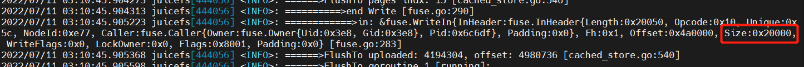

# 写入流程

正常write之前都有一个open的操作

```go
func (v *VFS) Open(ctx Context, ino Ino, flags uint32) (entry *meta.Entry, fh uint64, err syscall.Errno) {
    defer func() {
        if entry != nil {
            logit(ctx, "open (%d): %s [fh:%d]", ino, strerr(err), fh)
        } else {
            logit(ctx, "open (%d): %s", ino, strerr(err))
        }
    }()
    var attr = &Attr{}
    if IsSpecialNode(ino) {
        if ino != controlInode && (flags&O_ACCMODE) != syscall.O_RDONLY {
            err = syscall.EACCES
            return
        }
        h := v.newHandle(ino)
        fh = h.fh
        n := getInternalNode(ino)
        if n == nil {
            return
        }
        entry = &meta.Entry{Inode: ino, Attr: n.attr}
        switch ino {
        case logInode:
            openAccessLog(fh)
        case statsInode:
            h.data = collectMetrics(v.registry)
        case configInode:
            v.Conf.Format.RemoveSecret()
            h.data, _ = json.MarshalIndent(v.Conf, "", " ")
            entry.Attr.Length = uint64(len(h.data))
        }
        return
    }

    err = v.Meta.Open(ctx, ino, flags, attr)
    if err == 0 {
        v.UpdateLength(ino, attr)
        // 这里会new出一个handle，并返回对应编号
        fh = v.newFileHandle(ino, attr.Length, flags)
        entry = &meta.Entry{Inode: ino, Attr: attr}
    }
    return
}
```

```go
func (v *VFS) newFileHandle(inode Ino, length uint64, flags uint32) uint64 {
    h := v.newHandle(inode)
    h.Lock()
    defer h.Unlock()
    switch flags & O_ACCMODE {
    case syscall.O_RDONLY:
        h.reader = v.reader.Open(inode, length)
    case syscall.O_WRONLY: // FUSE writeback_cache mode need reader even for WRONLY
        // fallthrough 取消默认的break，使用rdwr一样的hander
        fallthrough
    case syscall.O_RDWR:
        // wr/rw操作都必须打开reader和writer，用于读取旧数据并重写
        h.reader = v.reader.Open(inode, length)
        h.writer = v.writer.Open(inode, length)
    }
    return h.fh
}
```

```go
func (f *fileWriter) Write(ctx meta.Context, off uint64, data []byte) syscall.Errno {
    for {
        if f.totalSlices() < 1000 {
            break
        }
        time.Sleep(time.Millisecond)
    }
    if f.w.usedBufferSize() > f.w.bufferSize {
        // slow down
        time.Sleep(time.Millisecond * 10)
        for f.w.usedBufferSize() > f.w.bufferSize*2 {
            time.Sleep(time.Millisecond * 100)
        }
    }

    s := time.Now()
    // 同一个filewriter，flush和write加锁互斥
    f.Lock()
    defer f.Unlock()
    size := uint64(len(data))
    f.writewaiting++
    // 判断是否有flush操作
    for f.flushwaiting > 0 {
        // WaitWithTimeout 到时间后返回true，否则for循环内空转
        if f.writecond.WaitWithTimeout(time.Second) && ctx.Canceled() {
            f.writewaiting--
            logger.Warnf("write %d interrupted after %d", f.inode, time.Since(s))
            return syscall.EINTR
        }
    }
    f.writewaiting--

    indx := uint32(off / meta.ChunkSize)
    pos := uint32(off % meta.ChunkSize)
    for len(data) > 0 {
        n := uint32(len(data))
        // ChunkSize = 1 << 26
        // 即一个chunk最大64M
        // 已经write的数据偏移量off + 一次读取到的数据size > 一个chunk的size
        // 循环分成不同chunk写入
        if pos+n > meta.ChunkSize {
            n = meta.ChunkSize - pos
        }
        // writeChunk写入一个chunk分块，chunk编号indx
        if st := f.writeChunk(ctx, indx, pos, data[:n]); st != 0 {
            return st
        }
        data = data[n:]
        // chunk编号indx自增1
        indx++
        pos = (pos + n) % meta.ChunkSize
    }
    if off+size > f.length {
        f.length = off + size
    }
    return f.err
}
```

```go
func (f *fileWriter) writeChunk(ctx meta.Context, indx uint32, off uint32, data []byte) syscall.Errno {
    // 查找对应编号chunkwriter，不在则new一个，这里的off是chunk内偏移量
    c := f.findChunk(indx)
    // 查找可写slice
    s := c.findWritableSlice(off, uint32(len(data)))
    if s == nil {
        // 如果找不到可用slicewriter则new一个
        // off是已经write的数据偏移量
        s = &sliceWriter{
            chunk:   c,
            off:     off,
            writer:  f.w.store.NewWriter(0),
            notify:  utils.NewCond(&f.Mutex),
            started: time.Now(),
        }
        c.slices = append(c.slices, s)
        if len(c.slices) == 1 {
            // 只要有slice出现，就启动commitThread，即flush数据的协程
            f.w.Lock()
            f.refs++
            f.w.Unlock()
            go c.commitThread()
        }
    }
    return s.write(ctx, off-s.off, data)
}
```

```go
func (s *sliceWriter) write(ctx meta.Context, off uint32, data []uint8) syscall.Errno {
    f := s.chunk.file
    // writeAt将数据写入到对应chunk的page[i]，page[i]即为block[i]，4M each block
    _, err := s.writer.WriteAt(data, int64(off))
    if err != nil {
        logger.Warnf("write: chunk: %d off: %d %s", s.id, off, err)
        return syscall.EIO
    }
    if off+uint32(len(data)) > s.slen {
        s.slen = off + uint32(len(data))
    }
    s.lastMod = time.Now()
    if s.slen == meta.ChunkSize {
        // 如果总数据等于一个chunk的上限64M，直接flushdata
        s.freezed = true
        go s.flushData()
    } else if int(s.slen) >= f.w.blockSize {
        // 如果数据不等于64M，但是>=一个block大小4M
        if s.id > 0 {
            // FlushTo：将uploaded<->s.slen之间的block按块upload上去，并非是所有数据
            // 如果s.slen未满块4M则这部分未满块数据仍然未上传，等待finish请求过来后上传
            err := s.writer.FlushTo(int(s.slen))
            if err != nil {
                logger.Warnf("write: chunk: %d off: %d %s", s.id, off, err)
                return syscall.EIO
            }
        } else if int(off) <= f.w.blockSize {
            go s.prepareID(ctx, false)
        }
    }
    return 0
}
```

```go
func (s *sliceWriter) prepareID(ctx meta.Context, retry bool) {
    f := s.chunk.file
    f.Lock()
    for s.id == 0 {
        var id uint64
        f.Unlock()
        // 获取当前的chunkid，如果超过了redis记录的nextChunk，则nextchunk自增chunkIDBatch=1000
        st := f.w.m.NewChunk(ctx, &id)
        f.Lock()
        if st != 0 && st != syscall.EIO {
            s.err = st
            break
        }
        if !retry || st == 0 {
            if s.id == 0 {
                // 每个slice.id就是chunk id
                s.id = id
            }
            break
        }
        f.Unlock()
        logger.Debugf("meta is not available: %s", st)
        time.Sleep(time.Millisecond * 100)
        f.Lock()
    }
    if s.writer != nil && s.writer.ID() == 0 {
        s.writer.SetID(s.id)
    }
    f.Unlock()
}
```



fuse kernel 0x20000B=128KB进行一次写调用

```go
func (c *wChunk) WriteAt(p []byte, off int64) (n int, err error) {
    // off 是chunk内偏移量，一般情况下len(p)=128k调用一次
    if int(off)+len(p) > chunkSize {
        return 0, fmt.Errorf("write out of chunk boudary: %d > %d", int(off)+len(p), chunkSize)
    }
    if off < int64(c.uploaded) {
        return 0, fmt.Errorf("Cannot overwrite uploaded block: %d < %d", off, c.uploaded)
    }

    // Fill previous blocks with zeros
    // c.length是对应chunk已经写入的数据总大小，如果小于本次写入数据的chunk偏移量off，则补齐zero
    if c.length < int(off) {
        zeros := make([]byte, int(off)-c.length)
        _, _ = c.WriteAt(zeros, int64(c.length))
    }
    // c.pages[0][0]...c.pages[0][63], allocPage 65536B=64KB each page, total 64*64K=4M
    // 一般情况下第一次调用wChunk.writeAt，写入128k，for循环2次
    // c.pages[1]...c.pages[n], allocPage 4194304B=4M each page
    // c.pages[i]即为第i个block
    for n < len(p) {
        // indx为一个chunk内block编号索引
        // index：(off+n) / s.store.conf.BlockSize 
        indx := c.index(int(off) + n)
        // boff为block内偏移量
        boff := (int(off) + n) % c.store.conf.BlockSize
        // pagesize: 65536B = 64KB
        var bs = pageSize
        // 第0个64k，第1个开始用blocksize 4M
        if indx > 0 || bs > c.store.conf.BlockSize {
            bs = c.store.conf.BlockSize
        }
        // indx = 0, bs为64K，此时一个block分为64个64K的小page，bi为page索引0...63
        // indx >= 1, bs为4M，此时bi必定为0，只操作c.pages[indx]对象，只分配一个4M的大的page
        // 为什么做这个区分？？
        bi := boff / bs
        // indx=0，bo为对应本次page的偏移量; indx>0，bo为对应本次block的偏移量
        bo := boff % bs
        var page *Page
        if bi < len(c.pages[indx]) {
            // 写入的起始位置未超过原有记录，直接拷贝原来的page内容
            // 这里针对已有文件的随机写场景
            page = c.pages[indx][bi]
        } else {
            page = allocPage(bs)
            // 清空data，golang切片清空操作，此时len为0，但是实际上切片的cap仍然为分配出来的容量bs，后续可在cap内扩容
            page.Data = page.Data[:0]
            c.pages[indx] = append(c.pages[indx], page)
        }
        left := len(p) - n
        if bo+left > bs {
            // 如果总位置超过bs，取bs，剩下的数据留给下一轮的page
            page.Data = page.Data[:bs]
        } else if len(page.Data) < bo+left {
            // 总位置不超过bs，说明一个page已经够容纳这些数据，扩到需要的size: bo+left
            page.Data = page.Data[:bo+left]
        }
        // 如果p大小大于page.Data，这里只会拷贝page.Data的数据量大小，并返回拷贝量
        n += copy(page.Data[bo:], p[n:])
    }
    // 更新chunk的length
    if int(off)+n > c.length {
        c.length = int(off) + n
    }
    return n, nil
}
```
