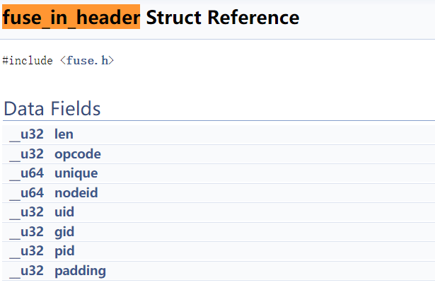
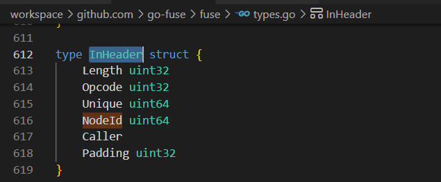
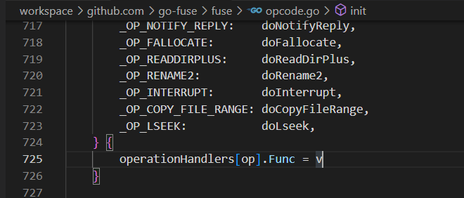
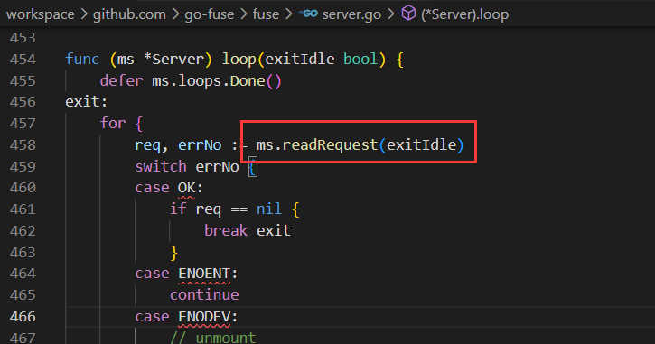
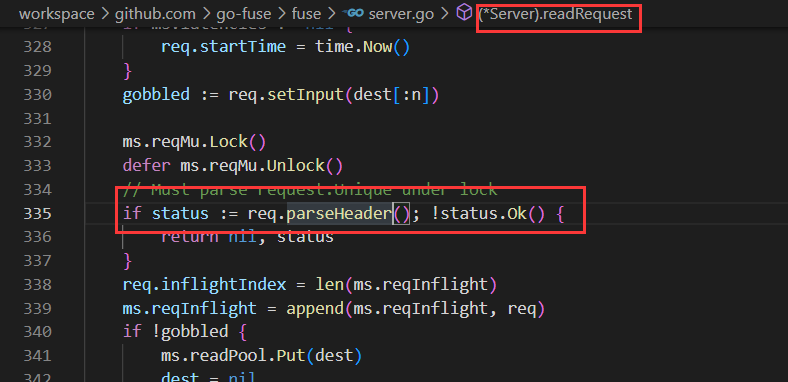
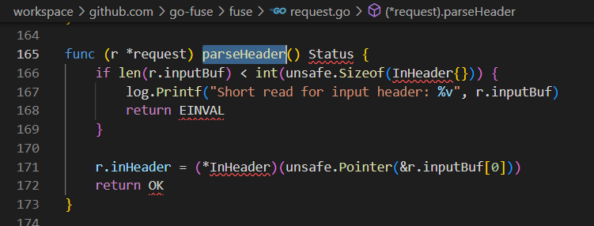

# go-fuse基本实现逻辑

作用：提供大概的serve逻辑，将设备读取信息反序列化成结构体
## 1、从/dev/fuse设备读取信息的结构化
types.go实现
- 1.1、in头部信息结构体InHeader
- 2.2、in参数结构体，不同操作实现不同结构体，与fuse内核标准对齐
    fuse kernel：https://docs.huihoo.com/doxygen/linux/kernel/3.7/annotated.html
    比如：内核结构体 fuse_mkdir_in 与 MkdirIn

go-fuse中结构体对应，包含Opcode

## 2、工厂化注册操作方式
opcode.go初始化字典
- 2.1 opcode与入参结构体大小InputSize
- 2.2 opcode与对应执行方法doXXX
- 2.3 doXXX调用filesystem接口实现函数XXX，将入参指针inData 转成对应操作In结构体

Opcode与执行函数的对应关系

## 3、参数解析
request.go中parse方法
- 3.1 根据InputSize通过unsafe.Pointer 强制把输入内容转成指针 inData

## 4、主流程
server.go中NewServer实现初始化(包括打开/dev/fuse并挂载)，Serve开始loop操作(读取处理)

