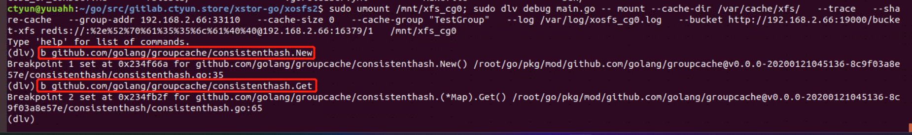

## 调试步骤

## 1、下载所有依赖包
    cd ~/go/src/github.com/juicefs
    go mod download
## 2、dlv调试
启动命令行去掉 -d (backgroup) 后台daemon运行选项
调试命令如下
```
sudo umount /mnt/xfs_cg0; 
sudo dlv debug main.go -- mount \
  --cache-dir /var/cache/xfs/   --trace   \
  --share-cache   --group-addr 192.168.2.66:33110   \
  --cache-size 0   --cache-group "TestGroup"   \
  --log /var/log/xosfs_cg0.log   \
  --bucket http://192.168.2.66:19000/bucket-xfs \
  redis://:%2e%52%70%61%35%35%6c%61%40%40@192.168.2.66:16379/1   /mnt/xfs_cg0
```

