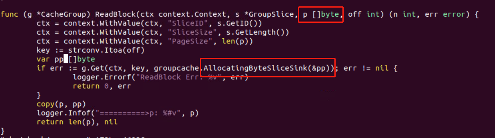
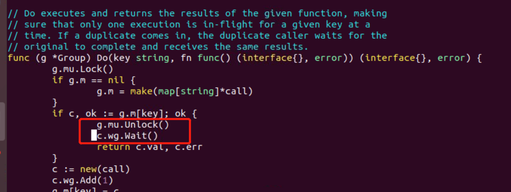
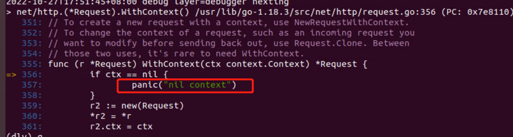
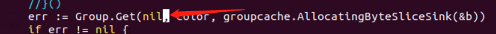
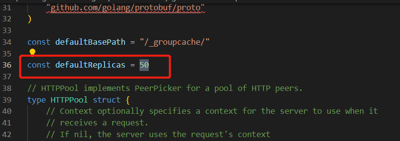
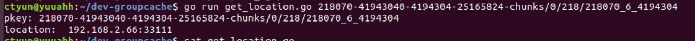

## 使用groupcache实现分布式缓存

## 传入groupcache.AllocatingByteSliceSink的引用地址指向内容未改变

原因：AllocatingByteSliceSink会重新分配切片地址，导致原来的p引用地址指向内容没有改变。

解决：新申请pp，然后copy 覆盖p引用地址



## groupcache阻塞问题

第一个Get请求panic后，后续的请求Get会被阻塞

阻塞位置 groupcache/singleflight/singleflight.go



原因：groupcache使用singleflight机制来防止缓存被击穿，singleflight内部实现是使用一个map来存储key，第一次请求会将key存储到map中，后续请求发现key存在时，会等待第一次请求完成返回其缓存值。此时如果第一次请求的goroutine panic了，c.wg.Done()没有被调用，会导致后续请求被阻塞在c.wg.Wait()上。

解决办法：singleflight 方案是为了避免缓存被击穿，代码往下可以看到如果返回err是会delete该key，下一个请求不会block，需要探索panic的情况(golang应用正常不应该panic，panic/recover并不是golang推崇的做法，异常也应该return err处理)。进一步调试找到panic点



故而ctx传入非nil应该可以解决该问题



## groupcache缓存集群的查找逻辑

- Group.Get 先查找本地缓存，如果查找不到根据一致性hash 对应peer节点的缓存数据
- 查找到则直接返回使用，查找不到调用远程peer节点的groupcache.GetterFunc方法获取到数据后，缓存到远程peer节点的内存中，然后返回client端，下一次查找从远程peer的缓存直接返回
- 查找不到则调用本地groupcache.GetterFunc，获取数据后写入本地缓存

查找顺序：本地缓存->远程peer缓存->远程peer getterfunc ->本地getterfunc

## 验证缓存groupcache

验证脚本
```
package main

import (
    "os"
    "fmt"
    "github.com/golang/groupcache/consistenthash"
)
func main() {
    pkey := os.Args[1]
        // groupcache默认replicas取值为50，即一个实际节点对应50个虚拟节点
        // consistenthash Add 对 0Node0/1Node0/2Node0.../49Node0 这些key分别计算hash值，取值范围一般为[0,2^32)
        // 相当于将每个实际节点映射出50个虚拟节点，然后均匀分布到2^32大的哈希环上
    hash := consistenthash.New(50, nil)
        // 这里用http:// 开始，是代码中的节点实际key
    hash.Add(
        "http://192.168.2.66:33110",
        "http://192.168.2.66:33111",
    )
    fmt.Printf("pkey: %s\n", pkey)
        // 这里Get内部会计算pkey的哈希值，比较得出第一个>=的虚拟节点hash值，取该虚拟节点对应的实际节点
    node := hash.Get(pkey)
    fmt.Println("location: ", node)
}
```




一致性哈希实现：
```
// Package consistenthash provides an implementation of a ring hash.
// Package consistenthash 提供了一个哈希环
package consistenthash

import (
	"hash/crc32"
	"sort"
	"strconv"
)
// Hash maps bytes to uint32
type Hash func(data []byte) uint32

type Map struct {
	hash     Hash
	// 虚拟节点倍数
	replicas int
	// 哈希环 keys
	keys     []int // Sorted
	// 虚拟节点与真实节点之间的联系，键是虚拟节点的哈希值，值是真实节点的名称
	hashMap  map[int]string
}

// New 采取依赖注入的方式，允许用于替换成自定义的 Hash 函数，默认为 crc32.ChecksumIEEE 算法。
func New(replicas int, fn Hash) *Map {
	m := &Map{
		replicas: replicas,
		hash:     fn,
		hashMap:  make(map[int]string),
	}
	// 如果 fn 为空，也就是不自定义设计哈希值，则默认为 crc32.ChecksumIEEE 算法
	if m.hash == nil {
		m.hash = crc32.ChecksumIEEE
	}
	return m
}

// IsEmpty returns true if there are no items available.
func (m *Map) IsEmpty() bool {
	return len(m.keys) == 0
}

// Add adds some keys to the hash.
// 添加 keys 到 hash 中
func (m *Map) Add(keys ...string) {
	for _, key := range keys {
		// 创建虚拟节点和真实节点之间的映射
		for i := 0; i < m.replicas; i++ {
			// 计算hash值
			hash := int(m.hash([]byte(strconv.Itoa(i) + key)))
			// 加入到keys
			m.keys = append(m.keys, hash)
			m.hashMap[hash] = key
		}
	}
	// 给keys排列
	sort.Ints(m.keys)
}

// Get gets the closest item in the hash to the provided key.
// Get 拿到最近的一个节点提供给键
func (m *Map) Get(key string) string {
	if m.IsEmpty() {
		return ""
	}

	// 计算 key 的哈希值
	hash := int(m.hash([]byte(key)))

	// Binary search for appropriate replica.
	// 二分检索拿到 大于等于 key的哈希值的第一个虚拟节点
	idx := sort.Search(len(m.keys), func(i int) bool { return m.keys[i] >= hash })

	// Means we have cycled back to the first replica.
	// 因为是一个哈希环，所以如果idx等于 keys的长度的话，那它的下标就应该是0
	if idx == len(m.keys) {
		idx = 0
	}

	return m.hashMap[m.keys[idx]]
}
```
