## fuse 重复挂载同一个目录
执行多次挂载会有多个entry
原因：https://www.cnblogs.com/bettersky/p/6754436.html
mount options：https://www.kernel.org/doc/html/latest/filesystems/fuse.html

重复挂载同一个目录，只有最后一个进程提供实际的文件系统服务

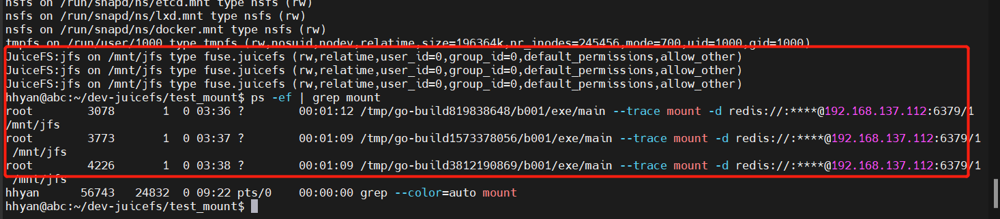

多次挂载返回的是同一个file descritor，存在多个挂载记录

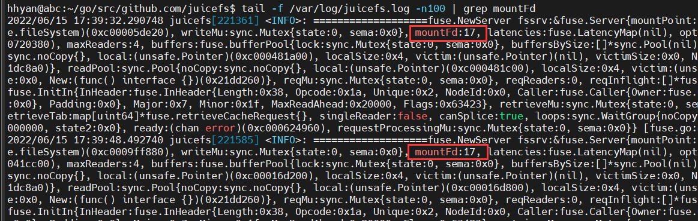

验证发现挂载新目录也是同一个mountFd

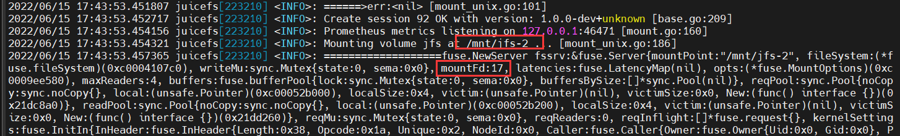

后端挂载点是同一个

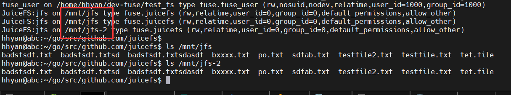

## 再次多次打开/dev/fuse设备，返回fd是一致的

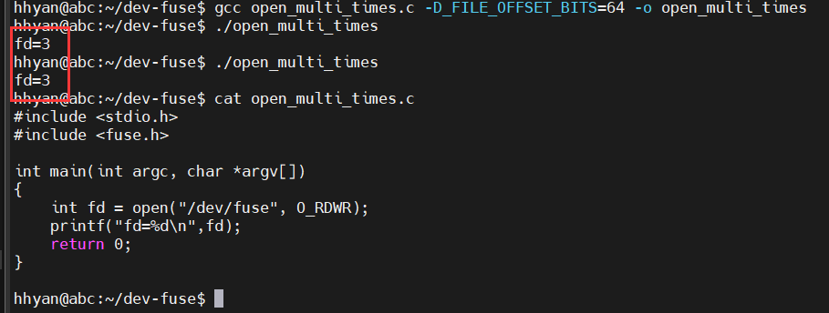

使用编译代码
```
#include <stdio.h>
#include <fuse.h>

int main(int argc, char *argv[])
{
    int fd = open("/dev/fuse", O_RDWR);
    printf("fd=%d\n",fd);
    close(fd);
    return 0;
}
```

But why？
```
参考：
https://blog.csdn.net/cywosp/article/details/38965239?depth_1-utm_source=distribute.pc_relevant.none-task&utm_source=distribute.pc_relevant.none-task
```
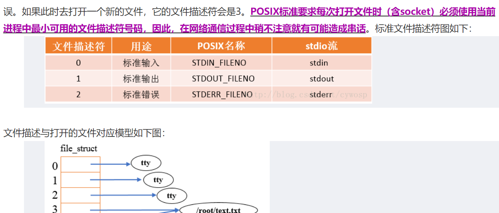

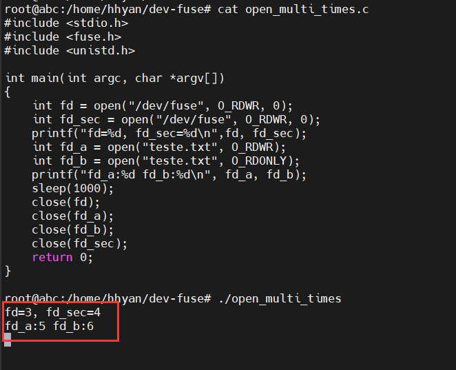

## 为什么程序多次启动挂载返回fd是17，而自己写的挂载返回fd=3，重启系统也是如此
说明juicefs包括打开日志文件在内，已经执行了 17-3+1=15次open操作了，导致进程级文件描述符为17

## fuse挂载返回no such device
```
package main

import (
    "fmt"
    "os"
    "strings"
    "syscall"
)

func test_mount(mountPoint string) (fd int, err error) {
    fd, err = syscall.Open("/dev/fuse", os.O_RDWR, 0) // use syscall.Open since we want an int fd
    if err != nil {
        return
    }
    fmt.Println("open fuse fd: ", fd)
    // managed to open dev/fuse, attempt to mount
    var flags uintptr
    flags |= syscall.MS_NOSUID | syscall.MS_NODEV
    var r = []string{
        fmt.Sprintf("fd=%d", fd),
        "rootmode=40000",
        "user_id=0",
        "group_id=0",
    }
    // fuse.xxx otherwise "no such device" happened
    err = syscall.Mount("myfs", mountPoint, "fuse.myfstype", 0, strings.Join(r, ","))
    if err != nil {
        syscall.Close(fd)
        return
    }
    return
}

func main() {
    m_point := "/mnt/test_m_fuse_go" // manully mkdir -p /mnt/test_m_fuse_go
    if m_fd, err := test_mount(m_point); err == nil {
        fmt.Println("mount fd: ", m_fd)
    } else {
        fmt.Println(err)
    }

}
```

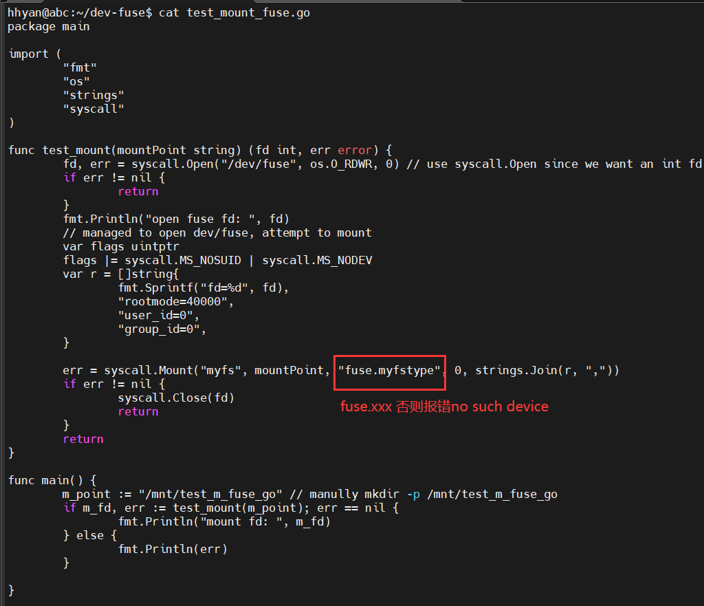

## 多次挂载如何确定由哪个Transport endpoint 来处理设备请求
```
参考：https://stackoverflow.com/questions/68586783/which-fuse-connection-corresponds-to-which-mount
```
fuse挂载(无论是否挂载同一个目录)，fusectl会在/sys/fs/fuse/connections/ 目录(fusectl文件系统是fuse内核态文件系统，可以卸载)下建立新目录标识内核通过/dev/fuse设备与用户态daemon进行通信的管道

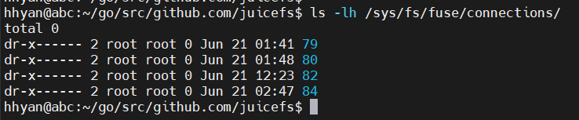

这个目录比如82即设备号，类似其它文件系统挂载的设备，系统会分配独立设备号(device number)

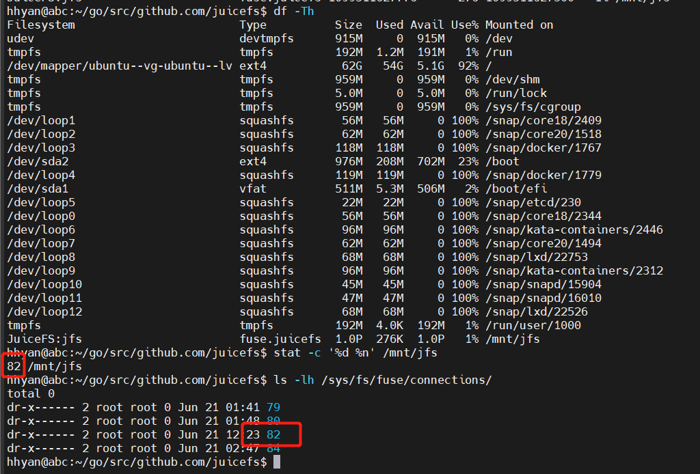

umount /sys/fs/fuse/connections/  后，fuse用户态文件系统仍然正常挂载工作。所以挂载的fusectl这个connections的操作只是将fuse内核中的fuse文件系统注册信息展示出来而已，不影响实际fuse的工作。

查看当前设备号或者通道设备：stat -c '%d %n' /mnt/jfs

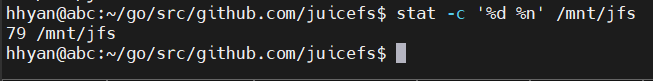

* 同一个挂载点挂载多次会形成挂载树 mount tree

cat /proc/self/mountinfo | grep "/mnt/jfs"

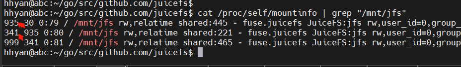

```
https://man7.org/linux/man-pages/man5/proc.5.html
```
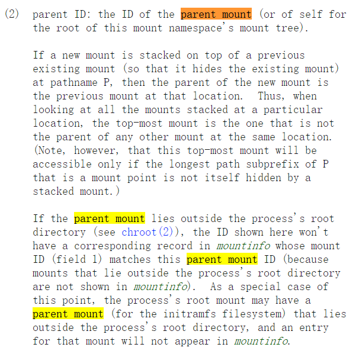

umount 只umount最顶端
```
https://man7.org/linux/man-pages/man2/umount.2.html
```
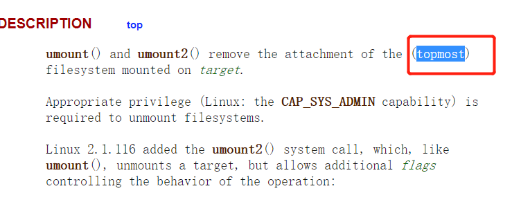

## 文件描述符共享
- 如果进程（线程）是父子关系，在fork之前的fd在fork之后会继承共享,但是fork之后各自独立的逻辑打开的fs不会共享
- 不同进程的fd是独立的，不能直接共享，因为属于不同的进程空间，互相隔离
- 但可以访问/proc/<pid_id>/fd看到其它进程的句柄

进程间可传递fd

进程间用 sendmsg/recvmsg 通过unix socket 传递fd

## syscall read 返回0x16对应错误码EINVAL 

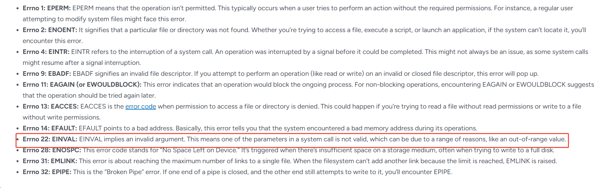

原因：传入的储值字符串长度太小，改成10240后正常

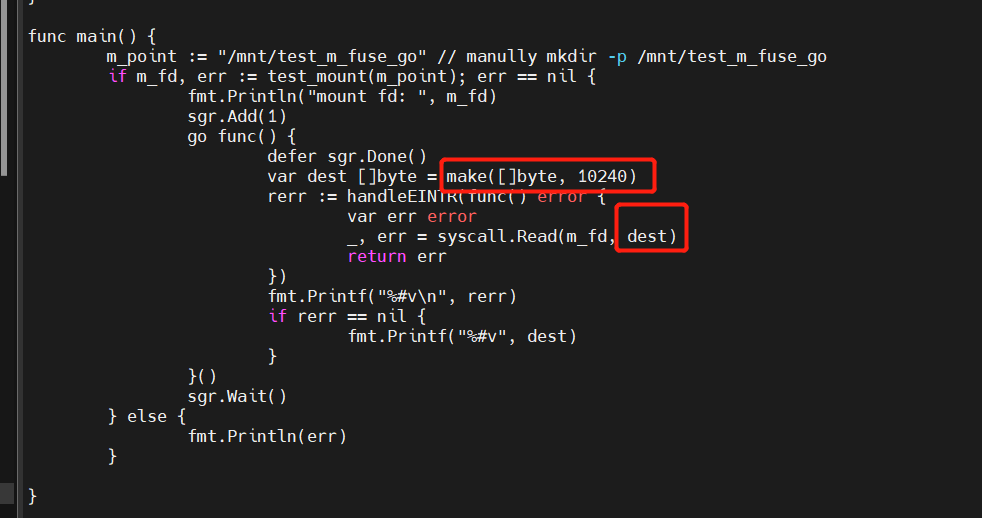

测试代码：
```
package main

import (
        "fmt"
        "os"
        "strings"
        "sync"
        "syscall"
)

var sgr sync.WaitGroup

func test_mount(mountPoint string) (fd int, err error) {
        fd, err = syscall.Open("/dev/fuse", os.O_RDWR, 0) // use syscall.Open since we want an int fd
        if err != nil {
                return
        }
        fmt.Println("open fuse fd: ", fd)
        // managed to open dev/fuse, attempt to mount
        var flags uintptr
        flags |= syscall.MS_NOSUID | syscall.MS_NODEV
        var r = []string{
                fmt.Sprintf("fd=%d", fd),
                "rootmode=40000",
                "user_id=0",
                "group_id=0",
        }

        // fuse.xxx otherwise "no such device" happened
        err = syscall.Mount("myfs", mountPoint, "fuse.myfstype", flags, strings.Join(r, ","))
        if err != nil {
                syscall.Close(fd)
                return
        }
        return
}

func handleEINTR(fn func() error) (err error) {
        for {
                err = fn()
                if err != syscall.EINTR {
                        break
                }
        }
        return
}

func main() {
        m_point := "/mnt/test_m_fuse_go" // manully mkdir -p /mnt/test_m_fuse_go
        if m_fd, err := test_mount(m_point); err == nil {
                fmt.Println("mount fd: ", m_fd)
                sgr.Add(1)
                go func() {
                        defer sgr.Done()
                        var dest []byte = make([]byte, 10240)
                        for {
                                rerr := handleEINTR(func() error {
                                        var err error
                                        _, err = syscall.Read(m_fd, dest)
                                        return err
                                })
                                fmt.Printf("%#v\n", rerr)
                                if rerr == nil {
                                        fmt.Printf("%#v", dest)
                                }
                        }
                }()
                sgr.Wait()
        } else {
                fmt.Println(err)
        }
}
```

## 清空目录后，元数据和后端数据未清理

默认启用回收站，如果使用--subdir 子目录作为根目录挂载，则隐藏了回收站

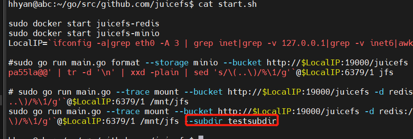

解决：取消该选项重新挂载即可看到回收站目录，进去sudo rm即可彻底清理

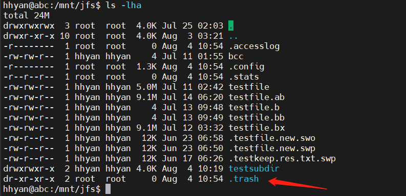

## 卸载umount报错，umount: /mnt/jfs: target is busy.

fuser -m 查看哪个进程在占用，退出即可

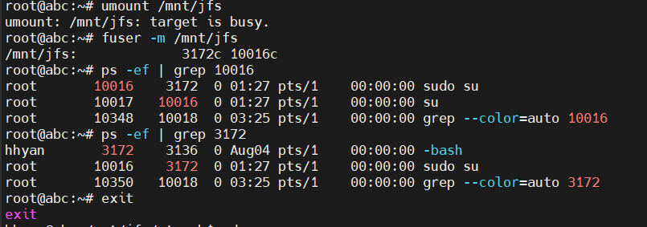

## 配置writeback后，缓存目录清理

查看缓存积压情况：
```
find /tmp/jcache -type d -name rawstaging | xargs du -sh
```

保证rawstaging下没有实体文件的情况下，直接清理编号目录？

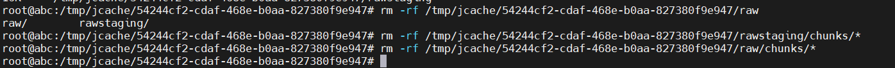


## promethues监控图无数据。promQL中rate 用1m无数据，5m有数据

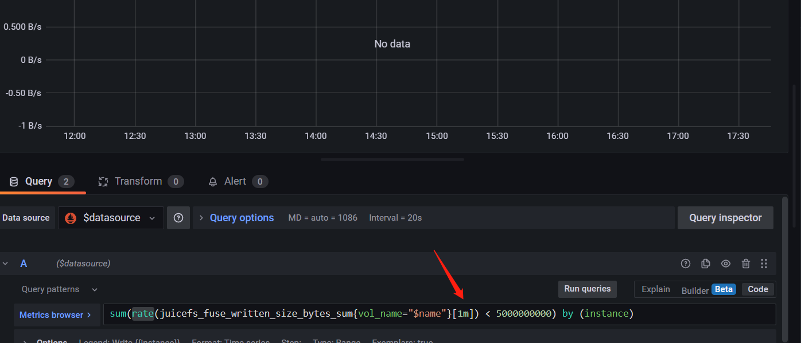

原因：采集时间间隔>=1m，rate计算需要多点数据才可 

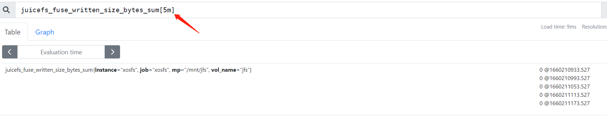

## juicefs-hadoop编译报错

[ERROR] Failed to execute goal on project juicefs-hadoop: Could not resolve dependencies for project io.juicefs:juicefs-hadoop:jar:1.0-dev: Could not find artifact jdk.tools:jdk.tools:jar:1.8 at specified path /usr/lib/jvm/java-8-openjdk-amd64/jre/../lib/tools.jar -> [Help 1]

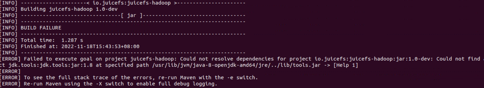

解决：需要使用jdk而不是jre

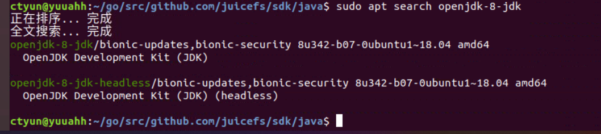

安装解决：sudo apt-get update && sudo apt install openjdk-8-jdk

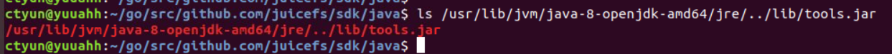


## 性能优化

参考 handleInternalMsg 通过写入control文件直接操作对应命令或者请求，不需要通过fuse接口

## 随机写单个block

测试脚本

```
TFILE="/mnt/jfs/rfile"
print("Test file:", TFILE)
f = open(TFILE, "r+")
#f.write("------------")
#f.seek(1234, 0)
#f.write("********1234")
f.seek(3800, 0)
pos = f.tell()
print("current position:", pos)
f.write("111222333444555666")
f.close()
```

会新生成一个block
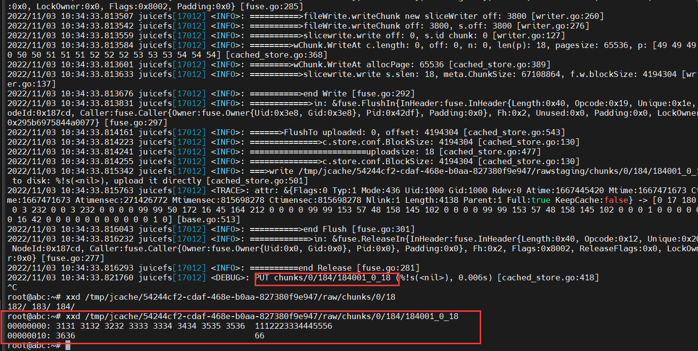

查看元信息
```
LocalIP=`ifconfig -a|grep ens3 -A 3 | grep inet|grep -v 127.0.0.1|grep -v inet6|awk '{print $2}'|tr -d "addr:"`
echo "Local address: "$LocalIP
./juicefs dump redis://:`echo '.Rpa55la@@' | tr -d '\n' | xxd -plain | sed 's/\(..\)/%\1/g'`@$LocalIP:16379/1 meta.dump
```
vim meta.dump
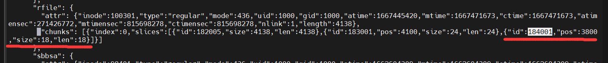

也就是说随机写也是新增文件(不需要拉取原数据block来重写覆盖)，分片覆盖重构由读操作完成

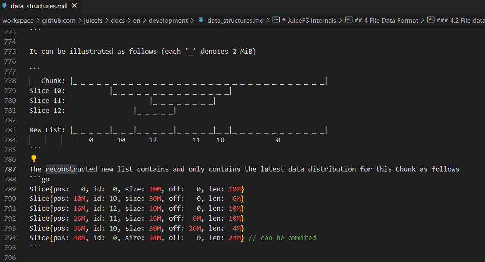

## 认证逻辑适配k8s
k8s上的node数量不固定，pod挂载所在物理机也不固定，无法通过获取单个节点的机器码来进行证书的加密生成以及后续的认证
使用k8s中的namespace的uuid来代替机器码
获取namespace的uuid：
```
kubectl get ns kube-system -o 'jsonpath={.metadata.uid}'
```

## 启动报错：invalid userinfo [interface.go:390]
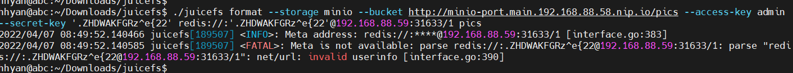

解决：特殊字符用base64进行加密，urlencode 这些特殊密码
```
echo '.ZHDWAKFGRz^e{22' | tr -d '\n' | xxd -plain | sed 's/\(..\)/%\1/g'
```
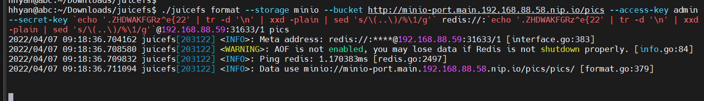

## 启动报错：failed to create new redis store, error info is LOADING Redis is loading the dataset in memory
解决：redis-cli flushall 后重启容器解决

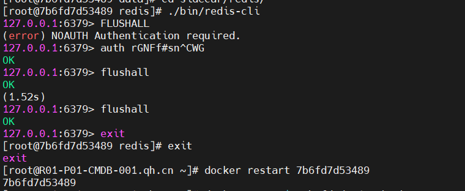

## 随机读导致读放大
大量的随机读取，会导致预读prefetch失效，造成严重的读放大问题：
https://juicefs.com/docs/zh/cloud/administration/troubleshooting/#read-amplification
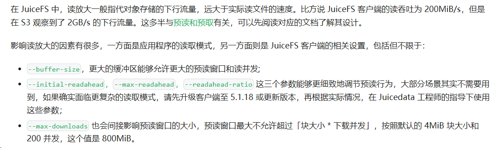

## 删除大文件
juicefs rmr `<Dir>`
内部删除命令写入.control控制文件，直接通过后端进程调用redis删除文件元数据。文件实际数据由定时任务来异步删除，从而加快删除操作。
```
    case meta.Rmr:
        done := make(chan struct{})
        var count uint64
        var st syscall.Errno
        go func() {
            inode := Ino(r.Get64())
            name := string(r.Get(int(r.Get8())))
            st = v.Meta.Remove(ctx, inode, name, &count)
            if st != 0 {
                logger.Errorf("remove %d/%s: %s", inode, name, st)
            }
            close(done)
        }()
        writeProgress(&count, nil, data, done)
        *data = append(*data, uint8(st))
```
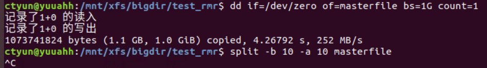

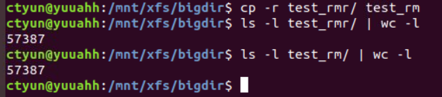

对比
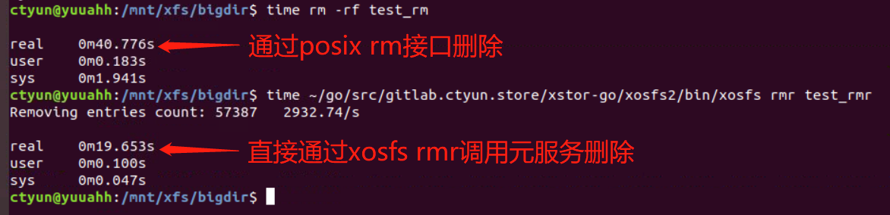
结论：性能提升一倍

## 商业版基础调研

https://juicefs.com/console/

### 1、在选择的云厂商上创建三个节点的元数据服务
/root/.juicefs/fsonali.conf
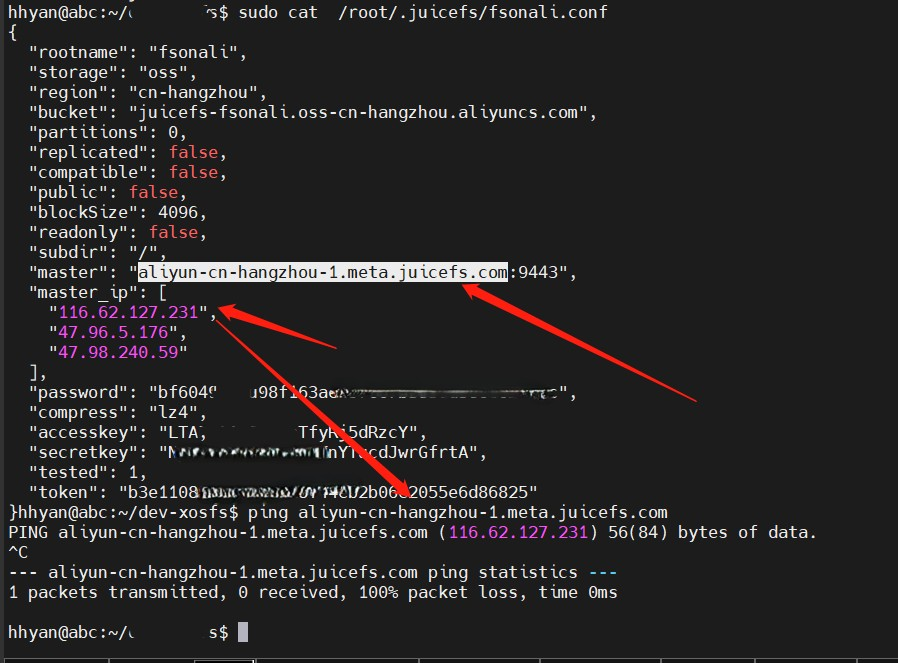

控制台上删除文件系统后，源数据库仍然存在
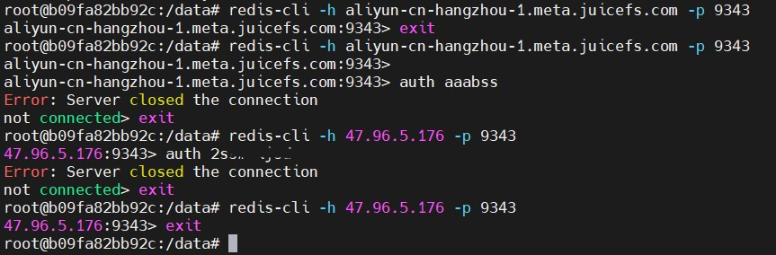
```
hhyan@abc:~/dev-xosfs$ sudo cat /root/.juicefs/fsonali.conf
{
  "rootname": "fsonali",
  "storage": "oss",
  "region": "cn-hangzhou",
  "bucket": "juicefs-fsonali.oss-cn-hangzhou.aliyuncs.com",
  "partitions": 0,
  "replicated": false,
  "compatible": false,
  "public": false,
  "blockSize": 4096,
  "readonly": false,
  "subdir": "/",
  "master": "aliyun-cn-hangzhou-1.meta.juicefs.com:9443",
  "master_ip": [
    "116.62.127.231",
    "47.96.5.176",
    "47.98.240.59"
  ],
  "password": "",
  "compress": "lz4",
  "accesskey": "",
  "secretkey": "",
  "tested": 1,
  "token": ""
```
* 以上认证信息已脱敏

### 2、安全加固
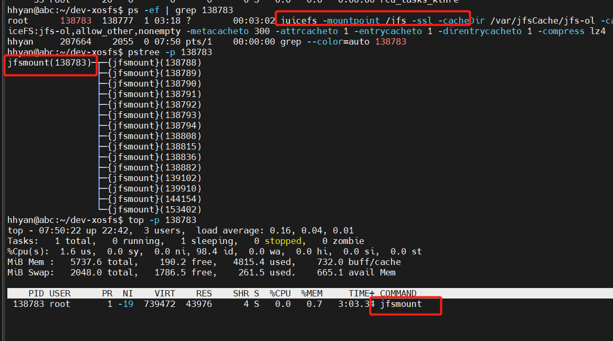
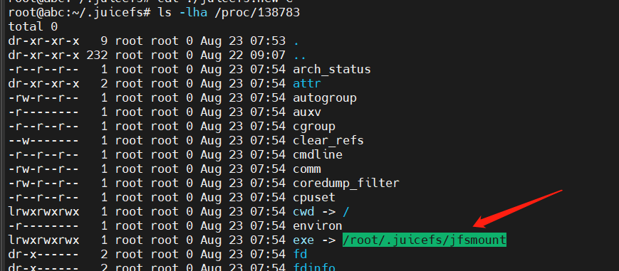

在本地都找不到他的juicefs 二进制包   但是ps可以看到对应命令行，因为这个二进制文件实际是jfsmount
查看启动进程的环境变量
cat /proc/138783/environ | tr '\0' '\n'
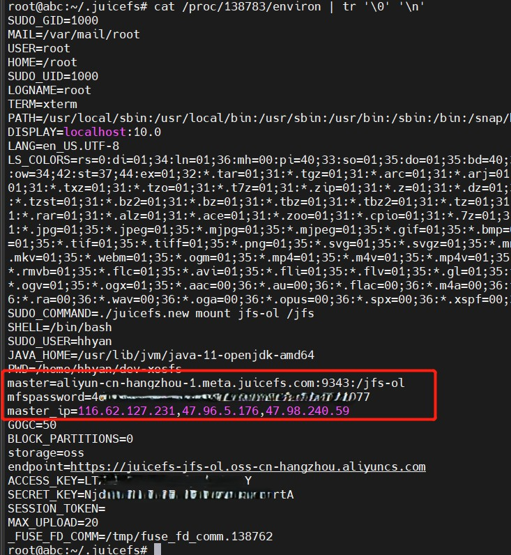

## 测试挂载启动

### 1、启动minio
参考：https://juicefs.com/docs/zh/community/how_to_setup_object_storage#minio
--restart=always  每次启动系统会自动拉起，这里去掉
```
sudo docker run --name juicefs-minio -p 19000:9000 -p 19001:9001 -d \
    -e "MINIO_ACCESS_KEY=admin" -e "MINIO_SECRET_KEY=adminPa55" \
    -v "/home/hhyan/dev-juicefs/minio-data":"/data" \
    minio/minio server /data --console-address ":9001"
```
minio控制台：http://172.23.117.213:19001/
登录信息：admin / adminPa55

### 2、启动redis
详细说明：https://juicefs.com/docs/zh/community/databases_for_metadata
```
sudo docker run -itd --name juicefs-redis \
  -p 6379:6379 redis --requirepass ".Rpa55la@@"
```
也可以登录容器内部redis-cli来设置/修改密码
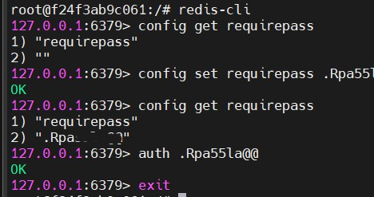

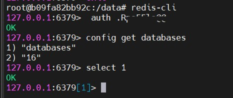

默认创建16个库（kv字典），使用第1个即可

### 3、本地juicefs操作
操作说明：https://juicefs.com/docs/zh/community/clouds/aws#3-%E5%88%9B%E5%BB%BA%E6%96%87%E4%BB%B6%E7%B3%BB%E7%BB%9F

#### 3.1 创建文件系统
```
./juicefs format --storage minio --bucket http://192.168.137.112:19000/juicefs \
    --access-key admin --secret-key adminPa55 \
    redis://:`echo '.Rpa55la@@' | tr -d '\n' | xxd -plain | sed 's/\(..\)/%\1/g'`@192.168.137.112:6379/1 jfs
```

#### 3.2 挂载文件系统
```
sudo ./juicefs mount -d redis://:`echo '.Rpa55la@@' | tr -d '\n' | xxd -plain | sed 's/\(..\)/%\1/g'`@192.168.137.112:6379/1 /mnt/jfs
```

#### 3.3 代码启动
```
sudo docker start juicefs-redis
sudo docker start juicefs-minio
LocalIP=`ifconfig -a|grep eth0 -A 3 | grep inet|grep -v 127.0.0.1|grep -v inet6|awk '{print $2}'|tr -d "addr:"`

#sudo go run main.go format --storage minio --bucket http://$LocalIP:19000/juicefs --access-key admin --secret-key adminPa55 redis://:`echo '.Rpa55la@@' | tr -d '\n' | xxd -plain | sed 's/\(..\)/%\1/g'`@$LocalIP:6379/1 jfs

sudo go run main.go --trace mount --bucket http://$LocalIP:19000/juicefs -d redis://:`echo '.Rpa55la@@' | tr -d '\n' | xxd -plain | sed 's/\(..\)/%\1/g'`@$LocalIP:6379/1 /mnt/jfs
```

## TiKV基本操作

命令行参考官网：https://tikv.org/docs/4.0/tasks/scale/introduction/#:~:text=You%20can%20scale%20out%20a%20TiKV%20cluster%20by,Ansible%2C%20see%20Scale%20the%20TiKV%20Cluster%20Using%20TiDB-Ansible.

### 1、查看pd集群信息
sudo docker exec -it tikv-pd1 sh
/ # ./pd-ctl -u http://localhost:2379 member

### 2、扩容tikv-server节点
拉起新的tikv-server，pd指向原集群即可

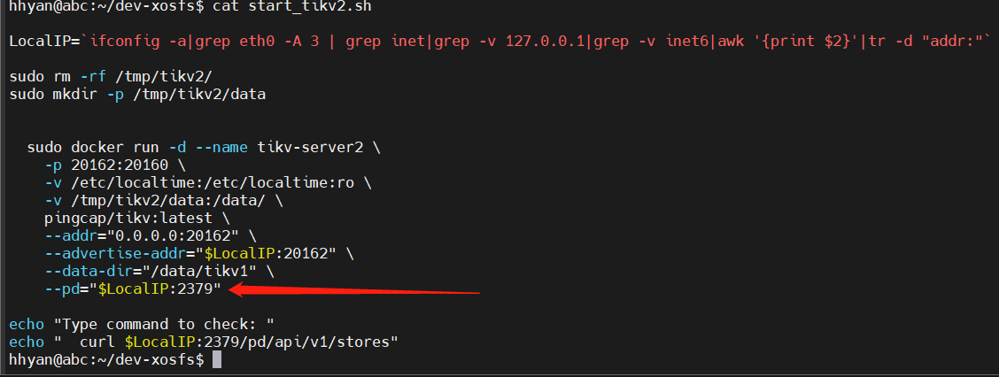

### 3、查看tikv-server集群信息
hhyan@abc:~/dev-xosfs$ sudo docker exec -it tikv-pd1 sh
/ # ./pd-ctl -u http://localhost:2379 store
或者 curl 192.168.137.10:2379/pd/api/v1/stores
