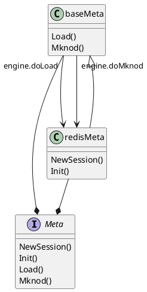
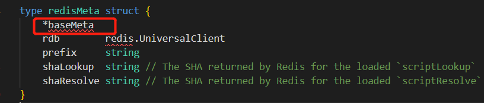

# 元数据实现接口

```plantuml
@startuml
interface Meta {
    NewSession()
    Init()
    Load()
    Mknod()
}
class baseMeta {
    Load()
    Mknod()
}
class redisMeta {
    NewSession()
    Init()
}
baseMeta "engine.doLoad" ---> redisMeta
baseMeta "engine.doMknod" ---> redisMeta
redisMeta --|> baseMeta
baseMeta --* Meta
redisMeta --* Meta
@enduml
```

baseMeta和具体元数据库对象比如redisMeta/kvMeta 共同实现接口类Meta，具体元数据库对象扩展自baseMeta，继承baseMeta的所有方法

