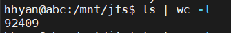
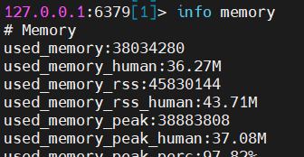
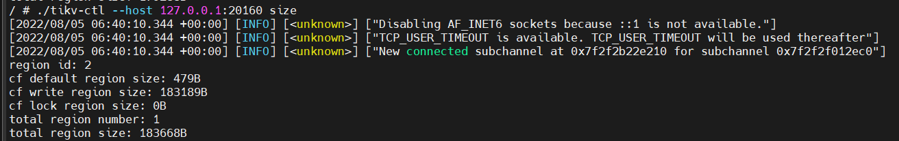
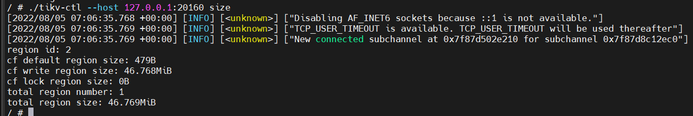
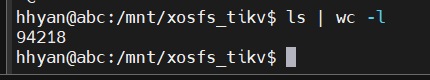

## 元数据容量测算

### 冷存容量
保守估计”一台机器应该有 500*180*200*10 = 1.8亿个文件，20台机器”
总的文件数量大约36亿左右

### 热存性能
3G/s，或者稍微低点(本地nvme ssd盘水准)。类似腾讯CFS Turbo（基于Lustre实现的并行文件系统）

## JFS文件系统元数据量基准测算
以下分别针对使用redis和tikv 作为元数据库做测算得出大概资源需求量

### 1、创建大量小文件快速方式
```
dd if=/dev/zero of=masterfile bs=1G count=1
split -b 10 -a 10 masterfile
```

### 2、Redis作为元数据服务容量测算
统计内存及文件数
```
hhyan@abc:/mnt/jfs$ ls | wc -l
92409
```


```
127.0.0.1:6379[1]> info memory
used_memory:38034280
used_memory_human:36.27M
used_memory_rss:45830144
```


38034280 / 92409 = 411 , 大概一个文件元信息需要占用400B左右
32G内存redis可以存 34,359,738,096 / 411 = 83600336，32G容量redis大概存储 8kw 的文件数
* 测算结果计算：36亿文件需要主Redis内存总量 1440 G，如果是高可靠主从部署redis节点，至少还需要同样容量的内存作为slave，总内存需求为2880G。

### 3、TiKV作为元数据容量测算
tikv小文件压测之前的起始size=183668B
```
/ # ./tikv-ctl --host 127.0.0.1:20160 size
[2022/08/05 06:40:10.344 +00:00] [INFO] [<unknown>] ["Disabling AF_INET6 sockets because ::1 is not available."]
[2022/08/05 06:40:10.344 +00:00] [INFO] [<unknown>] ["TCP_USER_TIMEOUT is available. TCP_USER_TIMEOUT will be used thereafter"]
[2022/08/05 06:40:10.344 +00:00] [INFO] [<unknown>] ["New connected subchannel at 0x7f2f2b22e210 for subchannel 0x7f2f2f012ec0"]
region id: 2
cf default region size: 479B
cf write region size: 183189B
cf lock region size: 0B
total region number: 1
total region size: 183668B
```


压测之后使用size=46.769MiB


生成总文件数 94218


46.769MiB / 94218 = 520.5 , 大概一个文件元信息需要占用 500B 左右
* 测算结果计算：36亿文件需要tikv磁盘容量约 1.6 T,tikv使用ssd本地盘作为其存储介质，加上高可靠三节点需要1.6 * 3 = 4.8 T SSD 存储，大约32G * 3内存用于tikv进程（tikv官网推荐配置）。

## 后端存储规划
- 单桶最大文件数 最佳实践 1亿
- 分开不同桶挂载在不同的文件系统上
