# juicefs sdk for hadoop

## 配置使用juicefs
配置 /etc/hadoop/core-site.xml
```
<?xml version="1.0" encoding="UTF-8"?>
<?xml-stylesheet type="text/xsl" href="configuration.xsl"?>
<!--
  Licensed under the Apache License, Version 2.0 (the "License");
  you may not use this file except in compliance with the License.
  You may obtain a copy of the License at

    http://www.apache.org/licenses/LICENSE-2.0

  Unless required by applicable law or agreed to in writing, software
  distributed under the License is distributed on an "AS IS" BASIS,
  WITHOUT WARRANTIES OR CONDITIONS OF ANY KIND, either express or implied.
  See the License for the specific language governing permissions and
  limitations under the License. See accompanying LICENSE file.
-->

<!-- Put site-specific property overrides in this file. -->

<configuration>
<property><name>hadoop.proxyuser.hue.hosts</name><value>*</value></property>
<property><name>fs.defaultFS</name><value>hdfs://namenode:8020</value></property>
<property><name>hadoop.proxyuser.hue.groups</name><value>*</value></property>
<property><name>hadoop.http.staticuser.user</name><value>root</value></property>
<property><name>hadoop.proxyuser.hue.hosts</name><value>*</value></property>
<property><name>fs.defaultFS</name><value>hdfs://namenode:8020</value></property>
<property><name>hadoop.proxyuser.hue.groups</name><value>*</value></property>
<property><name>hadoop.http.staticuser.user</name><value>root</value></property>

<property>
  <name>fs.jfs.impl</name>
  <value>io.juicefs.JuiceFileSystem</value>
</property>
<property>
  <name>fs.AbstractFileSystem.jfs.impl</name>
  <value>io.juicefs.JuiceFS</value>
</property>
<property>
  <name>juicefs.meta</name>
  <value>redis://:.Rpa55la@@@192.168.137.10:6379/1</value>
</property>
<property>
  <name>juicefs.cache-dir</name>
  <value>/data*/jfs</value>
</property>
<property>
  <name>juicefs.cache-size</name>
  <value>1024</value>
</property>
<property>
  <name>juicefs.access-log</name>
  <value>/tmp/juicefs.access.log</value>
</property>


</configuration>

```
说明：fs.defaultFS 不指定schema，默认仍然走hdfs

此时执行hadoop fs -ls jfs://

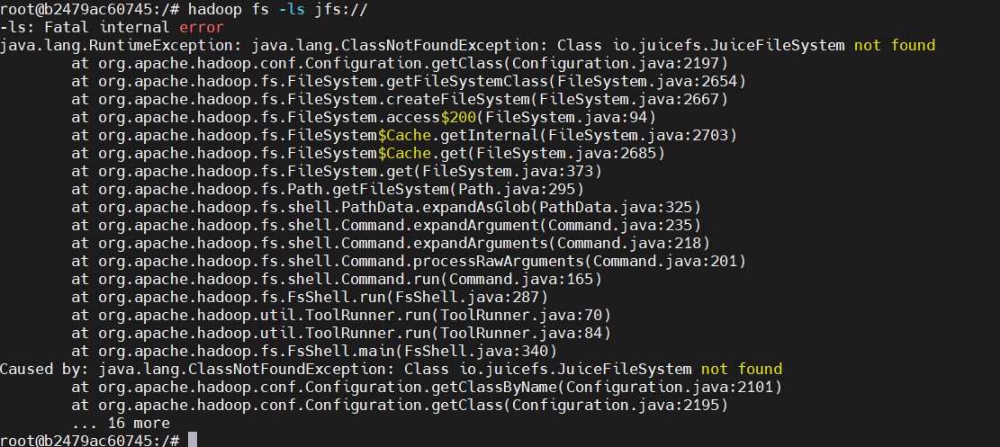

将sdk拷贝到 hadoop classpath：

cp juicefs-hadoop-1.0-dev.jar /opt/hadoop-2.7.4/share/hadoop/common/lib/

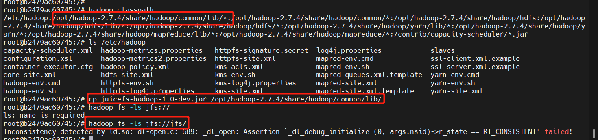

该报错是编译依赖的库版本不对，重新在对应容器内部创建编译环境，编译jar包后覆盖，执行后报错认证问题

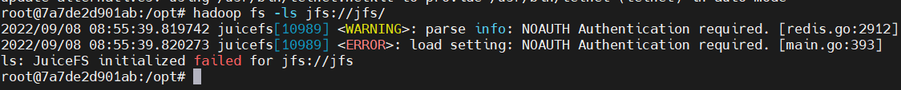

将redis pass配置到连接中

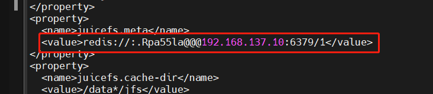

访问正常：

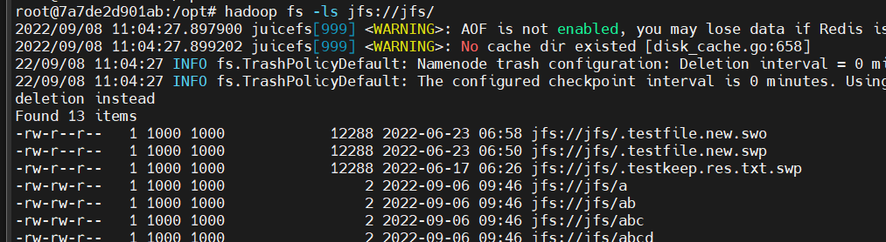

构建容器：docker-hive_hive-server_1 

## 创建表报错

Caused by: MetaException(message:Got exception: java.io.IOException No FileSystem for scheme: jfs)

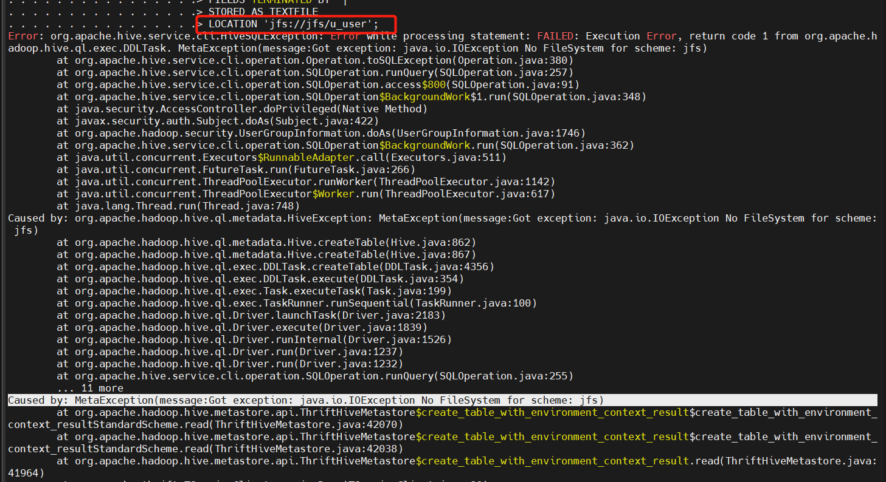

原因：创建表后meta返回的报错，hive-metastore 中加入对应sdk (/opt/hive/lib/)  
/opt/hive/conf/hive-site.xml中加入配置

```

<property>
  <name>fs.jfs.impl</name>
  <value>io.juicefs.JuiceFileSystem</value>
</property>
<property>
  <name>fs.AbstractFileSystem.jfs.impl</name>
  <value>io.juicefs.JuiceFS</value>
</property>
<property>
  <name>juicefs.meta</name>
  <value>redis://:.Rpa55la@@@192.168.137.10:6379/1</value>
</property>
<property>
  <name>juicefs.cache-dir</name>
  <value>/data*/jfs</value>
</property>
<property>
  <name>juicefs.cache-size</name>
  <value>1024</value>
</property>
<property>
  <name>juicefs.access-log</name>
  <value>/tmp/juicefs.access.log</value>
</property>
```
再次在jfs上创建表文件：
```
CREATE TABLE u_user (
userid INT,
age INT,
gender CHAR(1),
occupation STRING,
zipcode STRING)
ROW FORMAT DELIMITED
FIELDS TERMINATED BY '|'
STORED AS TEXTFILE
LOCATION 'jfs://jfs/u_user';
```
查询成功

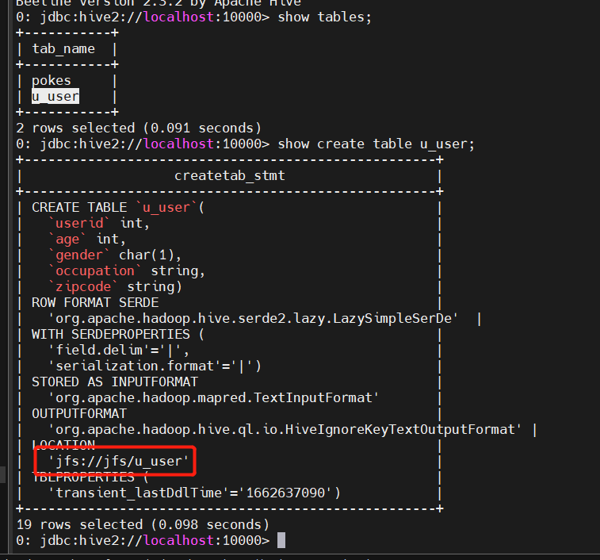

此时并没有其它节点挂载jfs，在容器外挂载jfs看看文件目录情况

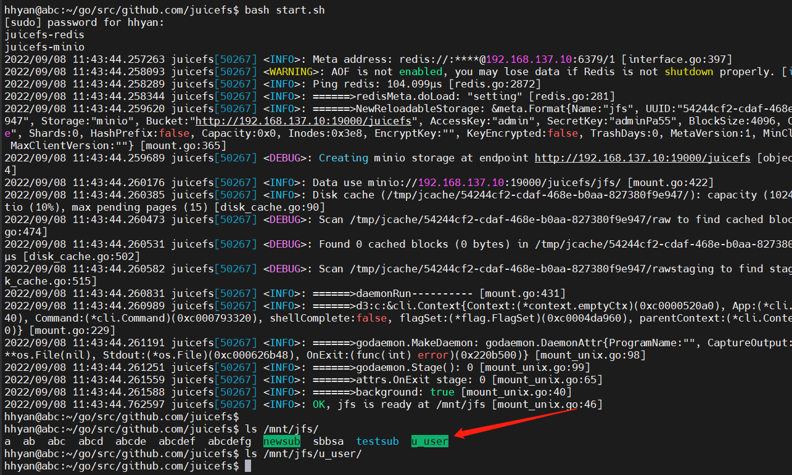


## 3、CDH集群中hive insert报错
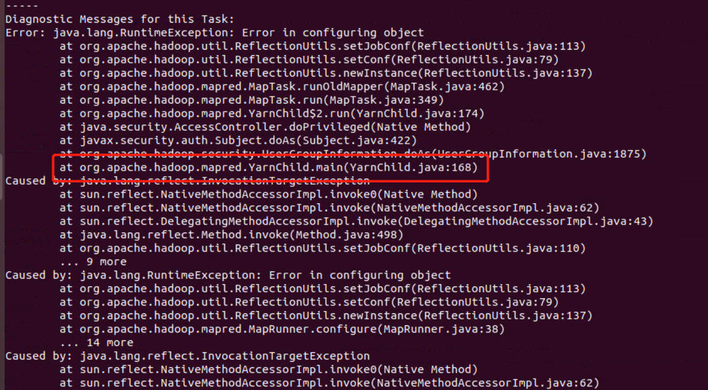

说明hive使用的mr引擎yarn组件没有配置sdk
配置SDK重启yarn

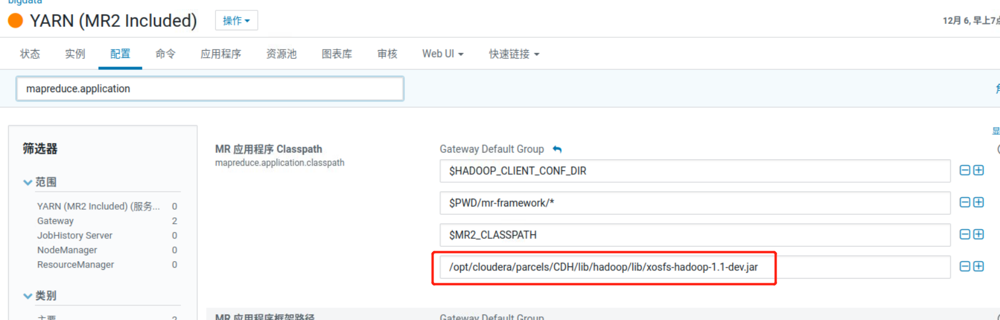

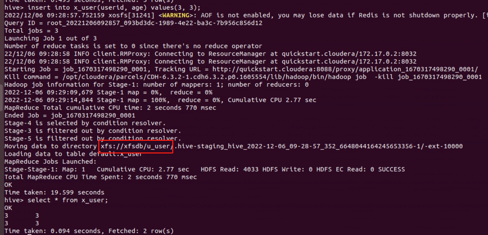
