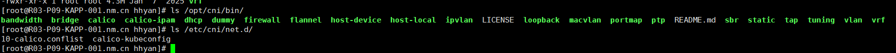
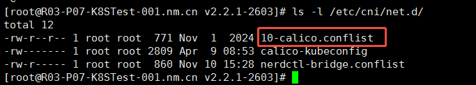

# CNI (Container Network Interface) Notes

## 1. CNI 插件运行方式

- CNI 插件实现为**进程外可执行文件**接口。
- kubelet（通过容器运行时）在 Pod 生命周期关键节点以 **进程调用 + 环境变量 + stdin JSON** 的方式将网络参数传入插件。
- 插件将配置结果通过 **stdout** 返回给 kubelet，完成“给 Pod 插网线”的动作。
- CNI 插件**只在真正需要“动”网络时**，才由 kubelet 临时拉起执行一次。

手动执行比如：CNI_COMMAND=ADD CNI_CONTAINERID=xxx CNI_XXX=XXX /opt/cni/bin/calico < config.json

## 2. CNI 插件安装位置

## 3. 查看当前使用哪个CNI插件

## 4. CNI 插件规范

插件实现CNI 规范需要提供可执行文件，该可执行文件的执行需要支持以下几个操作：

| 操作（CNI_COMMAND） | 标准输入 (stdin) | 标准输出 (stdout) | 说明 |
|-------------|------------------|-------------------|------|
| `ADD`       | JSON NetConf     | JSON Result       | 创建网卡、分配 IP、返回给 kubelet |
| `DEL`       | JSON NetConf     | 无或空            | 清理网卡、释放 IP |
| `CHECK`     | JSON NetConf     | 无或错误 JSON     | 健康检查（可选） |
| `VERSION`   | 空               | 支持的 CNI 版本列表 | 版本协商 |

## 5. 常见的 CNI 插件

| 大类 | 代表实现 | 一句话定位 |
|------|----------|-------------|
| Overlay 网络 | Flannel | 上手最快，VXLAN/Host-GW 两种后端，功能简单，中小型集群首选 |
| BGP 三层网络 + 策略 | Calico | 纯路由转发，性能高，NetworkPolicy 完整，适合大规模、需要安全策略的场景 |
| eBPF 下一代 | Cilium | 基于 eBPF，可观测、ServiceMesh、安全策略一把抓，内核 ≥4.19 才玩得转 |
| Flannel+Calico 缝合怪 | Canal | 同时跑 Flannel（互通）+ Calico（策略），想偷懒时可用 |
| OVS 流派 | Antrea / kube-ovn | 基于 Open vSwitch，支持 VPC、子网等高级玩法，适合私有云 |
| 私有网络 | Weave Net | 自动加密、去中心化，但性能一般，适合边缘或对加密强需求的场景 |
| 云厂商 | Terway（阿里云）、Amazon VPC CNI、Azure CNI | 直接对接云 VPC，性能最好，但锁定云平台 |