## 1. NewSharedIndexInformer vs NewSharedInformerFactory

NewSharedIndexInformer：直接返回某个类型的informer，需要自己实现ListWatch接口，每个informer的reflect、缓存都是独立的。适用于监听单个CRD

NewSharedInformerFactory：工厂模式，每种资源（Pod/Deployment…）各一个 SharedIndexInformer，全集群共用，所有 reflector 复用同一条 list/watch 连接。一般controller使用这个工厂模式。

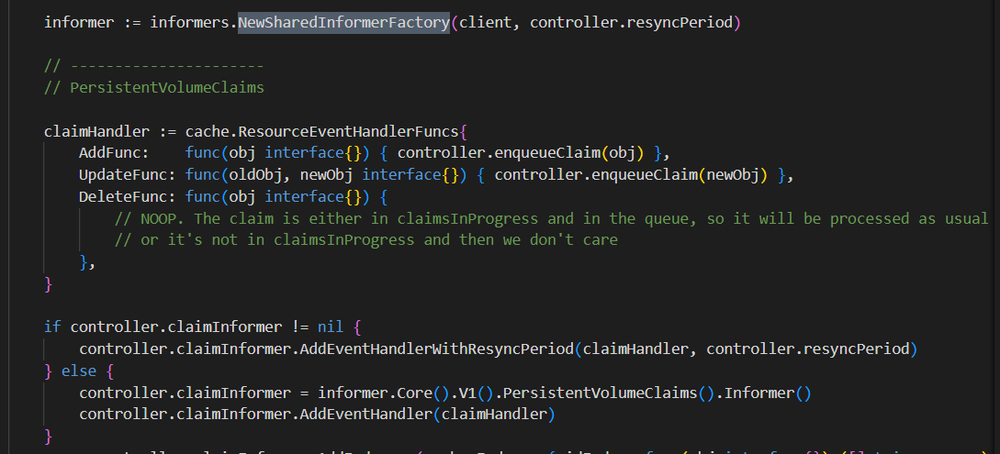

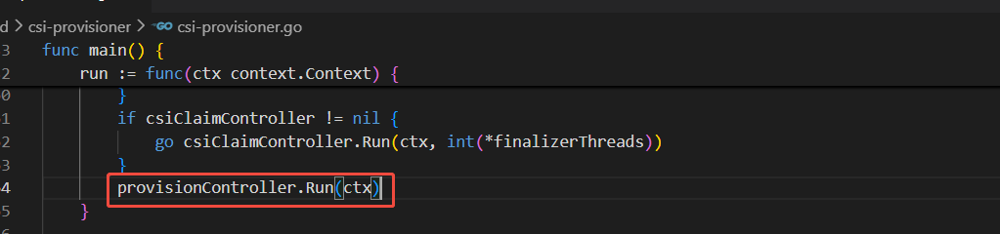

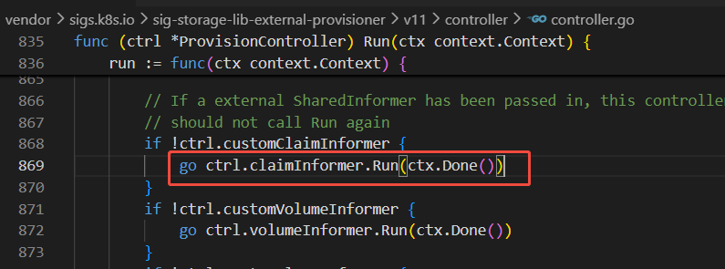

## 2. Informer Indexer

Informer 的 store 本质是一个 ThreadSafeStore，主键默认是 namespace/name。AddIndexers给这些数据生成新的索引，后续通过indexer查询降低时间复杂度。

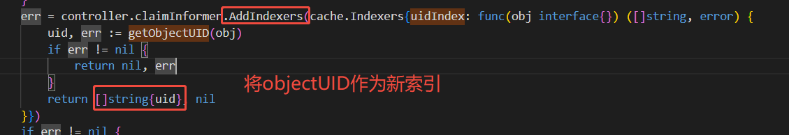

通过uid查找obj

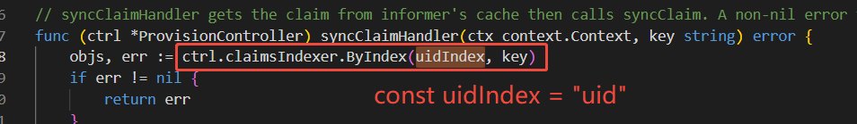

## 3. informer lister

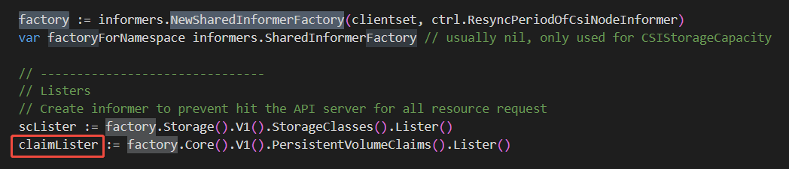
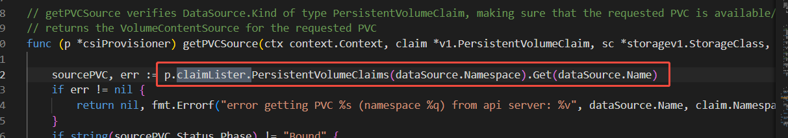

Informer 是"推"模式（事件推送），适合实时响应

Lister 是"拉"模式（主动查询），适合按需获取

两者共享同一缓存，数据最终一致。Informer 监听变化触发处理，Lister 在处理中查询相关状态

## 4. 选主流程
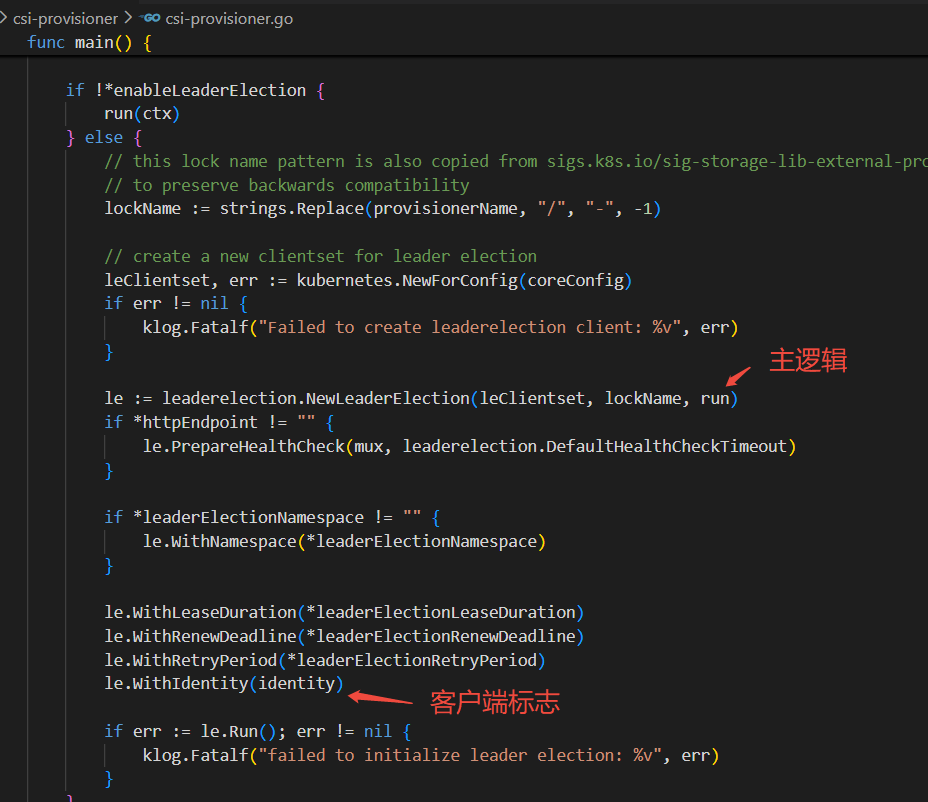

identity含随机字符串重启后变化

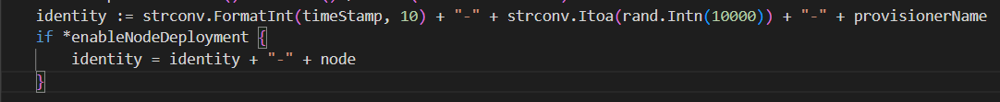

如果identity没有设置则直接使用hostname

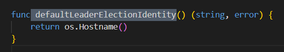

leaselock通过创建Lease资源的方式

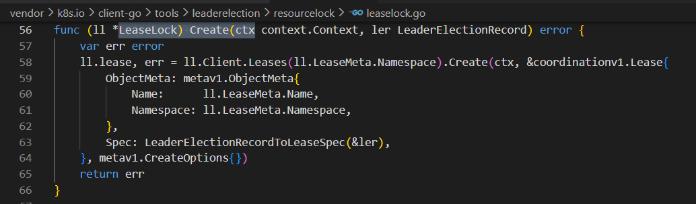
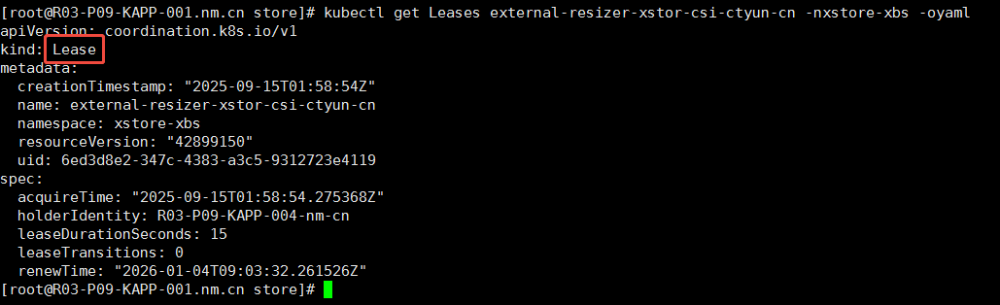

通过Lease选主的流程

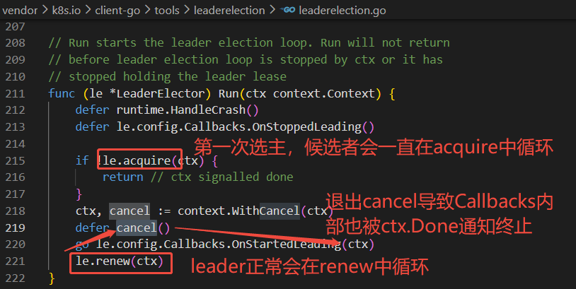
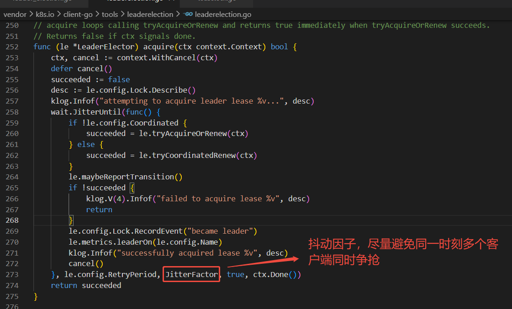
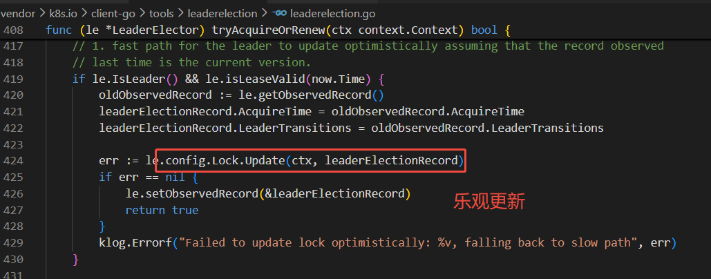

如果执行乐观更新的客户端是leader并且上次刚更新过，缓存中的resourceversion对得上，这里乐观更新就会通过，否则快速路径(乐观更新，类似乐观锁)就会失败

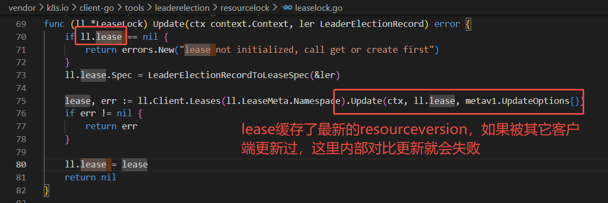

乐观续约失败则重新争抢

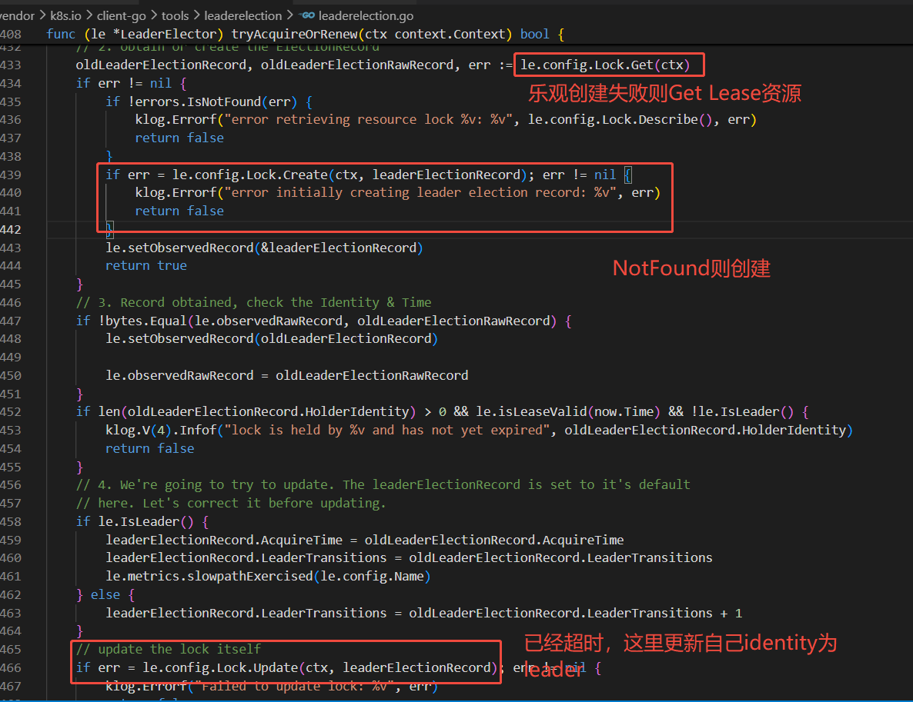

## 5. 主动释放leader lease

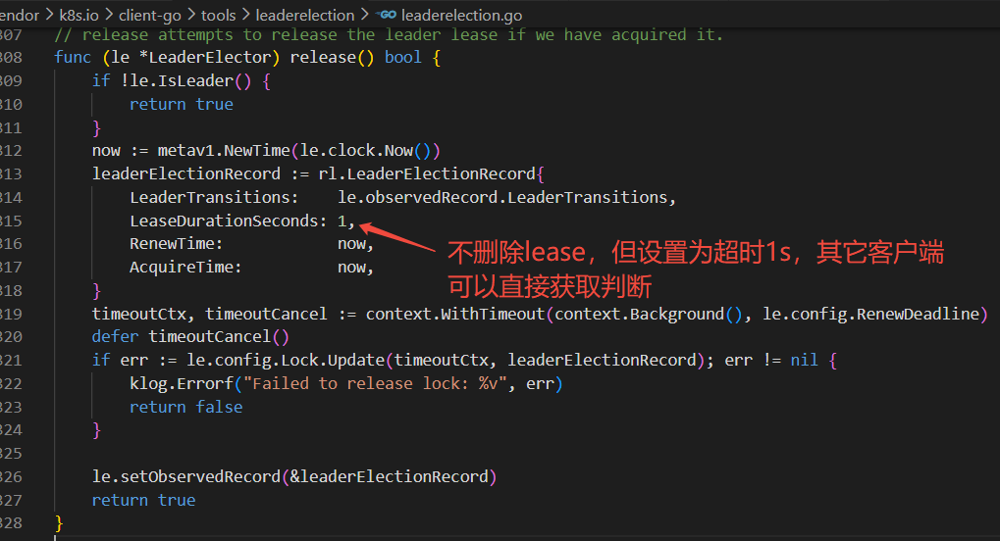

## 6. informer在重启的情况下
LIstWatch机制在重启情况下，会list所有资源，重新触发AddFunc，所以AddFunc的业务处理逻辑需要保证幂等
