## 1. staging/publish阶段的区别
staging是针对pvc在node上的准备阶段，同一个pvc在同一个node上挂载多次只需要StageVolume一次

publish是pvc在pod挂载前的发布阶段，每个pod的挂载卸载都会单独调用PublishVolume/UnpublishVolume

## 2. global map path的作用
kubelet中对该设备目录的操作流程发生在MapBlockVolume阶段


global map path将设备文件描述符创建为loop块设备，losetup命令会在内核打开并持有这个path的文件描述符，防止对应设备在不知情情况下被卸载或者挂载到其它pod


getLoopDeviceFromSysfs通过扫描对比/sys/block/loop*目录下的所有backing_file文件获取到global map path对应的loop设备


## 3. 真正提供给pod去bind的设备路径


## 4. pod内设备名称由容器运行时containerd创建
PublishVolume后，kubelet通过调用CRI gRPC接口创建container


containerd接收到CRI请求后，调用runc


Init流程中prepareRootfs创建rootfs


三方库通过mknod创建声明的设备

## 5. kubelet与containerd通信sock文件

## 6. kubelet先PublishVolume再创建pod
kubelet前序流程

```
cmd->kubelet
  ->RunKubelet
    ->createAndInitKubelet
      ->pkg.NewMainKubelet
        ->makePodSourceConfig
          ->NewSourceApiserver
            ->NewListWatchFromClient  # create watch, filter spec.nodeName
    ->pkg.RunOnce
      ->pkg.runPod
        ->pkg.SyncPod
```
SyncPod内部开始处理volume


## 7. volumeBindingMode模式及区别
CreateVolume 的调用时机不同

Immediate 模式：

PVC 创建 -> external-provisioner 立即收到 Add 事件 -> 调用 CSI CreateVolume -> 生成 PV -> 完成 PV/PVC 绑定 -> 以后 Pod 调度再随便挑节点。

WaitForFirstConsumer 模式：

PVC 创建 -> provisioner 只把 PVC 缓存起来，不调用CSI CreateVolume -> 等第一个使用它的 Pod 进入调度 -> scheduler 把 selected-node 写回 PVC -> provisioner 才根据该节点信息调用 CSI CreateVolume -> 生成 PV -> 完成绑定 -> kubelet 挂载。

## 8. 接口失败指数退避重试
代码写死了必须使用“指数退避”方式进行重试
```
kubernetes/pkg/volume/util/operationexecutor/operation_executor.go:NewOperationExecutor
  ->exponentialBackOffOnError=true
```

## 9. CSI RPC接口定义
接口proto描述文件：https://github.com/container-storage-interface/spec/blob/master/csi.proto

编译脚本：https://github.com/container-storage-interface/spec/blob/master/lib/go/Makefile


生成go接口文件：https://github.com/container-storage-interface/spec/blob/master/lib/go/csi/csi_grpc.pb.go

生成go数据结构文件：https://github.com/container-storage-interface/spec/blob/master/lib/go/csi/csi.pb.go

## 10. 创建snapshot，csi并未触发调用CreateSnapshot接口
csi的sidecar中配置了csi-snapshot 这个容器，但要执行snapshot操作还需要snapshot controller，除了配置snapshot相关crd外，还需要部署snapshot controller


snapshot controller会对snapshot相关cr进行管控，csi sidecar csi-snapshot识别到vsc后调用csi接口


## 11. attach vs mount

挂接和挂载的区别

https://stackoverflow.com/questions/16386699/whats-the-difference-between-attach-and-mount-in-ebs-for-amazon-ec2

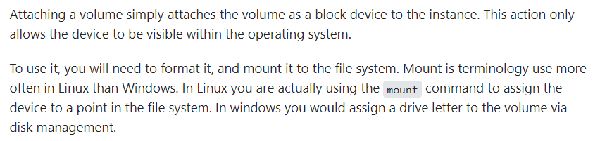

Attacher容器调用ControllerPublishVolume只是调用存储接口对卷和节点进行关联，使得对应存储卷具备在该节点挂载的权限

NodeStageVolume/NodePublishVolme才是实际在node节点上进行挂载绑定。

参考：https://github.com/digitalocean/csi-digitalocean/blob/v0.1.1/driver/controller.go#L164

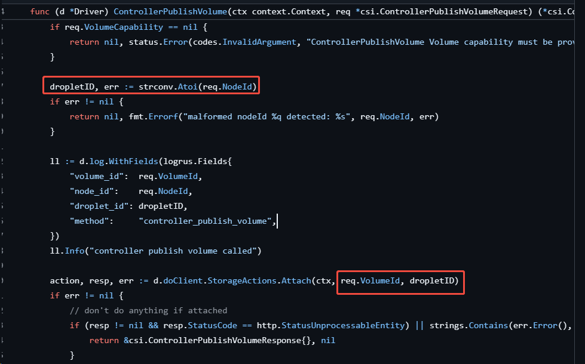

## 12. pod挂载的情况下删除pvc

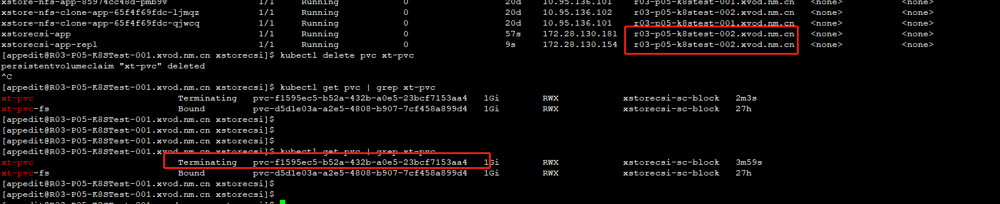

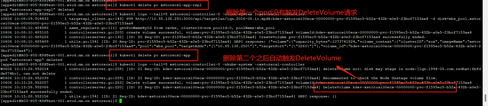

pvc挂载在同一个宿主机节点上不同pod的情况：
1. k8s 直接delete pvc后一直是Terminating状态，此时不会把删除请求发到csi
2. 删除第一个pod之后，pvc还有pod引用，仍然不会发送DeleteVolume请求
3. 删除第二个pod之后，pvc没有pod引用，此时会自动触发DeleteVolume请求，把terminating状态的pvc删除掉

## 13. pv的访问模式、回收策略及状态
### AccessModes（访问模式）
- ReadWriteOnce（RWO）：读写权限，但是只能被单个节点挂载
- ReadOnlyMany（ROX）：只读权限，可以被多个节点挂载
- ReadWriteMany（RWX）：读写权限，可以被多个节点挂载
### RECLAIM POLICY（回收策略）
- Retain（保留）： 保留数据，删除pvc后动态创建的pv不会被删除
- Recycle（回收）：清除 PV 中的数据，pv的状态会变成Available，可以被重新绑定
- Delete（删除）：默认值，删除pvc后，动态创建的pv也会被删除
### STATUS（状态）
一个 PV 的生命周期中，可能会处于4中不同的阶段：
- Available（可用）：表示可用状态，还未被任何 PVC 绑定
- Bound（已绑定）：表示 PV 已经被 PVC 绑定
- Released（已释放）：PVC 被删除，资源尚未回收，可以被集群重新声明
- Failed（失败）： 表示该 PV 回收失败

## 14. 宿主机可以创建iscsi云盘，但是在csi容器内部login时报错
(12 - iSCSI driver not found. Please make sure it is loaded, and retry the operation)
说明：csi已经配置了privilege: true。定位发现容器上的 iscsiadm 命令行与宿主机上的版本不一致
相关问题：https://github.com/rancher/rancher/issues/14161

## 15. pvc/pv创建成功，但是pod仍然没有正常mount上去
说明：查看对应节点的kubelet日志，云盘仍然有问题，kubelet无法mount bind publish设备到实际pod中的设备

## 16. 计算节点nvme discovery报错
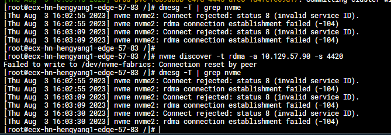
问题说明：经过排查，做过bond的tgt节点可以正常discover，与网卡bond有关

## 17. 不同节点使用相同pvc共享pv时，报错
Multi-Attach error for volume "pvc-7c8a9de0-6288-471b-9bfa-33e8bc17c6c4" Volume is already used by pod(s) xxx

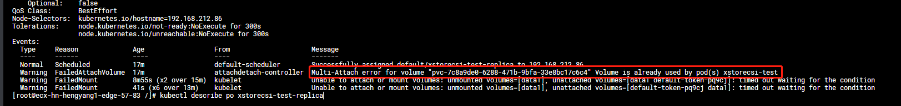

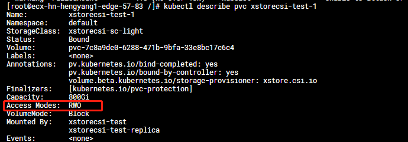

解决：创建pvc时，指定accessModes为ReadWriteMany

## 18. 启动容器内部执行 iscsi 报错
iscsiadm: iscsid is not running. Could not start it up automatically using the startup command in the /etc/iscsi/iscsid.conf iscsid.startup setting. Please check that the
file exists or that your init scripts have started iscsid.

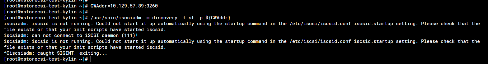

说明：与宿主机的iscsid服务通信报错，pod需要配置 hostNetwork: true 

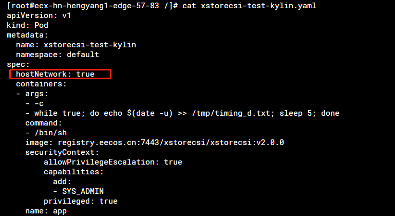

## 19. controller 设置多副本
kubectl edit sts xxxcsi-controller -n kube-system
修改 spec.replicas
* 需要csi sidercar容器provisoner新增选主参数：'--leader-election=true'，否则会导致所有副本都收到请求

## 20. 配置监控metrics

* CSI_ENDPOINT 取值要与pod内其它container取值相同

### CSI NodeServer
业务容器新增参数
```
            - '--enablegrpcmetrics=true'
            - '--metricsport=19090'
            - '--metricspath=/metrics'
```
Pod新增探活容器，该容器通过rpc调用csi metrics接口，获取metrics数据
```
        - name: liveness-prometheus
          image: <registry>/<liveness-image>:<tag>
          args:
            - '--type=liveness'
            - '--endpoint=$(CSI_ENDPOINT)'
            - '--metricsport=9090'
            - '--metricspath=/metrics'
            - '--polltime=60s'
            - '--timeout=3s'
          env:
            - name: CSI_ENDPOINT
              value: unix:///csi/csi.sock
            - name: POD_IP
              valueFrom:
                fieldRef:
                  apiVersion: v1
                  fieldPath: status.podIP
          resources: {}
          volumeMounts:
            - name: socket-dir
              mountPath: /csi
          terminationMessagePath: /dev/termination-log
          terminationMessagePolicy: File
          imagePullPolicy: IfNotPresent
          securityContext:
            privileged: true
```
### CSI ControllerServer
业务容器新增参数
```
            - '--enablegrpcmetrics=true'
            - '--metricsport=19091'
            - '--metricspath=/metrics'
```
同样pod新增探活容器，该容器通过rpc调用csi metrics接口，获取metrics数据
```
        - name: liveness-prometheus
          image: <registry>/<liveness-image>:<tag>
          args:
            - '--type=liveness'
            - '--endpoint=$(CSI_ENDPOINT)'
            - '--metricsport=9091'
            - '--metricspath=/metrics'
            - '--polltime=60s'
            - '--timeout=3s'
          env:
            - name: CSI_ENDPOINT
              value: unix:///csi/csi-provisioner.sock
            - name: POD_IP
              valueFrom:
                fieldRef:
                  apiVersion: v1
                  fieldPath: status.podIP
          resources: {}
          volumeMounts:
            - name: socket-dir
              mountPath: /csi
          terminationMessagePath: /dev/termination-log
          terminationMessagePolicy: File
          imagePullPolicy: IfNotPresent
```
### 验证
```
curl http://ip:port/metrics # 查看是否返回 metrics
curl http://IP:9091/metrics | grep liveness # 查看controller是否存活
```
### 监控项说明
业务类
```
1、node_unstage_failures：unstage流程中调用接口失败，但为了不阻塞重新挂载而产生脏数据的volume
# HELP node_unstage_failures Total number of failed CSI volume unstage
# TYPE node_unstage_failures counter
node_unstage_failures{volume_id="bdev-xstorcsi00ecx-00000000-pvc-xxxxxxxx-xxxx-xxxx-yyyy-000000000000"} 2
说明：该例子说明unstage volume id为 bdev-xstorcsi00ecx-00000000-pvc-xxxxxxxx-xxxx-xxxx-yyyy-000000000000 的云盘，实际后台调用接口失败了2次，需要人工介入处理
```
服务类
```
1、csi_liveness：对应csi业务服务的运行状态，0为异常，1为正常
# HELP csi_liveness Liveness Probe
# TYPE csi_liveness gauge
csi_liveness 0

2、grpc_server_started_total：各RPC接口的调用次数统计
# HELP grpc_server_started_total Total number of RPCs started on the server.
# TYPE grpc_server_started_total counter

3、grpc_server_handled_total：各RPC接口的处理接口状态统计（按处理状态分类）
# HELP grpc_server_handled_total Total number of RPCs completed on the server, regardless of success or failure.
# TYPE grpc_server_handled_total counter
如：grpc_server_handled_total{grpc_code="OK",grpc_method="NodeUnstageVolume",grpc_service="csi.v1.Node",grpc_type="unary"} 2

4、grpc_server_handling_seconds_sum：各RPC接口处理时间累加值
如：grpc_server_handling_seconds_sum{grpc_method="NodeUnstageVolume",grpc_service="csi.v1.Node",grpc_type="unary"} 0.291672519

5、grpc_server_handling_seconds_count：各RPC接口处理次数总和
如：grpc_server_handling_seconds_count{grpc_method="NodeUnstageVolume",grpc_service="csi.v1.Node",grpc_type="unary"} 2

6、grpc_server_handling_seconds_bucket：各RPC接口处理时间分布
如下所示：
grpc_server_handling_seconds_bucket{grpc_method="NodeUnstageVolume",grpc_service="csi.v1.Node",grpc_type="unary",le="0.5"} 2
grpc_server_handling_seconds_bucket{grpc_method="NodeUnstageVolume",grpc_service="csi.v1.Node",grpc_type="unary",le="1"} 2
grpc_server_handling_seconds_bucket{grpc_method="NodeUnstageVolume",grpc_service="csi.v1.Node",grpc_type="unary",le="2"} 2
```
## 21. 日志分级实现

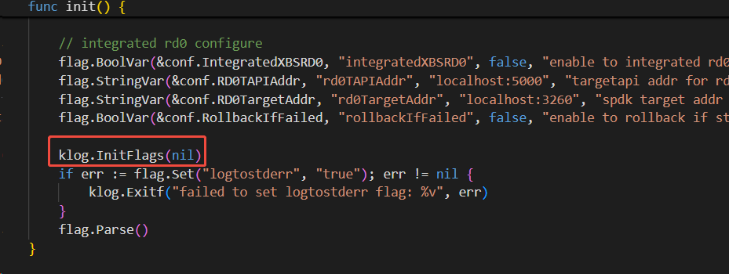

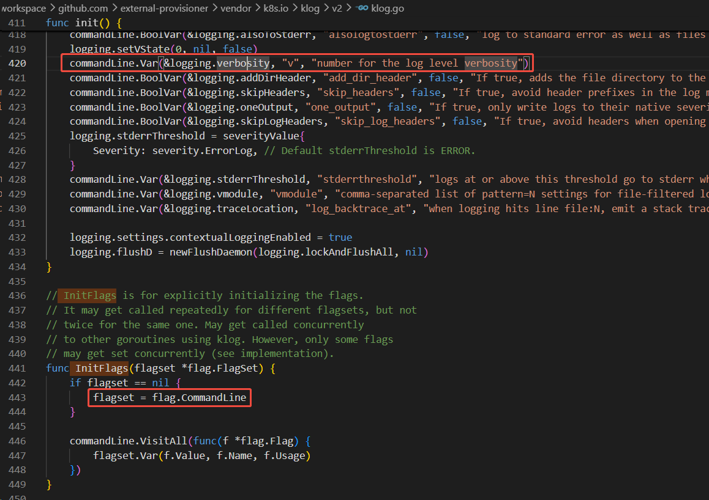

klog.InitFlags 自动注册命令行参数比如--v到全局flag中，flag.Parse() 会获取解析参数

业务代码中通过指定内容打印等级，klog.V(5).Infof ，启动时配置打印日志等级

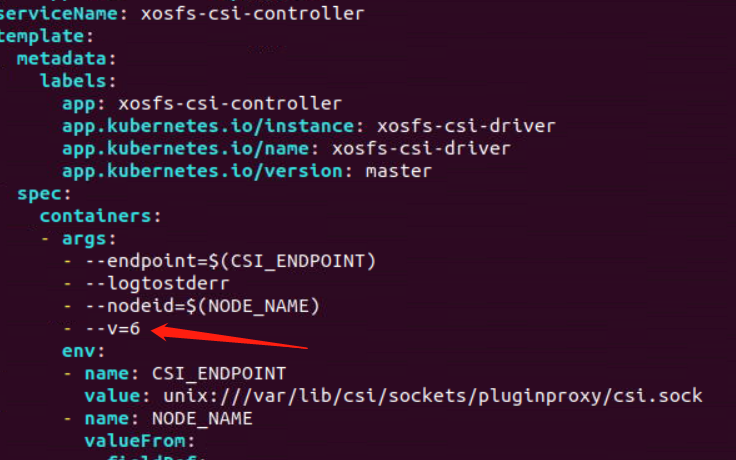

## 22. Provisioner 处理pvc的过程中触发了切主操作
### 如何保证pvc处理任务的可恢复性
新Leader会进行resync, resyncPeriod 到期，Informer 会将其缓存中的所有对象（不是重新从 API Server 拉取全量数据）重新“推入”工作队列，触发 ProvisionController 对这些对象的 Reconcile 过程，从而增强健壮性和自愈能力

resyncPeriod默认15min

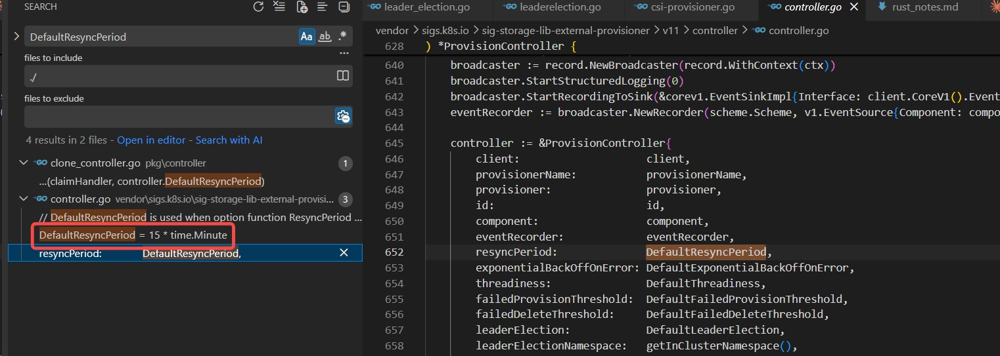

### 如何避免双主脑裂问题
旧Leader续约失败有10s的刷日志时间
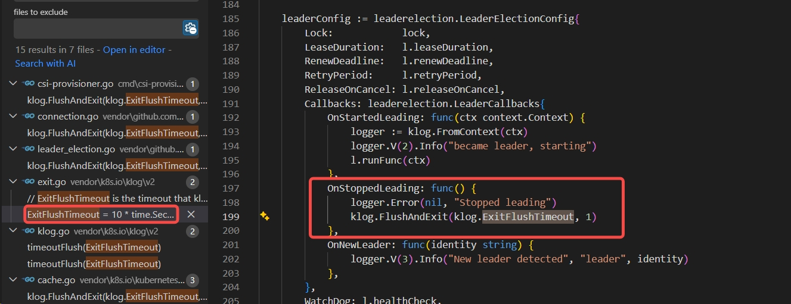
- 旧Leader续约失败，在新Leader切换完成后，旧Leader还未完成OnStoppedLeading清理，此时仍然执行pvc处理任务
- 新Leader进行resync ，也会重新执行pvc处理任务。

**此时需要pvc处理逻辑的幂等性保证两处重复执行不出错**

## 23. 查看CSIDriver支持的属性
不同版本CSIDriver支持的属性不同，创建pvc时，需要根据CSIDriver的属性来配置kubelet对pvc的行为
kubectl explain CSIDriver.spec
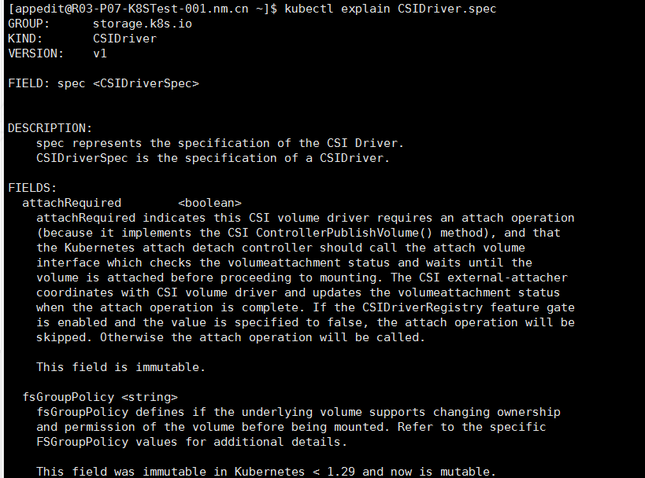

