## 1. staging/publish阶段的区别
staging是针对pvc在node上的准备阶段，同一个pvc在同一个node上挂载多次只需要StageVolume一次

publish是pvc在pod挂载前的发布阶段，每个pod的挂载卸载都会单独调用PublishVolume/UnpublishVolume

## 2. global map path的作用
kubelet中对该设备目录的操作流程发生在MapBlockVolume阶段

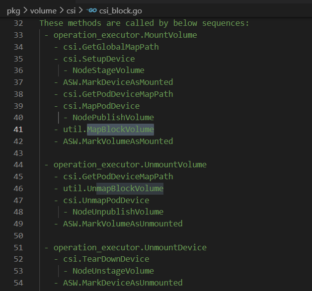

global map path将设备文件描述符创建为loop块设备，losetup命令会在内核打开并持有这个path的文件描述符，防止对应设备在不知情情况下被卸载或者挂载到其它pod

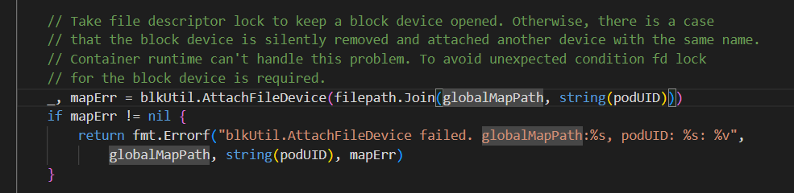

getLoopDeviceFromSysfs通过扫描对比/sys/block/loop*目录下的所有backing_file文件获取到global map path对应的loop设备

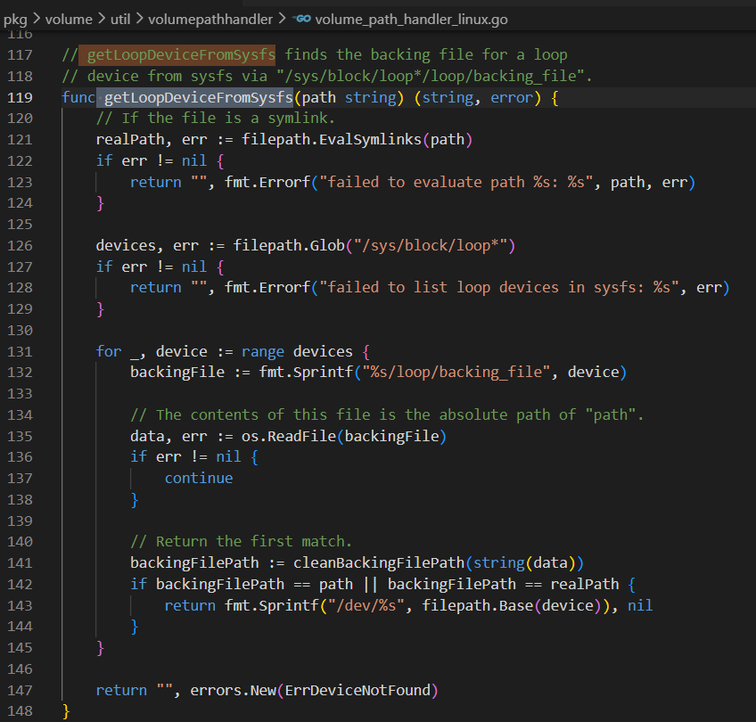
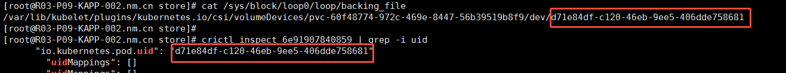

## 3. 真正提供给pod去bind的设备路径
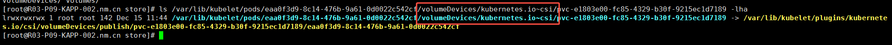

## 4. pod内设备名称由容器运行时containerd创建
PublishVolume后，kubelet通过调用CRI gRPC接口创建container

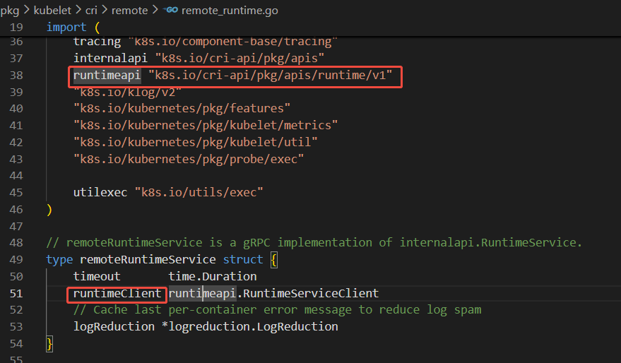
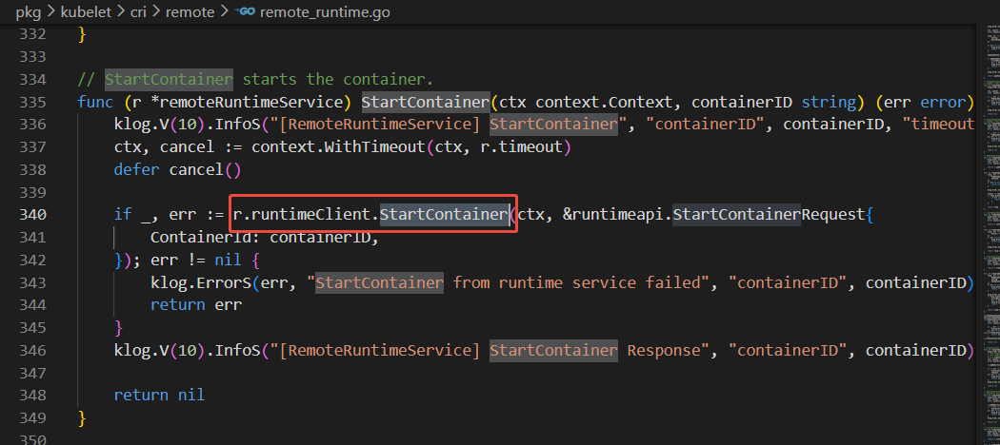


containerd接收到CRI请求后，调用runc

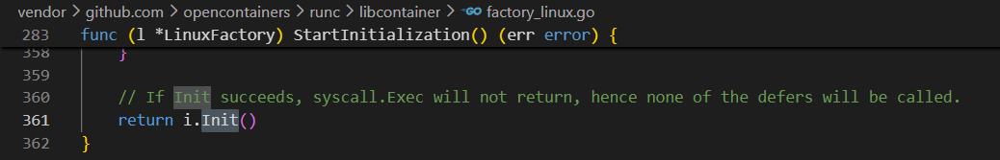

Init流程中prepareRootfs创建rootfs

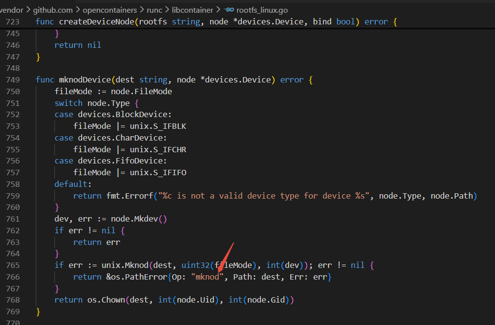
三方库通过mknod创建声明的设备

## 5. kubelet与containerd通信sock文件
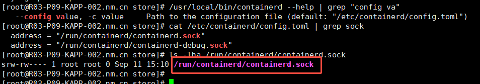
## 6. kubelet先PublishVolume再创建pod
kubelet前序流程

```
cmd->kubelet
  ->RunKubelet
    ->createAndInitKubelet
      ->pkg.NewMainKubelet
        ->makePodSourceConfig
          ->NewSourceApiserver
            ->NewListWatchFromClient  # create watch, filter spec.nodeName
    ->pkg.RunOnce
      ->pkg.runPod
        ->pkg.SyncPod
```
SyncPod内部开始处理volume

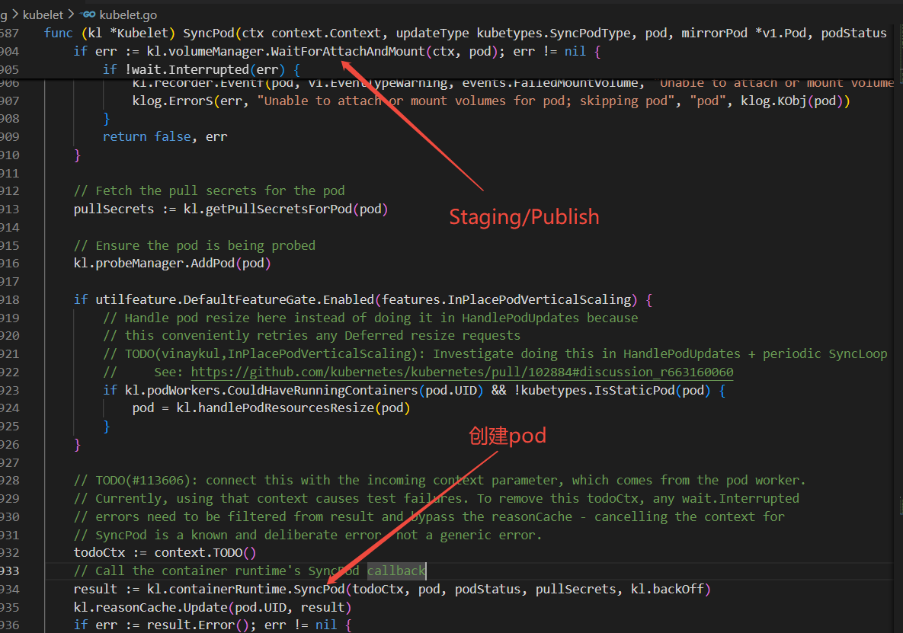
## 7. volumeBindingMode模式及区别
CreateVolume 的调用时机不同

Immediate 模式：

PVC 创建 -> external-provisioner 立即收到 Add 事件 -> 调用 CSI CreateVolume -> 生成 PV -> 完成 PV/PVC 绑定 -> 以后 Pod 调度再随便挑节点。

WaitForFirstConsumer 模式：

PVC 创建 -> provisioner 只把 PVC 缓存起来，不调用CSI CreateVolume -> 等第一个使用它的 Pod 进入调度 -> scheduler 把 selected-node 写回 PVC -> provisioner 才根据该节点信息调用 CSI CreateVolume -> 生成 PV -> 完成绑定 -> kubelet 挂载。

## 8. 接口失败指数退避重试
代码写死了必须使用“指数退避”方式进行重试
```
kubernetes/pkg/volume/util/operationexecutor/operation_executor.go:NewOperationExecutor
  ->exponentialBackOffOnError=true
```
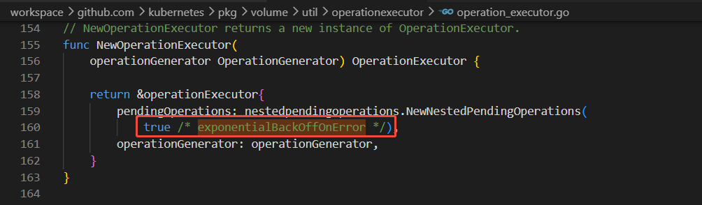
## 9. CSI RPC接口定义
接口proto描述文件：https://github.com/container-storage-interface/spec/blob/master/csi.proto

编译脚本：https://github.com/container-storage-interface/spec/blob/master/lib/go/Makefile

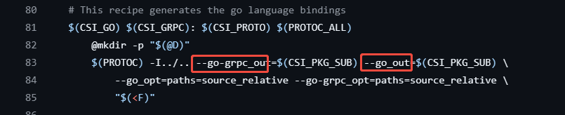

生成go接口文件：https://github.com/container-storage-interface/spec/blob/master/lib/go/csi/csi_grpc.pb.go

生成go数据结构文件：https://github.com/container-storage-interface/spec/blob/master/lib/go/csi/csi.pb.go

## 10. 创建snapshot，csi并未触发调用CreateSnapshot接口
csi的sidecar中配置了csi-snapshot 这个容器，但要执行snapshot操作还需要snapshot controller，除了配置snapshot相关crd外，还需要部署snapshot controller

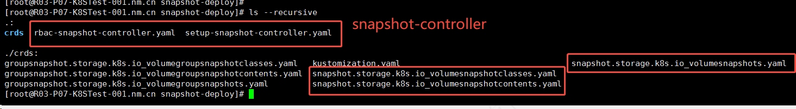

snapshot controller会对snapshot相关cr进行管控，csi sidecar csi-snapshot识别到vsc后调用csi接口

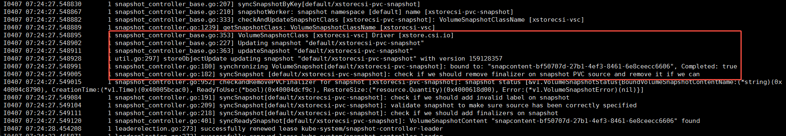
