## 1. docker cp permission denied
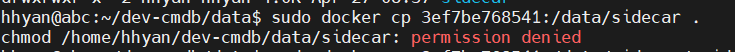

上级目录设置权限777后可以拷贝
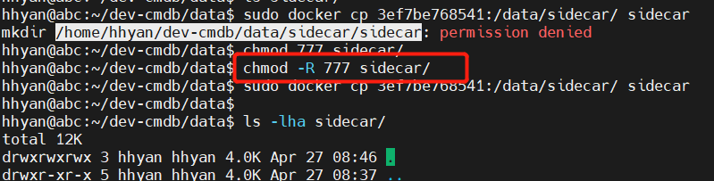

或者直接拷贝到/tmp/或者/root/ 目录下
sudo docker cp  x:/yyy /root/

## 2. docker build卡住
docker build卡在apk add，但是本地wget没问题
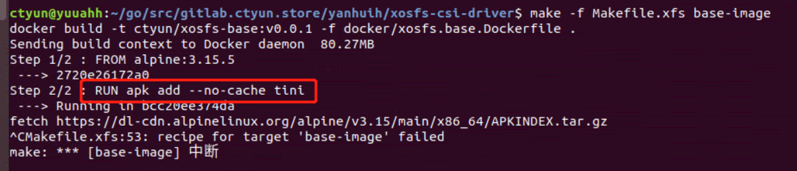

解决：使用host网络 --network host
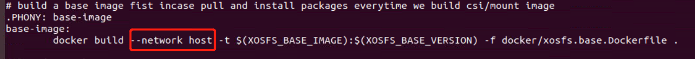

## 3. docker跨平台交叉编译
可以使用多阶段构建
构建实际镜像时，先引用golang镜像内部编译二进制包
```
# 第一阶段：编译 Golang 二进制包
FROM golang:1.16 AS builder

WORKDIR /app

COPY . .

# 使用交叉编译来构建不同平台的二进制包
# 注：go build本身支持跨平台编译
RUN GOARCH=amd64 GOOS=linux go build -o app-linux-amd64
RUN GOARCH=arm64 GOOS=linux go build -o app-linux-arm64

# 第二阶段：构建镜像
FROM alpine:3.14

WORKDIR /app

# 复制不同平台的二进制包
COPY --from=builder /app/app-linux-amd64 app-linux-amd64
COPY --from=builder /app/app-linux-arm64 app-linux-arm64

# 设置入口命令
CMD ["./app-linux-amd64"]
```
为保证本地编译二进制与镜像中使用的二进制包的一致性，这里不使用多阶段构建。


### 4. ERROR: Multiple platforms feature is currently not supported for docker driver
说明：默认的docker 驱动不支持跨平台编译
解决：切换到 docker-container
docker buildx create --name=container --driver=docker-container --use --bootstrap

### 5. The GPG keys listed for the "CentOS-7 - Base" repository are already installed but they are not correct for this package.
解决：使用官方gpgkey，替换repo中的gpgkey地址和本地rpm-gpg

### 6. docker内部fuse挂载
报错：/bin/fusermount: fuse device not found
启动时加入--privileged参数
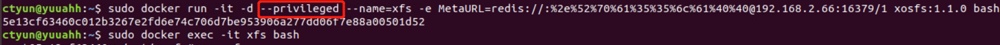


### 7. docker使用gpu设备
#### （1）报错：could not select device driver "" with capabilities: [[gpu]]

说明：需要更新gpu toolkits

```
distribution=$(. /etc/os-release;echo $ID$VERSION_ID)
curl -s -L https://nvidia.github.io/nvidia-docker/gpgkey | sudo apt-key add -
curl -s -L https://nvidia.github.io/nvidia-docker/$distribution/nvidia-docker.list | sudo tee /etc/apt/sources.list.d/nvidia-docker.list

sudo apt-get update && sudo apt-get install -y nvidia-container-toolkit
sudo systemctl restart docker
```

### （2）报错：nvidia-container-cli: initialization error: load library failed: libnvidia-ml.so.1: cannot open shared object file: no such file or directory: unknown
解决：sudo apt install nvidia-driver-525

### （3）ubuntu-drivers 命令行不存在
sudo apt install ubuntu-drivers-common

### （4）运行ubuntu-drivers 命令行报错
ModuleNotFoundError: No module named 'apt_pkg'
解决：sudo ln -s /usr/lib/python3/dist-packages/apt_pkg.cpython-36m-x86_64-linux-gnu.so /usr/lib/python3/dist-packages/apt_pkg.so

## 4. 构建多cpu平台架构镜像
### （1）使用docker buildx 构建
Dockerfile
```
ARG DEP_BIN_DIR="/workspace/dep_bin"
ARG BASE_IMAGE


#-- Copy the right architecture dependency binaries
FROM alpine:latest as copier
ARG DEP_BIN_DIR
COPY deps ${DEP_BIN_DIR}
RUN if [ $(uname -m) = "aarch64" ]; then \
        mv ${DEP_BIN_DIR}/aarch64/csc ${DEP_BIN_DIR}/csc; \
        mv ${DEP_BIN_DIR}/aarch64/xstorecsi ${DEP_BIN_DIR}/xstorecsi; \
        chmod +x ${DEP_BIN_DIR}/*; \
    elif [ $(uname -m) = "x86_64" ]; then \
        mv ${DEP_BIN_DIR}/x86_64/csc ${DEP_BIN_DIR}/csc; \
        mv ${DEP_BIN_DIR}/x86_64/xstorecsi ${DEP_BIN_DIR}/xstorecsi; \
        chmod +x ${DEP_BIN_DIR}/*; \
    else \
        echo "Unknown OS System Architecture!"; \
        exit -1; \
    fi


#-- Final container
FROM ${BASE_IMAGE}

ARG DEP_BIN_DIR

WORKDIR /root

COPY --from=copier ${DEP_BIN_DIR}/csc /root
COPY --from=copier ${DEP_BIN_DIR}/xstorecsi /root

ENTRYPOINT ["/root/xstorecsi"]

```
Makefile
```
.PHONY: image-all
image-all: bin-all
        mkdir -p deps
        cp -r ../aarch64 ../x86_64 deps/
        cp bin/arm64/xstorecsi deps/aarch64/
        cp bin/amd64/xstorecsi deps/x86_64/
        docker buildx build -t ${REMOTE_IMAGE} \
                --build-arg BASE_IMAGE=${REMOTE_BASEIMAGE} \
                --platform linux/amd64,linux/arm64 -f deploy/image/Dockerfile_local . --push
```
### （2）使用docker manifest 合并不同平台镜像
```
docker manifest create ${REMOTE_IMAGE} ${REMOTE_IMAGE}-arm64 ${REMOTE_IMAGE}-amd64
docker manifest push ${REMOTE_IMAGE}
```
## 5. windows wsl启动proto-gen容器配置后仍然没有使用正确GOPROXY
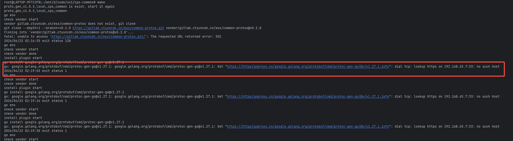
Makefile
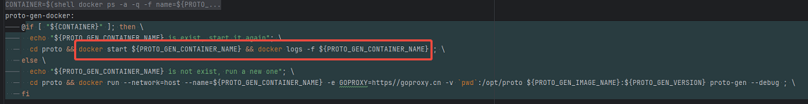

说明使用镜像默认的GOPROXY，通过-e 新增GOPROXY环境变量发现仍然未生效

解决：这里是docker start一个已经启动过的容器，环境变量在run的时候已经固定。docker rm后，重新启动并加入-e GOPROXY=https://goproxy.cn,direct

## 6. skopeo+podman同步仓库镜像
本地启动podman或者docker
podman run quay.io/skopeo/stable:latest copy --help
```
 podman run quay.io/skopeo/stable:latest copy docker://harbor-dev.ctyun.store:23443/xstore/xstor-csi-driver:v2.2.1 docker://harbor.ctyuncdn.cn/xstore-dev/xstor-csi-driver:v2.2.1 \
   --multi-arch all \
   --src-username 'robot$xstore-skopeo-sync' --src-password "" \
   --dest-username 'robot$xstore-dev+ctyuncdn-skopeo-sync' --dest-password ""
```
### Toubleshooting
（1）unauthorized to access repository
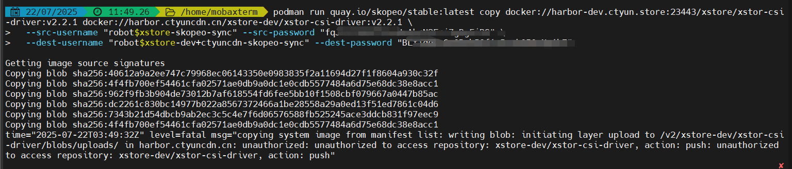

原因：username中$当作变量被引用
解决：双引号改成引号

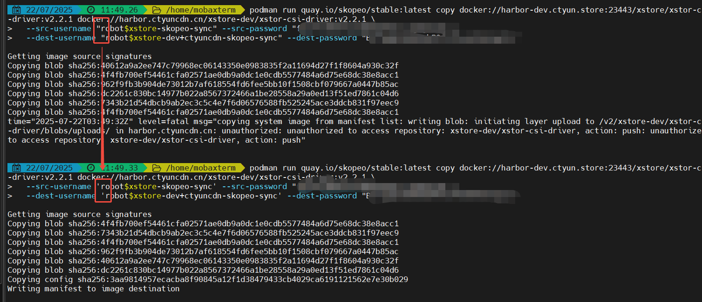

（2）对于跨平台镜像，只同步了单cpu arch镜像，没有同步其它arch镜像

解决：加参数--multi-arch all

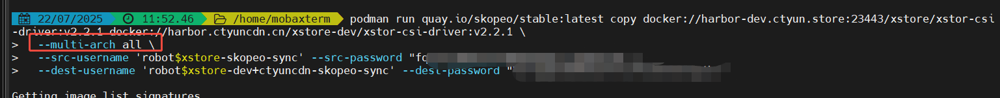

## 7. ubuntu 18.04修改docker默认路径
(1) 停止dockerd
```
sudo systemctl stop docker
sudo systemctl stop docker.socket
sudo systemctl stop containerd
```
docker会被docker命令行直接启动
(2) 将数据拷贝到新目录
```
sudo cp -rp /var/lib/docker /mnt/vdb/
```
(3) 新增配置
```
sudo vim /etc/docker/daemon.json
{
  "data-root": "/mnt/vdb/docker"
}
```
(4) 启动docker服务
```
sudo systemctl start docker
```
(5) 检查
```
sudo docker info -f '{{ .DockerRootDir}}'
```
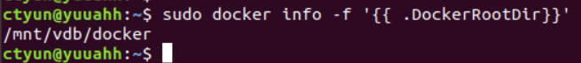

## 8. x86上运行arm镜像
(1) 拉取arm镜像
通过 --platform=linux/arm64 指定平台
```
docker pull --platform=linux/arm64 quay.io/ceph/ceph:v14
```

(2) 启用qemu支持
```
# apt-get install qemu
docker run --rm --privileged multiarch/qemu-user-static --reset -p yes
```
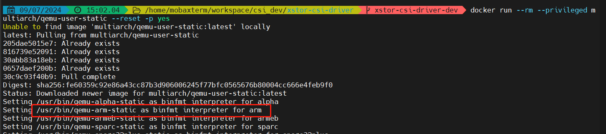

说明宿主机配置了binfmt_misc，对特定的二进制使用对应解析器执行

## 9. Docker for MongoDB
```
docker pull mongo
docker run -d -p 27017:27017 \
  -v "D:\Program Files\MongoDB\Server\7.0\data":/data/db \
  --name my-mongo-container mongo
docker exec -it my-mongo-container bash
```
说明：数据目录可以直接拷贝迁移等到其它节点的mongodb docker实例上，使用-v映射到容器内部的/data/db 目录即可直接使用。

查询相关数据
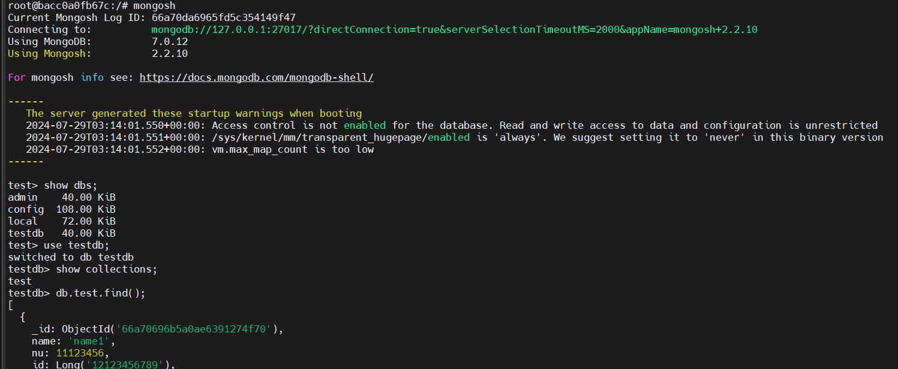

指定nu查询
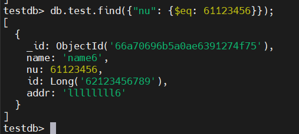

## 10. Docker proxy代理
打开代理端口
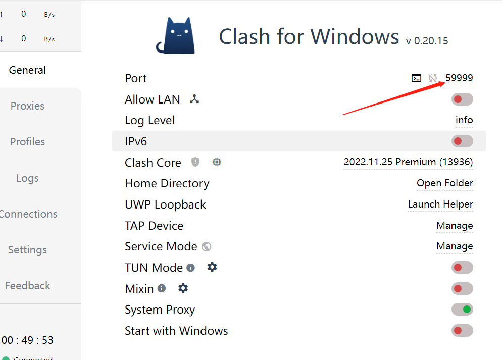


docker命令行环境导出代理环境变量
```
export HTTP_PROXY=http://127.0.0.1:59999
export HTTPS_PROXY=http://127.0.0.1:59999
```

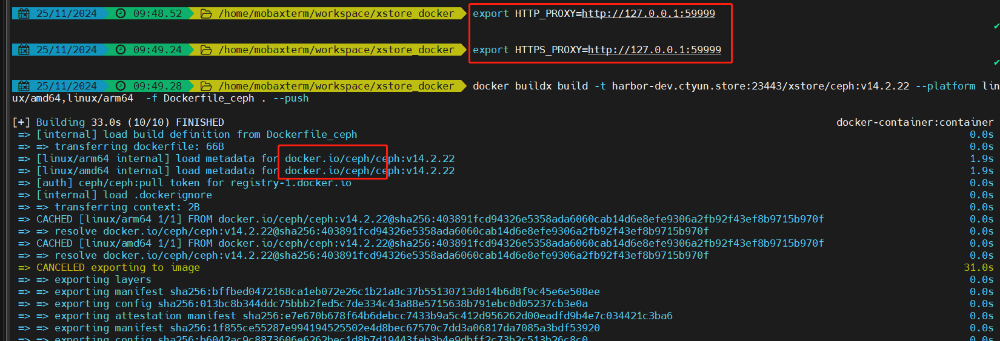

## 11. DockerDesktop空间压缩

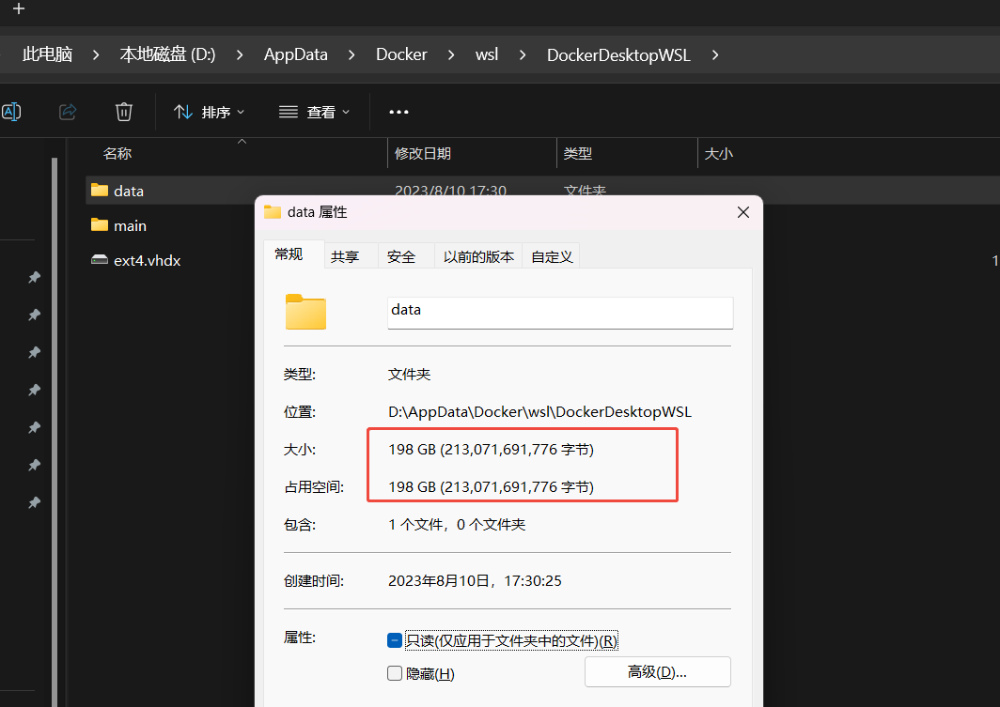
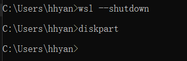
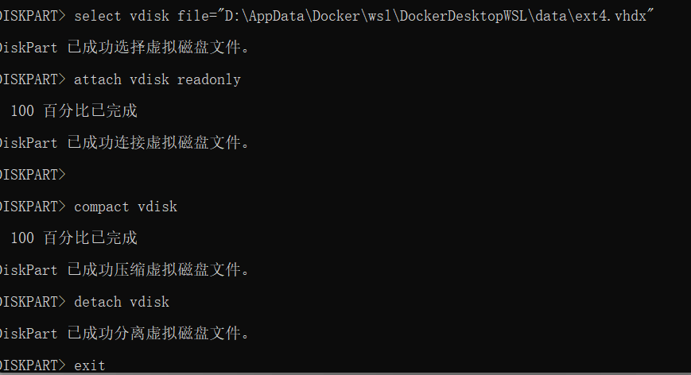
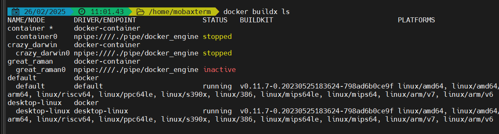
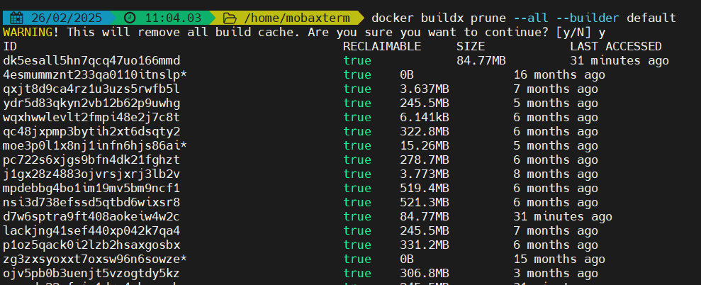
通过以上docker buildx prune 清理镜像缓存后，重新压缩一下，可进一步释放空间
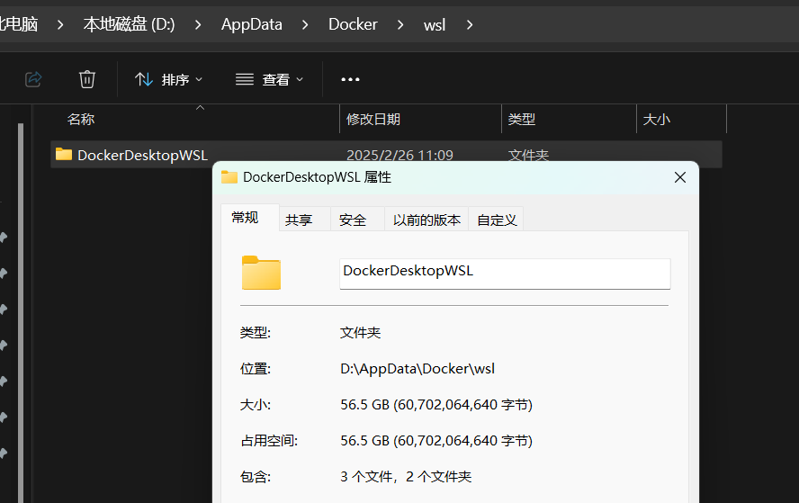
## 12. Dockerfile变量不生效
refer: https://docs.docker.com/engine/reference/builder/#understand-how-arg-and-from-interact


ARG在FROM之前声明的变量在FROM之后无法生效
要在FROM之后的语句中引用的话必须重新用ARG声明
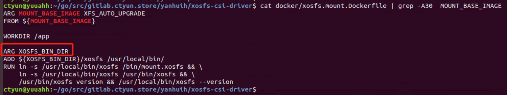

## 13. losetup in Docker or Pod
(1) dd写报错: Operation not permitted
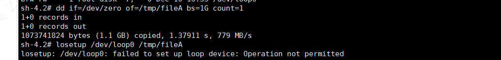

问题定位：经对比，pod对应容器内未配置权限
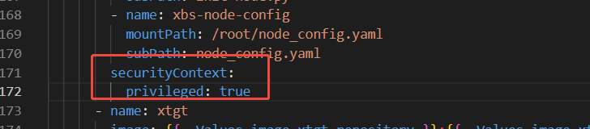

(2) losetup | grep xx 导致脚本退出

说明：脚本set -e(出错即退出)后，grep命令行未找到匹配项目使得整个命令行退出码非0，导致脚本退出
解决：grep 后新增 || true
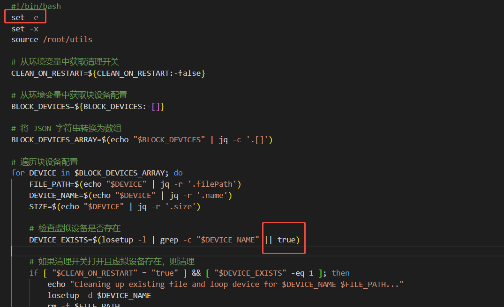

## 14. 清空docker或者k8s pod日志
默认日志在 /var/lib/docker/container/xxx/xxx-json.log
xxx：为docker id，pod需要先找到对应docker
如下：
```
truncate -s 0 /var/lib/docker/container/5f172bfeeec82bb86e582a2ce70b575cbc24f48d874c009611b9d6091935dd10/5f172bfeeec82bb86e582a2ce70b575cbc24f48d874c009611b9d6091935dd10-json.log
```
清空所有pod日志
```
truncate -s 0 /var/lib/docker/containers/*/*-json.log
```

## 15. 容器动态新增expose端口
(1) -p 新增端口映射
```
# 提交容器为新镜像
docker commit -a "hhyan" -m "for new expose" 15a56423e982 nacos/nacos-server:newport
docker run --detach=true --name nacos-newport -p 9848:9848 -p 8848:8848 nacos/nacos-server:newport
# 把容器中的9848端口也暴露出去
```

(2) 不新建容器动态新增端口映射

找到并修对应容器的hostconfig.json
注意：需要停止docker，否则修改会被覆盖

## 16. 容器提权操作宿主机
宿主机上无root权限，但是容器使用privileged / hostpid / hostnetwork 拉起
则使用nsenter 可以进入宿主机的命名空间
```
nsenter --mount=/proc/1/ns/mnt
```
说明：进入宿主机的命名空间后，即可操作宿主机的文件系统
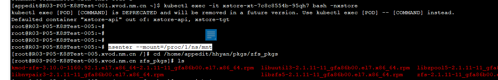

## 17. How to SSH into the Docker VM (MobyLinuxVM) on Windows
refer: https://forums.docker.com/t/how-can-i-ssh-into-the-betas-mobylinuxvm/10991/6
```
# get a privileged container with access to Docker daemon
docker run --privileged -it --rm -v /var/run/docker.sock:/var/run/docker.sock -v /usr/bin/docker:/usr/bin/docker alpine sh

# run a container with full root access to MobyLinuxVM and no seccomp profile (so you can mount stuff)
docker run --net=host --ipc=host --uts=host --pid=host -it --security-opt=seccomp=unconfined --privileged --rm -v /:/host alpine /bin/sh

# switch to host FS
chroot /host
```
## 18. standard_init_linux.go:190: exec user process caused "no such file or directory"
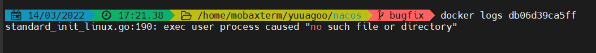
原因：windows下，文件为dos格式问题
解决：
dos2unix bin/*
重新构建

## 19. docker: Error response from daemon: error while creating mount source path '/opt/prometheus/prometheus.yml': mkdir /opt/prometheus: read-only file system.
```
root@abc:/opt/prometheus# docker run  -d \
-p 9090:9090 
-v /opt/prometheus/prometheus.yml:/etc/prometheus/prometheus.yml  
prom/prometheus
a5e324ef48a9b78cb2c5aeb69565f3e19ee2fb535ab755a4f96824cff4dd234d
docker: Error response from daemon: error while creating mount source path '/opt/prometheus/prometheus.yml': mkdir /opt/prometheus: read-only file system.
```
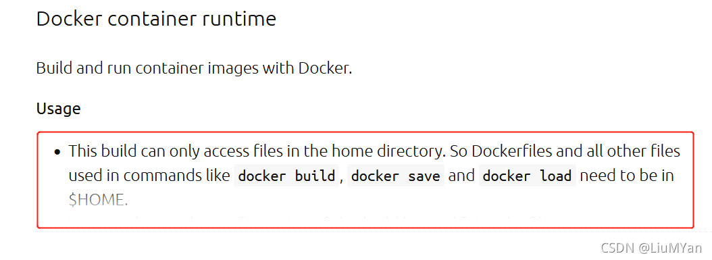
默认的配置是容器使用的所有文件都需要在/home目录下
解决：将目录移动到home目录下，重新-v挂载即可
(1) mv /opt/prometheus /home/hhyan/

(2) 调整启动挂载路径
```
docker run -d  \
    -p 9090:9090  \
    -v /home/hhyan/prometheus/prometheus.yml:/etc/prometheus/prometheus.yml  \
    prom/prometheus
```


## 20. docker build报错：Could not resolve host: mirrorlist.centos.org

原因：centos 7到期，需要切换到vault.centos.org

## 21. 查看image的dockerfile
- 下载工具镜像 alpine/dfimage
```
sudo docker pull alpine/dfimage
```
- 配置命令行
```
alias dfimage="sudo docker run -v /var/run/docker.sock:/var/run/docker.sock --rm alpine/dfimage"
```
- 执行分析
```
dfimage pingcap/tikv:latest
```
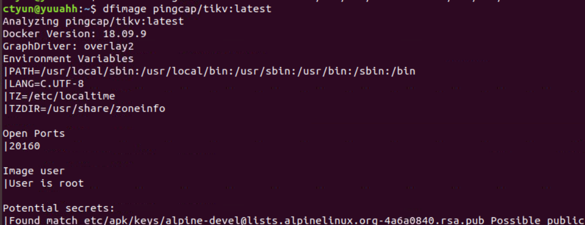

注：也可以 docker history <image> 查看
