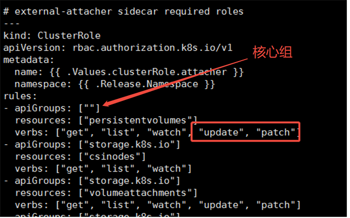
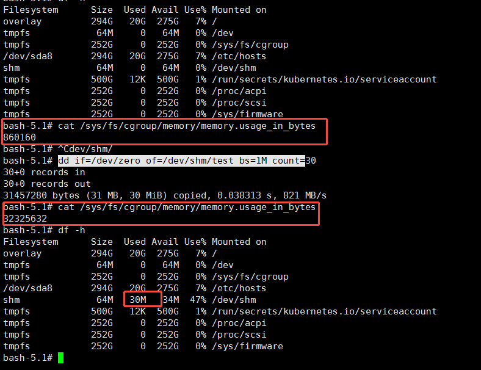
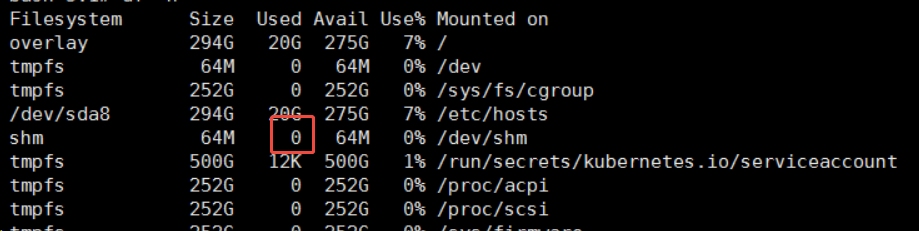
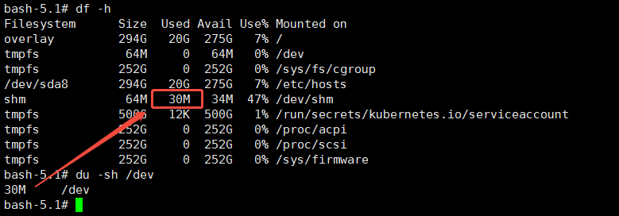
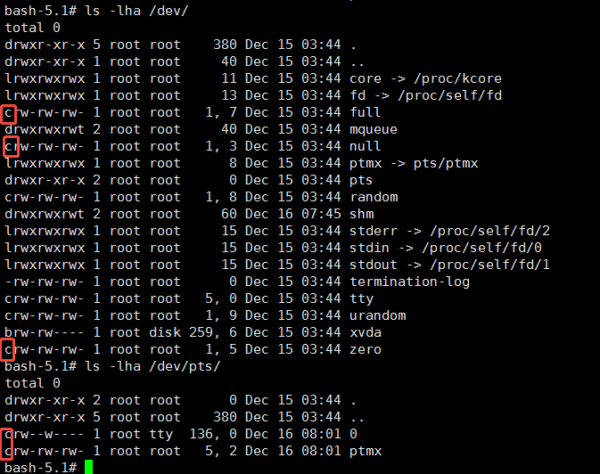
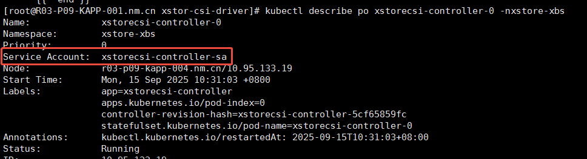
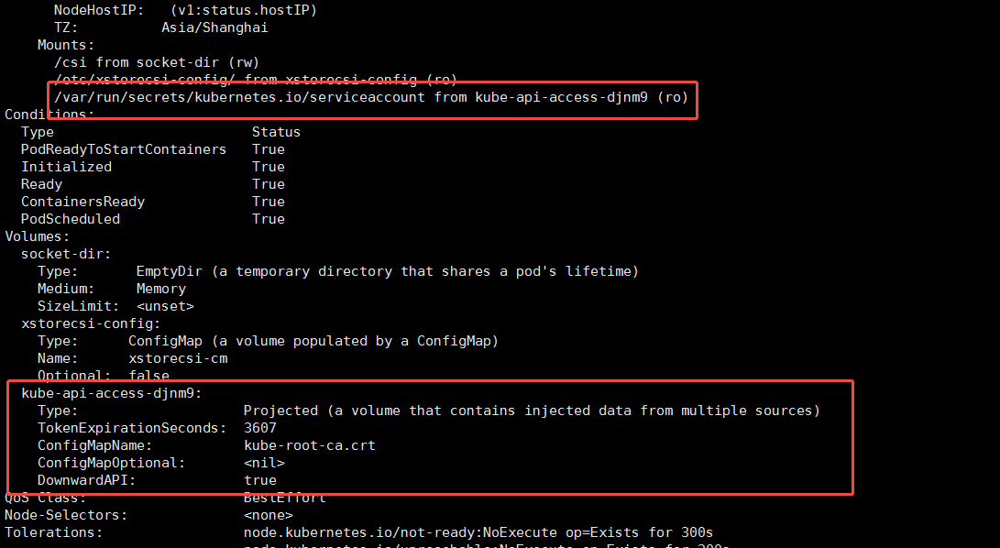
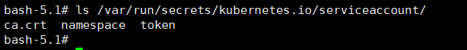

## 1. Cloud Controller Manager(CCM)
LoadBalance 类型的Service需要调用云厂商API创建公网IP
基本流程是
```
用户创建 LoadBalancer 类型的Service
        ↓
kube-apiserver 存储到 etcd
        ↓
Cloud Controller Manager 检测到
        ↓
调用云厂商特定 API
        ↓
创建云负载均衡器 + 公网 IP
        ↓
更新 Service 的 status.loadBalancer.ingress
```
此处的ingress并非k8s原生的Ingress资源的含义

## 2. ClusterRole中update与patch


update：PUT请求，全量替换
patch：PATCH请求，修改特定字段

## 3. 容器内的共享内存 /dev/shm占用的内存是计入容器的 request memory的


## 4. 动态设备文件默认不占用内存

/dev/下的设备节点本身存在内存文件系统tmpfs中，用多少占多少





/dev/下其它设备为字符设备



## 5. Pod内访问Kubernete API

pod内访问k8s API需要传递ca证书，pod通过声明ServiceAccount后，k8s Admission Controller会自动给pod添加对应权限的volumeMount，挂载到每个容器内部





容器内


pod内服务代码初始化k8s客户端
```
import (
    "k8s.io/client-go/kubernetes"
    "k8s.io/client-go/rest"
    "k8s.io/client-go/informers"
    "k8s.io/client-go/tools/cache"
)

func NewK8sClient() (*kubernetes.Clientset, error) {
    var cfg *rest.Config
    var err error
    cPath := os.Getenv("KUBERNETES_CONFIG_PATH")
    if cPath != "" {
        cfg, err = clientcmd.BuildConfigFromFlags("", cPath)
        if err != nil {
            return nil, fmt.Errorf("failed to get cluster config from %q: %w", cPath, err)
        }
    } else {
        cfg, err = rest.InClusterConfig()
        if err != nil {
            return nil, fmt.Errorf("failed to get cluster config: %w", err)
        }
    }
    client, err := kubernetes.NewForConfig(cfg)
    if err != nil {
        return nil, fmt.Errorf("failed to create client: %w", err)
    }

    return client, nil
}

func RunController(clientset kubernetes.Interface) {
    // 获取当前 Pod 的命名空间（从挂载的文件读取）
    namespaceBytes, err := os.ReadFile("/var/run/secrets/kubernetes.io/serviceaccount/namespace")
    namespace := "default"
    if err == nil {
        namespace = string(namespaceBytes)
    }

    klog.Infof("Starting controller in namespace: %s", namespace)

    // 创建 informer 监听 Service 变化
    factory := informers.NewSharedInformerFactoryWithOptions(
        clientset,
        30*time.Second,
        informers.WithNamespace(namespace),
    )

    serviceInformer := factory.Core().V1().Services().Informer()

    serviceInformer.Informer().AddEventHandler(cache.ResourceEventHandlerFuncs{
        AddFunc: c.handleServiceAdd,
        UpdateFunc: c.handleServiceUpdate,
        DeleteFunc: c.handleServiceDelete,
    })

    // 启动 informer
    stopCh := make(chan struct{})
    factory.Start(stopCh)
    factory.WaitForCacheSync(stopCh)

    <-stopCh
}
```


