## 1. openebs mayastor引擎两个节点的io-engine启动过程绑核报错

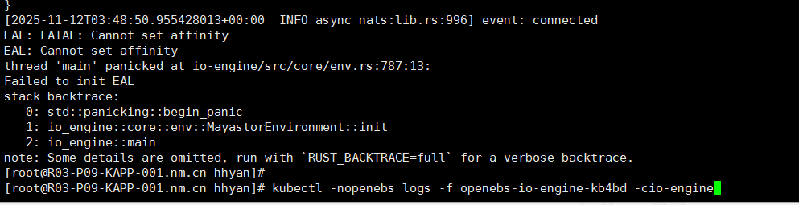
spdk服务启动报错 
EAL: FATAL: Cannot set affinity
EAL: Cannot set affinity
（1）其中一个节点绑定cpu的大页内存不够(配置系统大页内存后，每个numa node会单独分配，可能不够用)，通过增加对于numa node的大页内存后解决

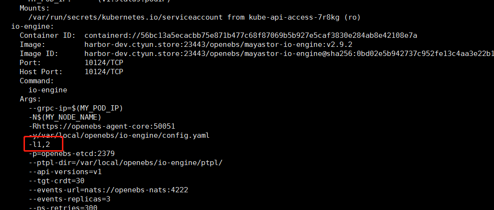

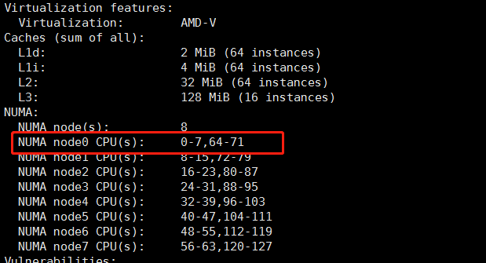

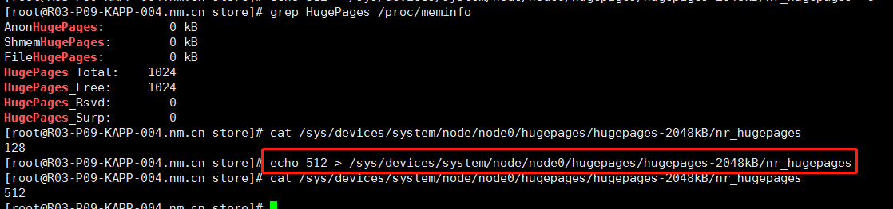

（2）另外一个节点是因为k8s配置了静态cpu分配策略，分配给pod的独占cpu与绑定核心对不上，导致绑定报错。由于openebs io-engine绑定cpu比较固定，原版没法读取容器内分配的cpu核心进行绑定，这里暂时关闭k8s赌占cpu的特性。关闭后io-engine状态恢复

```
容器内查询独享的cpu: cat /sys/fs/cgroup/cpuset/cpuset.cpus
节点上查看pod是否独占cpu: cat /var/lib/kubelet/cpu_manager_state
```
独占cpu核心操作
```
# https://kubernetes.io/zh-cn/docs/tasks/administer-cluster/cpu-management-policies/#static-policy
/var/lib/kubelet/config.yaml 新增配置 cpuManagerPolicy: static
mv /var/lib/kubelet/cpu_manager_state .
systemctl restart kubelet.service
systemctl status kubelet.service
journalctl -u kubelet -n30
节点上查看pod是否独占cpu: cat /var/lib/kubelet/cpu_manager_state
pod上所有容器配置request=limit（cpu和内存都要配置），包括init容器
容器内查询独享的cpu: cat /sys/fs/cgroup/cpuset/cpuset.cpus
node_config.yaml中cpu_cores与uzpool_cores
```

## 2. openebs配置DiskPool过程中，如果配置1.6T磁盘正常，配置7.3T磁盘报错
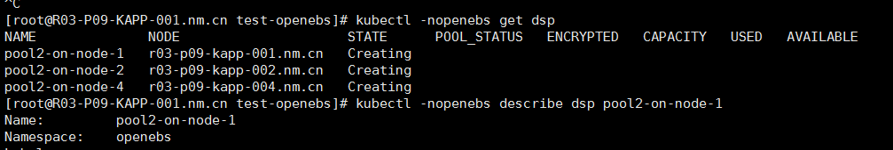
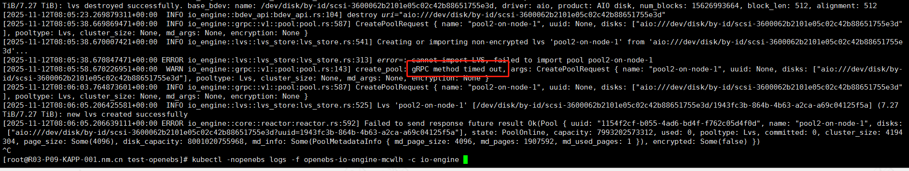

解决：通过延长restapi请求超时时间解决

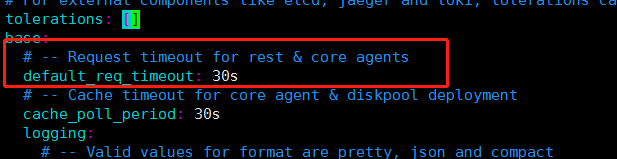
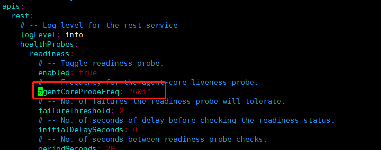
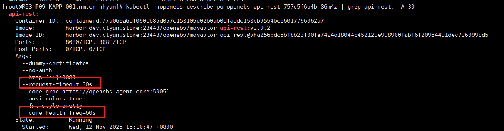

## 3. 新版mayastor已经不再使用原来的volume replica之类的cr来记录元数据，直接通过plugin kubectl-mayastor 查询mayastor组件接口：https://openebs.io/docs/4.0.x/user-guides/replicated-storage-user-guide/replicated-pv-mayastor/advanced-operations/kubectl-plugin

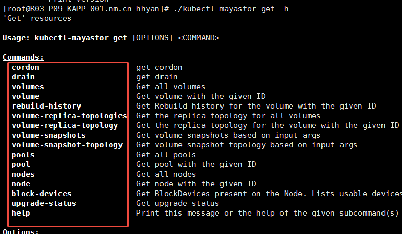

kubectl plugin 放在PATH目录下即可，kubectl mayastor会自动识别到kubectl-mayastor这个二进制

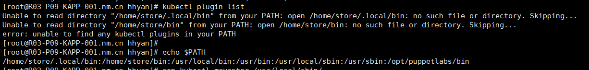

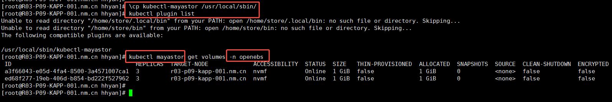

## 4. 4.mayastor编译

参考：https://github.com/openebs/mayastor/blob/develop/doc/build-all.md
