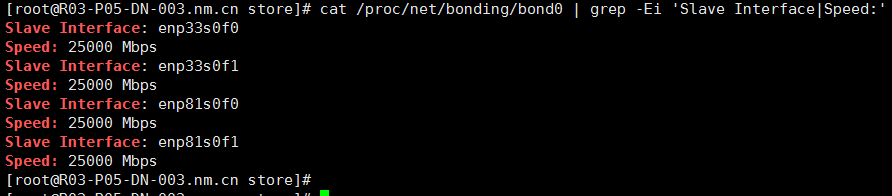
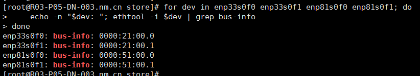
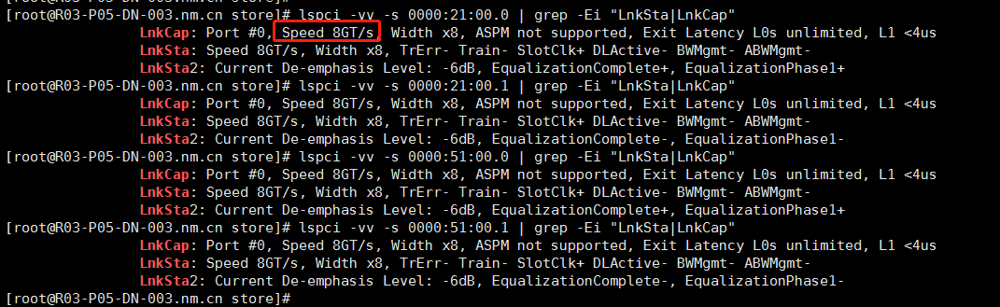
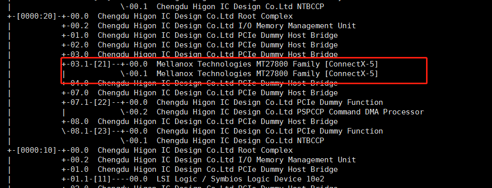
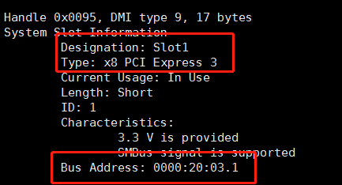

## PCIe及网络带宽
查看PCIe带宽是否满足网卡带宽
cat /proc/net/bonding/bond0 | grep -Ei 'Slave Interface|Speed:'

bond0网卡是25G*4
ethtool查看bus信息

lspci查看pcie带宽

Speed 8GT/s (8×10⁹次信号跳变/秒), 通道数lanes (Width) *8

lspci -tv 查看拓扑

* 这是一张双口网卡共享同一个pci插槽
PCIe 3.0 x8的单向理论带宽 = 8GT/s × 8 lanes × (128/130) ≈ 7.88GB/s（考虑编码开销）。
25Gbps网卡需要 **3.125GB/s（25Gbps / 8）**的单向PCIe带宽，双网卡50Gbps = 6.25GB/s，PCIe单个插槽双网口满足双网卡带宽需求。
故2个PCIe插槽4个接口可满足100Gbps bond0聚合网卡带宽。

dmidecode -t slot   查看所在插槽

类型：PCIe3  插槽：Slot1
