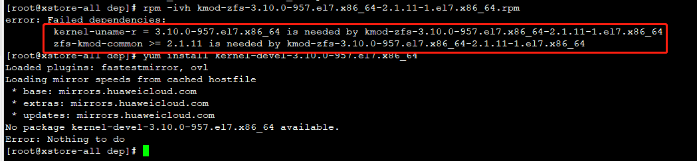
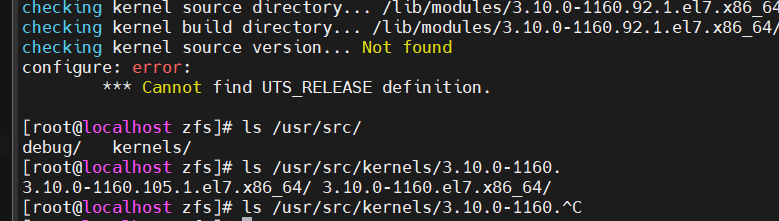
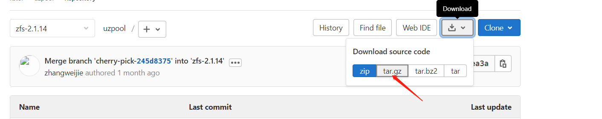
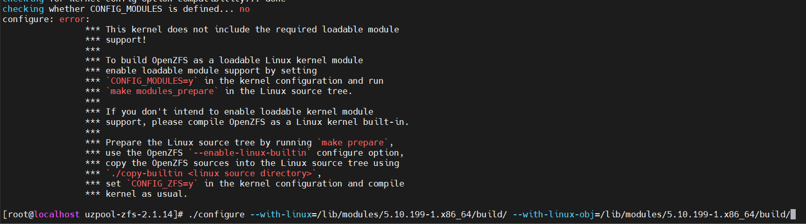
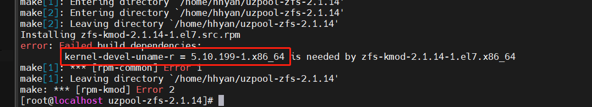

## zfs指定内核编译

参考：https://openzfs.github.io/openzfs-docs/Developer%20Resources/Building%20ZFS.html

Tips：https://rpmfind.net/ 上查找对应内核rpm包

centos下载对应版本内核rpm包
```bash
wget https://rpmfind.net/linux/centos/7.9.2009/updates/x86_64/Packages/kernel-3.10.0-1160.92.1.el7.x86_64.rpm
# wget https://rpmfind.net/linux/centos/7.9.2009/updates/x86_64/Packages/kernel-devel-3.10.0-1160.92.1.el7.x86_64.rpm
```

版本较低则强制安装
```bash
rpm -ivh kernel-3.10.0-1160.92.1.el7.x86_64.rpm --force
# rpm -ivh kernel-devel-3.10.0-1160.92.1.el7.x86_64.rpm --force
```
查看内核路径
```bash
rpm -qa | grep kernel-3.10.0-1160.92.1.el7
rpm -ql kernel-3.10.0-1160.92.1.el7.x86_64
```
/lib/modules/3.10.0-1160.92.1.el7.x86_64/

centos下安装编译工具
```bash
sudo yum install -y epel-release gcc make autoconf automake libtool rpm-build libtirpc-devel libblkid-devel libuuid-devel libudev-devel openssl-devel zlib-devel libaio-devel libattr-devel elfutils-libelf-devel kernel-devel-$(uname -r) python python2-devel python-setuptools python-cffi libffi-devel git ncompress libcurl-devel
```

gitlab或者githab上clone zfs源码（不要使用压缩包，会影响编码）
```bash
sh autogen.sh
./configure --with-linux=/lib/modules/3.10.0-1160.92.1.el7.x86_64/build/ --with-linux-obj=/lib/modules/3.10.0-1160.92.1.el7.x86_64/build/
# ./configure --with-linux=/lib/modules/$(uname -r)/build/ --with-linux-obj=/lib/modules/$(uname -r)/build/
make rpm #Builds RPM packages for CentOS/Fedora
make deb #Builds RPM converted DEB packages for Debian/Ubuntu
make native-deb #Builds native DEB packages for Debian/Ubuntu
```
## 容器内安装zfs
zfs依赖内核模块，容器内无法直接安装依赖内核的zfs


centos系统无法找到用户态的zfs cli，可以切换至ubuntu镜像
ubuntu image下安装
```bash
apt-get update && apt-get install zfsutils-linux
```

## Troubleshooting
### 1、checking kernel source version... Not found


解决：with-linux配置kernel build路径 /lib/modules/3.10.0-1160.92.1.el7.x86_64/build/

### 2、NR_FILE_PAGES in either node_stat_item or zone_stat_item: NOT FOUND
压缩包有问题，直接从gitlab上下载对应tar.gz包解压可解决


### 3、切换到5.10.199版本内核编译报错
This kernel does not include the required loadable module

使用新版本gcc，创建 use_gcc_730
```
export LD_LIBRARY_PATH=/home/store/gcc-profile/gmp-6.1.0/lib:/home/store/gcc-profile/mpfr-3.1.4/lib:/home/store/gcc-profile/mpc-1.0.3/lib:/home/store/gcc-profile/isl-0.18/lib:$LD_LIBRARY_PATH;export PATH=/home/store/gcc-profile/gcc-7.3.0/bin:$PATH
```
source use_gcc_730

### 4、依赖内核报错



解决：scripts/kmodtool 注释掉以下版本需求
```
# Requires:         kernel-uname-r = ${kernel_uname_r}
# BuildRequires:          kernel-devel-uname-r = ${kernel_uname_r}
```
