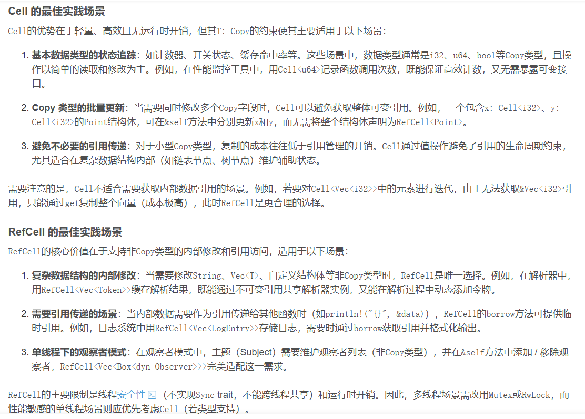
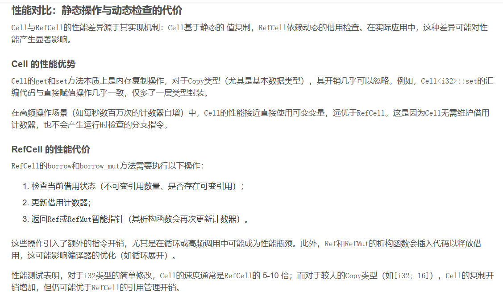
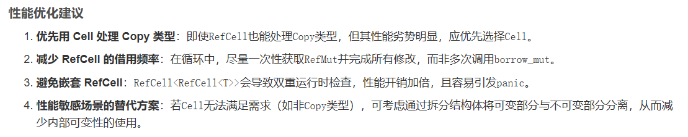

# Rust内部可变性

## 什么叫内部可变性
```rust
// 外部可变性：可变性写在变量声明上，暴露在"外面"
let mut x = 5;           // 外部可见：x 是可变的
x = 10;                  // 直接修改

let y = &mut x;          // 外部可见：可变引用
*y = 20;                 // 通过引用修改

// 内部可变性：变量本身是不可变的，但"内部"可以变
let cell = Cell::new(5); // 外部：cell 是不可变绑定（默认）
cell.set(10);            // 但内部值被修改了！
```

说明：cell 变量本身不需要 mut 修饰，可变性是 Cell 类型内部实现的特性，对外部用户透明

## 外部可比性与内部可变性区别

| 维度       | 外部可变性（Exterior Mutability） | 内部可变性（Interior Mutability）             |
| -------- | -------------------------- | -------------------------------------- |
| **检查时机** | **编译期**（静态检查）              | **运行时**（动态检查）或**值语义绕过**                |
| **检查位置** | 在**变量/引用层面**（外部）           | 在**类型内部**（内部）                          |
| **典型代表** | `let mut x` / `&mut T`     | `Cell<T>` / `RefCell<T>` / `Mutex<T>`  |
| **违反后果** | **编译错误**                   | **运行时 panic**（RefCell）或**不可能发生**（Cell） |
| **开销**   | 零运行时开销                     | 有运行时开销（RefCell）或复制开销（Cell）             |

## 内部可用性的意义

Cell 和 RefCell 的共同使命是突破 Rust "共享不可变，可变不共享" 的默认规则，允许在持有不可变引用（&self）的情况下修改数据内部状态。

有些场景持有可变引用 &mut self 无法实现，比如
### 1. 计数器
```rust
use std::rc::Rc;

struct Counter {
    value: u32,
}

impl Counter {
    fn increment(&mut self) {
        self.value += 1;
    }
}

fn main() {
    let counter = Rc::new(Counter { value: 0 });
    let handle1 = counter.clone();
    let handle2 = counter.clone();

    // 以下代码无法编译：Rc 只提供 &Counter，不能调用 increment(&mut self)
    // handle1.increment();
    // handle2.increment();
}
```
说明：可见rc共享与外部可变&mut self天然冲突

使用内部可变性Cell版本

```rust
use std::cell::Cell;

struct Counter {
    value: Cell<i32>,
}

impl Counter {
    // 方法仍然接受 &self，因为 Cell 提供了内部可变性
    fn inc_n(&self, n: u32) {
        if n > 0 {
            // Cell::get 获取当前值，Cell::set 设置新值
            let current = self.value.get();
            self.value.set(current + 1);
            self.inc_n(n - 1);
        }
    }
}

fn main() {
    let c = Counter { value: Cell::new(0) };
    c.inc_n(5);
    println!("{}", c.value.get()); // 输出 5
}
```

使用内部可变性RefCell版本
```rust
use std::cell::RefCell;
use std::rc::Rc;

struct Counter {
    value: RefCell<u32>,
}

impl Counter {
    fn increment(&self) {
        *self.value.borrow_mut() += 1;
    }
}

fn main() {
    let counter = Rc::new(Counter { value: RefCell::new(0) });
    let handle1 = counter.clone();
    let handle2 = counter.clone();

    handle1.increment(); // 可以修改
    handle2.increment(); // 可以修改
    println!("{}", *counter.value.borrow()); // 输出 2
}
```


### 2. 循环递归调用
```rust
struct Counter {
    value: i32,
}

impl Counter {
    fn inc_n(&mut self, n: u32) {
        if n > 0 {
            self.value += 1;
            // ❌ 编译错误：cannot borrow `*self` as mutable more than once at a time
            self.inc_n(n - 1);
        }
    }
}
```

使用内部可变性

```rust
use std::cell::RefCell;

struct Counter {
    value: RefCell<i32>,
}

impl Counter {
    // 注意：现在方法接受 &self，而不是 &mut self
    fn inc_n(&self, n: u32) {
        if n > 0 {
            *self.value.borrow_mut() += 1;
            self.inc_n(n - 1);  // ✅ 递归调用，因为 borrow_mut() 会在递归返回后释放
        }
    }
}

fn main() {
    let c = Counter { value: RefCell::new(0) };
    c.inc_n(5);
    println!("{}", *c.value.borrow()); // 输出 5
}
```

## Cell与RefCell的区别
| 特性        | `Cell<T>`           | `RefCell<T>`                |
| --------- | ------------------- | --------------------------- |
| **操作方式**  | 值复制/替换（`get`/`set`） | 引用获取（`borrow`/`borrow_mut`） |
| **类型约束**  | 要求 `T: Copy`        | 无约束，支持任意类型                  |
| **运行时检查** | 无（编译期安全）            | 有（运行时借用检查）                  |
| **性能**    | 极高（接近原生操作）          | 有开销（计数器维护）                  |
| **风险**    | 无运行时错误              | 违反规则会 `panic`               |

注：注意区别在于检查或者绕过阶段。

## Cell/RefCell 最佳实践


## Cell/RefCell性能对比



