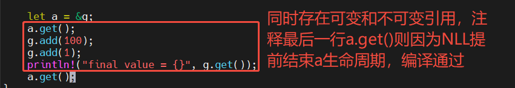
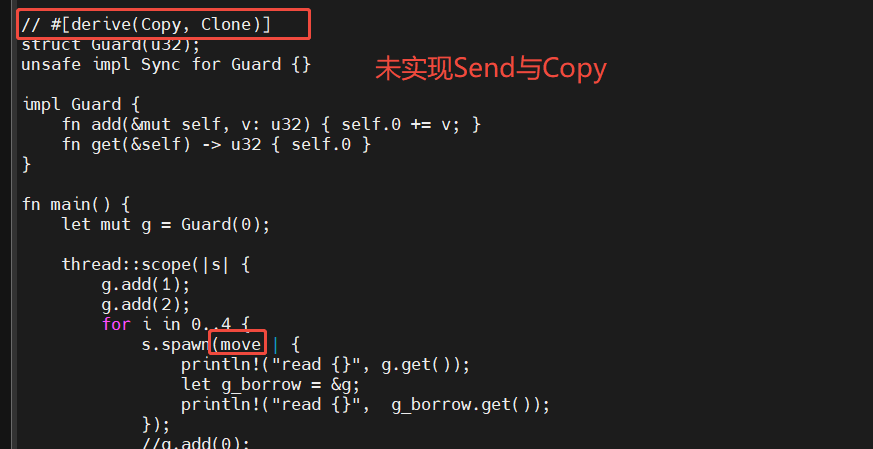
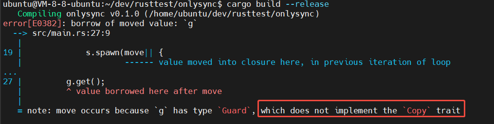
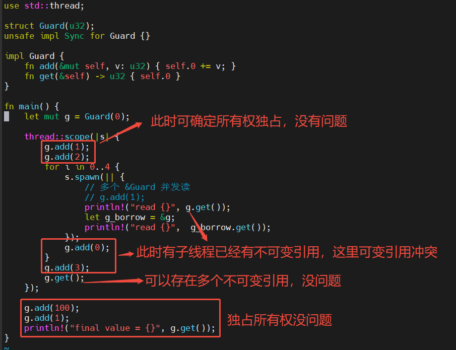
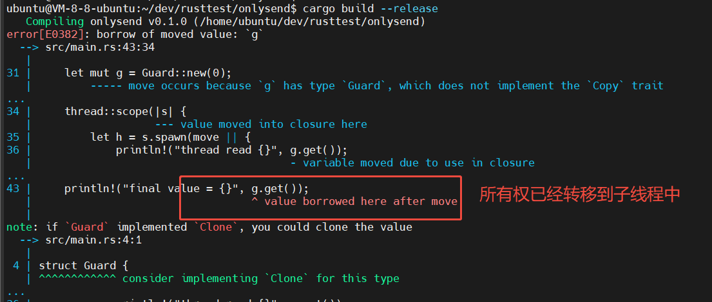
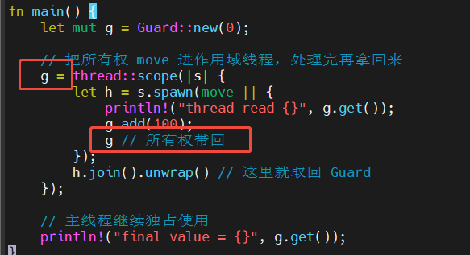
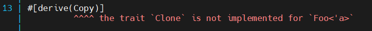
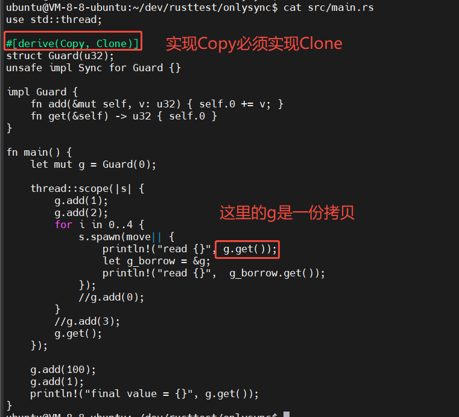
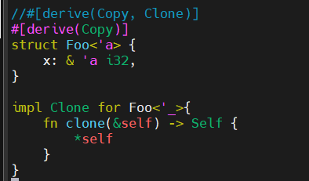
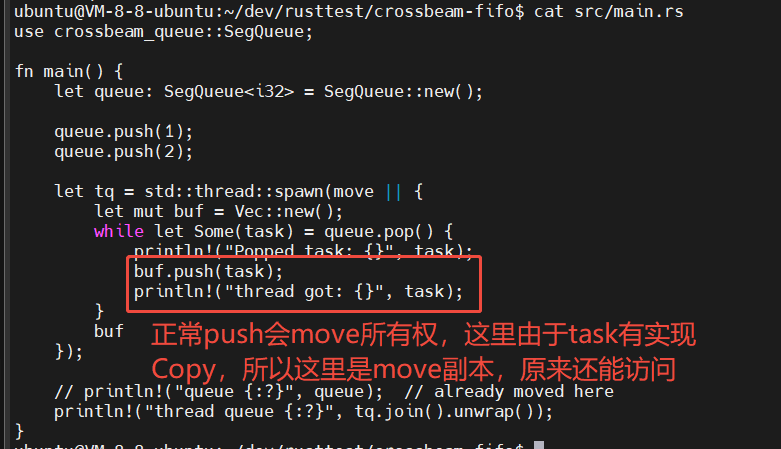

## 1. 结构体实例引用与借用
```rust
struct MyStruct {
    value: i32,
}

impl MyStruct {
    // This method takes ownership of the instance.
    fn take_ownership(self) -> i32 {
        self.value
    }

    // This method borrows the instance immutably.
    fn borrow(&self) -> i32 {
        self.value
    }

    // This method borrows the instance mutably.
    fn borrow_mut(&mut self, new_value: i32) {
        self.value = new_value;
    }
}
let test = MyStruct {};
test.take_ownership();  //此时test所有权已经move到take_ownership方法内部，take_ownership调用结束后test被销毁
test.borrow(); //此时调用test报错
```
## 2. 借用和所有权移动
```rust
// 原所有权创建
let mut owner = String::from("go rust")
// 可变借用，所有权仍归owner，实际内容被借出，borrow借用结束后归还
let borrow = &mut owner;
// 所有权被移动，owner失效
let new_owner = owner;
```
## 3. 非词法作用域生命周期NLL(Non-Lexical Lifetimes)
```rust
    let mut test_str = String::from("test string");
    let mut_borrow = &mut test_str;
    let mut_b_2 = &mut test_str;
    // 注释后边对mut_borrow的使用代码，可以编译通过
    // println!("mut 1 = {}", mut_borrow);
```
取消后边对mut_borrow的使用代码注释后编译报错:

error[E0499]: cannot borrow test_str as mutable more than once at a time

说明：借用mut_borrow后边没再使用，NLL判断其生命周期已经结束，但是此时变量test_str本身的生命周期并未结束



## 4. NLL与变量生命周期
NLL: (Non-Lexical Lifetimes)
```RUST
  struct Resource {
    id: i32,
}

impl Drop for Resource {
    fn drop(&mut self) {
        println!("Dropping resource {}", self.id);
    }
}

fn main() {
  {
        let r = Resource { id: 666 };
        println!("Resource = {}", r.id);
        println!("Another print after r ref");
    }
}
```
结果是

Resource = 666

Another print after r ref

Dropping resource 666

说明：NLL是针对借用(引用)的生命周期检查，但drop是针对变量（值的唯一所有者）的语法作用域（变量的生命周期）

5、Rust内部可变性

需要突破的默认规则：“可变不共享，共享不可变” “只能存在一个可变引用，或者多个不可变引用”

```rust
struct Node {
    data: i32,
    children: RefCell<Vec<Rc<Node>>>,
}

impl Node {
    // 只读遍历，但要在回调里继续修改子树
    fn traverse(&self, f: &dyn Fn(&Node)) {
        f(self);
        for c in self.children.borrow().iter() {
            c.traverse(f); // 若这里是 &mut self，就永远借不出来
        }
    }
}
```
把 traverse 改成 &mut self 后，任何递归调用都会因为“已有 &mut 未释放”而编译拒绝。

又或者结构体中对可变指针*mut的操作，某个函数返回该指针内容，编译器无法识别判断是否是悬垂指针。

故而需要新特性：对外表现为不可变，但是能够修改内部属性。通过Cell和Refcell将借用规则检查从编译期放到运行期。

参考：https://blog.csdn.net/qq_39465480/article/details/154097417

[Rust内部可变性](./Rust内部可变性.md)

## 6. 共享所有权

| 场景需求 | 选用组合 |
| --- | --- |
| 单线程只读共享 | `Rc<T>` |
| 单线程共享 + 可变 | `Rc<RefCell<T>>` |
| 多线程只读共享 | `Arc<T>` |
| 多线程共享 + 可变（互斥访问） | `Arc<Mutex<T>>` |
| 读远多于写（支持一写多读） | `Arc<RwLock<T>>` |
| 全局常量/配置 | `&'static T`（或 `once_cell`） |

## 7. 解引用dereferencing

将智能指针或者引用还原成其指向值的动作

```rust
use std::ops::{Deref, DerefMut};

struct MyBox<T>(T);

// 智能指针通过实现Deref/DerefMut实现自动解引用
impl<T> Deref for MyBox<T> {
    type Target = T;
    fn deref(&self) -> &Self::Target {
        &self.0
    }
}

let b = MyBox(5);
assert_eq!(5, *b);      // 自动调用 Deref::deref
impl<T> DerefMut for MyBox<T> {
    fn deref_mut(&mut self) -> &mut Self::Target {
        &mut self.0
    }
}

let mut c = MyBox(10);
*c += 1;      // 先 DerefMut，再对内部的 i32 做 +=1
```

常见的Box自带解引用能力
```rust
fn fib_heap(n: u32) -> Box<u32> {
    if n <= 1 {
        Box::new(n)  // 在堆上分配
    } else {
        let a = fib_heap(n - 1);
        let b = fib_heap(n - 2);
        // 堆上分配
        Box::new(*a + *b)  // *a和*b自动解引用成u32值
        // 等价于：Box::new(*a.as_ref() + *b.as_ref())
    }
}
```
## 8. 内置标量传参走“移动”语义

函数参数有三类传递方式：引用、Copy、move所有权，内置标量(bool、char、所有整数、浮点数)，硬性规定走复制，如果要走“移动”语义，就包一层不实现 Copy 的类型
```rust
struct MyI32(i32);          // 默认 !Copy

fn take_it(m: MyI32) -> i32 { m.0 }

let a = MyI32(42);
let b = take_it(a);
// println!("{}", a.0);     // 编译错误：a 已被移动
```
## 9. 自动借用

使用点语法调用时，左值本身不是所需类型，编译器会根据函数签名改写AST“自动借用”
```rust
struct Guard(u32);
unsafe impl Sync for Guard {}

impl Guard {
    fn add(&mut self, v: u32) { self.0 += v; }
    fn get(&self) -> u32 { self.0 }  // 
}

let mut g = Guard(0);
thread::scope(|s| {
  s.spawn(|| { g.work(); });   // 子线程自动(隐式)借用 `&g`，等价于 (&g).work()
}
```
## 10. 只实现Sync但没有Send，多线程只能通过借用操作对象实例

没有Send，则无法实现对g所有权的move操作




spawn中去掉move，多线程可以直接进行不可变借用



说明：子线程中g.get()属于隐式借用，编译器“自动借用”。有了NLL之后，需要从程序逻辑上理解是否独占，是否“同时”存在可变不可变借用。

## 11. 只有Send没有Sync
```rust
use std::thread;

// 仍是“只 Send 不 Sync”
struct Guard {
    ptr: *mut u32,
}
unsafe impl Send for Guard {}
// 故意不写 impl Sync

impl Guard {
    fn new(v: u32) -> Self {
        Guard {
            ptr: Box::into_raw(Box::new(v)),
        }
    }
    fn get(&self) -> u32 {
        unsafe { *self.ptr }
    }
    fn add(&mut self, v: u32) {
        unsafe { *self.ptr += v; }
    }
}

impl Drop for Guard {
    fn drop(&mut self) {
        unsafe { drop(Box::from_raw(self.ptr)); }
    }
}

fn main() {
    let mut g = Guard::new(0);

    // 把所有权 move 进作用域线程
    thread::scope(|s| {
        let h = s.spawn(move || {
            println!("thread read {}", g.get());
            g.add(100);
        });
        h.join().unwrap() // 这里就取回 Guard
    });

    // 主线程继续独占使用
    println!("final value = {}", g.get());
}
```



可以把g所有权返回来，如下



## 12. Copy vs Clone

Copy是浅拷贝，隐式发生，在赋值操作是自动拷贝，不可重载，结构体内所有成员类型必须实现Copy才能对该结构体derive Copy

Clone是自定义拷贝

Copy是Clone的子集，实现Copy必须带上Clone





或者手动 impl clone



注：对Arc进行Clone只是增加引用计数，所有Clone出来的句柄都指向同一块内存，一般多线程“ Clone + move ” 的方式实现共享同步

## 13. 无锁消息队列 FIFO
```rust
use std::sync::mpsc;

fn main() {
    let (tx, rx) = mpsc::channel::<String>();

    let s = String::from("hello");
    tx.send(s).unwrap();

    // println!("{}", s);   // 编译错误：value borrowed here after move
    let received = rx.recv().unwrap();
    println!("got: {}", received); // got: hello
}
```
说明：mpsc.channel实现cas无锁队列，send实际move了所有权(零成本抽象)。mpsc.channel pop会阻塞，也也可以使用crossbeam_queue::SegQueue 进行非阻塞pop
```rust
use crossbeam_queue::SegQueue;

fn main() {
    let queue: SegQueue<i32> = SegQueue::new();

    queue.push(1);
    queue.push(2);

    let tq = std::thread::spawn(move || {
        let mut buf = Vec::new();
        while let Some(task) = queue.pop() {
            println!("Popped task: {}", task);
            buf.push(task);
            println!("thread got: {}", task);
        }
        buf
    });

    // println!("queue {:?}", queue);  // already moved here
    println!("thread queue {:?}", tq.join().unwrap());
}
```


## 14. 栈 LIFO

可以标准库的 Mutex<Vec<T>>实现有锁LIFO
```rust
struct ConcurrentStack<T>(Arc<Mutex<Vec<T>>>);

impl<T> ConcurrentStack<T> {
    fn new() -> Self { ConcurrentStack(Arc::new(Mutex::new(Vec::new()))) }
    fn push(&self, v: T) { self.0.lock().unwrap().push(v); }
    fn pop (&self) -> Option<T> { self.0.lock().unwrap().pop() }
}
```

说明：ConcurrentStack 结构体内部字段未命名，self.0为第一个字段；self.0.lock()返回一个Result<MutexGuard<T>, PoisonError>，这里的unwrap()返回智能指针MutexGuard<Vec<T>> 或者panic，这里的智能指针实现了解引用Deref，可以直接像使用 &Vec<T> 一样进行push。

## 15. crossbeam-deque 库中的 new_lifo 和 new_fifo与通用lifo和fifo的区别

crossbeam-deque 库中的 new_lifo 和 new_fifo是在本地创建LIFO和FIFO线程私有数据结构，如果本地队列为空，线程会尝试从一个共享的全局队列 (Injector) 中窃取任务（即工作窃取work-stealing特性）。跟golalng GMP模型中从其它P中窃取Goroutine类似。

## 16. 解决无锁CAS的ABA问题

CAS: compare and swap

ABA问题：值从A->B->A，但本线程无法感知到值已经经过数轮变化，如果这个值是个指针地址，则可能对应内存早已改变，此时CAS漏判导致数据覆盖
```rust
loop {
    let old_snap = cell.load(Acquire);
    let old_ptr  = old_snap as u64;
    let old_ver  = (old_snap >> 64) as u64;

    let new_ptr = modify(old_ptr);      // 业务逻辑
    let new_ver = old_ver.wrapping_add(1); // 新数据都产生新版本号
    let new_snap = (new_ver << 64) | new_ptr;
    // compare_exchange_weak是硬件汇编级别的原子性操作
    if cell.compare_exchange_weak(old_snap, new_snap, …).is_ok() {
        break;
    }
}
```
说明：只要保证产生的new_snap不会与old_snap相同，即可挡住ABA问题

## 17. unwrap() 与 ? 语法糖

相同点：定义在 Option<T> 和 Result<T, E> 上，因此当前都只能直接用于这两个 enum

不同点：unwrap要么成功要么panic，? 是"传播错误"
```rust
let test = match expr {
    Ok(v)  => v,
    Err(e) => return Err(e.into()),
}
```
以上可缩写成 let test = expr? 如果是Err直接return往上传播；
但如果是 let test = expr.unwrap() 此时Err则直接panic。
